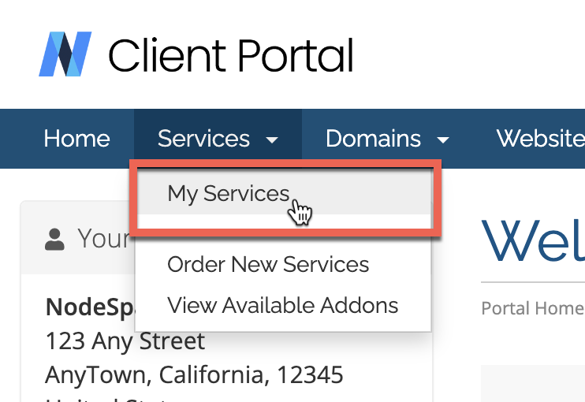
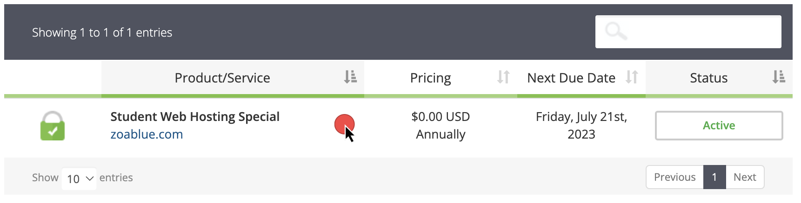
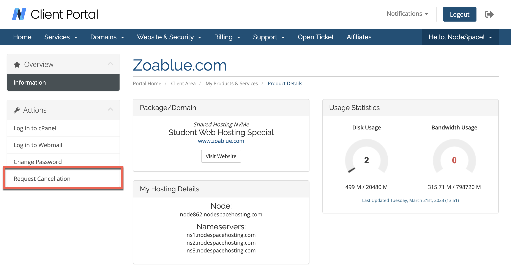
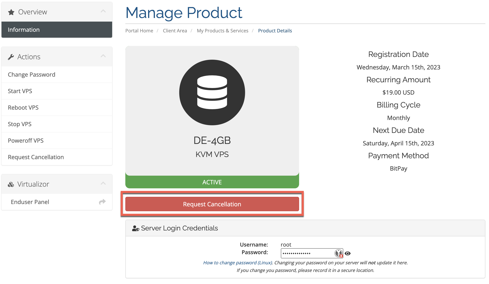

# Account Cancellation

You can cancel your account at any time by logging into the My NodeSpace customer portal and clicking on the "Request Cancellation" link under the "Actions" menu for the service you want to cancel. You can also contact our billing team by opening a support ticket from the [NodeSpace Client Portal](https://my.nodespace.com). For security reasons, we cannot accept cancellation requests by email. They must be submitted through the NodeSpace Client Portal.

## How to Cancel Your Service

!!! note
    If you have multiple services you want to cancel, you will need to cancel each service individually. You cannot cancel multiple services at the same time.

To cancel your service, please follow these steps:

First, login to the [NodeSpace Client Portal](https://my.nodespace.com). From the Services menu, click on My Services.

Next, select the service that you want to cancel. 

Next, click on the "Request Cancellation" link under the "Actions" menu.

If the service does not have a "Request Cancellation" link under the "Actions" menu, there is an alternative location which is on the main service page, right under the service icon as indicated here:

!!! warning
    IMPORTANT: If your product or service does not have a request cancellation button, you must open a billing ticket to request cancellation. Cancellation tickets must be received at least 24 hours prior to service due date in order to cancel.

You will be prompted with a form to say why you're cancelling. While it is optional, please include a reason for your cancellation to better help us improve our services.

!!! warning "Cancel PayPal Subscription Payments"
    Please cancel any PayPal subscriptions you may have after cancelling your service with us. If you do not cancel your subscription, PayPal will continue to bill you! **We do not offer refunds for PayPal subscriptions that are not cancelled.**

## Cancellation Types

We offer two types of cancellations: immediate cancellation and end of billing period cancellation. If you choose immediate cancellation, your service will be terminated immediately and you will not be billed again. If you choose end of billing period cancellation, your service will remain active until the end of your current billing period and you will not be billed again. If you choose end of billing period cancellation, you will still be able to access your service until the end of your current billing period.

!!! note
    If you choose immediate cancellation, your service will be terminated **within the next 24 hours**. We do not offer refunds for unused time if you choose immediate cancellation. When your service is terminated, all of your data will be deleted and cannot be recovered. If you want to keep your data, you should download it before you cancel your service.

!!! warning 
    If you have changed your mind about cancelling your service, you need to contact our billing team as soon as possible. If you do not contact our billing team before your service is terminated, we will not be able to recover your data.

## Refunds

We offer a 45 day money back guarantee for all shared hosting plans. If you are not satisfied with your service, you can request a refund within 45 days of the date of signing up. If you request a refund within 45 days of the date of purchase, we will refund your payment in full. If you request a refund after 45 days of the date of signing up, we will not refund your payment.

## Data Retention

If you cancel your service, we will retain your account data including your billing information, contact information, support tickets, and information about your prior services. We will not retain any data related to your service, such as your website files, databases, or email messages. If you want to keep your data, you should download it before you cancel your service.

### GDPR Compliance

If you are a resident of the European Union, you have the right to request that we delete your personal data. If you request that we delete your personal data, we will delete all of your personal data including your billing information, contact information, support tickets, and information about your prior services. We will not retain any data related to your service, such as your website files, databases, or email messages. If you want to keep your data, you should download it before you request that we delete your personal data.

## Reactivating Your Account

If you cancel your service, your account remains "inactive" which allows you to view your account data including your billing information, contact information, support tickets, and information about your prior services. If you want to reactivate your account, you can order a new service from the [NodeSpace Client Portal](https://my.nodespace.com).