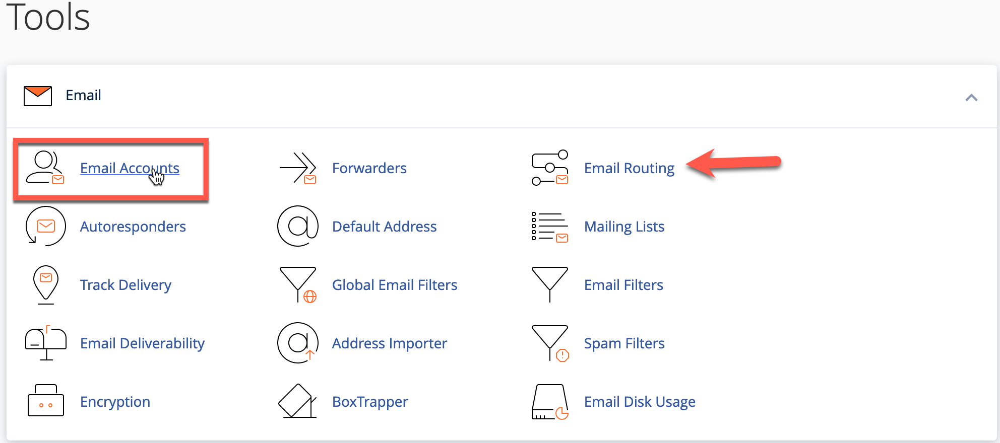
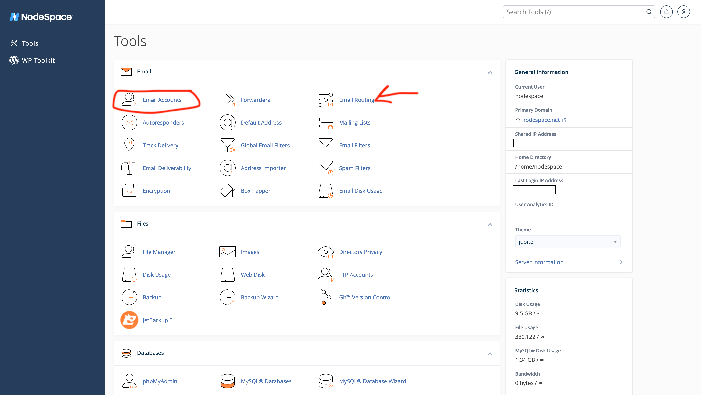

# Documentation Standards

In order to maintain a consistent look and feel across our documentation, we have created this document to outline our standards. This document is a work in progress and will be updated as needed.

## Table of Contents

- [Documentation Standards](#documentation-standards)
  - [Table of Contents](#table-of-contents)
  - [File Structure](#file-structure)
  - [Front Matter](#front-matter)
  - [Page Content](#page-content)
  - [Code Blocks](#code-blocks)
  - [Images](#images)
  - [Links](#links)
  - [Tables](#tables)
  - [Notes](#notes)
  - [Warnings](#warnings)
  - [Tips](#tips)
  - [Important](#important)
  - [Questions](#questions)
  - [Contributing](#contributing)
  - [License](#license)

## File Structure

The file structure for the documentation is as follows:

```
.contributing/ - Contains templates that you can use to get started.
docs/ - Contains the documentation files. All of the documentation files are located in this directory.
├─ assets/ - Contains the assets for the site such as logos (Do not edit these files).
└─ images/ - Contains images for top-level pages.
stylesheets/ - Contains the stylesheets for the site (Do not edit these files).
overrides/ - Contains overrides for the mkdocs theme (Do not edit these files).
mkdocs.yml - Contains the configuration for the mkdocs site.
```

Content is laid out in the `/docs` directory and each subject has a similar structure:

```
docs/
├─ subject/
├── topic/ - Use a directory if the topic has multiple pages.
├── topic.md - The main page for the topic.
└─ images - Contains images for the topic.
```

If a subject is further nested, the structure is the same, but with an additional level:

```
docs/
├─ subject/
├─ topic/
├─── subtopic/ - Use a directory if the subtopic has multiple pages.
├──── /images - Contains images for the subtopic.
├─── subtopic.md - The main page for the subtopic.
├─── /images - Contains images for the topic.
└── topic.md - The main page for the topic.
```

You can continue to nest topics as needed, but try to keep the nesting to a minimum. It is recommended that you do not nest more than 3 levels deep. This is because the URL structure will begin to get very long and it will be difficult to navigate the site. For example, a page nested 3 levels deep would have a URL similar to the following:

```
https://learn.nodespace.com/subject/topic/subtopic/subsubtopic
```

## Front Matter

!!! note
    This is not used.

## Page Content

The page content is to be written in markdown. The markdown should be formatted using the following guidelines:

- Use H1 for the page title.
- Use H2 for the main sections of the page.
- Use H3-H6 for sub-sections of the page.

The file name should be lowercase and use hyphens to separate words. For example, `getting-started.md`. The file name will also become the URL for the page. For example, `https://learn.nodespace.com/getting-started`.

If there are sub-pages for a topic, the main page should be named `index.md`. For example, `docs/getting-started/index.md`. The sub-pages should be named using the same guidelines as above. For example, `docs/getting-started/creating-an-account.md`.

### Images

Images should be placed in the `images/` directory that is located in the same directory as the page. For example, if the page is located at `docs/getting-started/index.md`, the images should be placed in `docs/getting-started/images/`. The images should be named using the same guidelines as above. For example, `docs/getting-started/images/creating-an-account.png`. For screenshots that are multi-step, use the following naming convention: `docs/getting-started/images/creating-an-account-1.png`, `docs/getting-started/images/creating-an-account-2.png`, etc.

Images can be placed in the page using the following markdown:

```markdown

```

Alt text will be generated from `[Creating an Account]` bit. The image will be placed in the page and will be centered.

Images should be used whenever it is possible to do so. This will help to break up the text and make the page easier to read. Our documentation should be easy to read and understand - not a wall of text. If you are having trouble explaining something, try using an image. A picture is worth a thousand words! 

#### Screenshots

Screenshots should be taken using a screen clipping program, such as TechSmith Snagit, Fireshot, ShareX, Greenshot, or similar. The screenshots should be cropped to show only the relevant information. If you need to show or highlight a specific area of the screenshot, use a tool such as TechSmith Snagit, Greenshot, or similar to do so. Please do not use hand-drawn arrows or circles. These look unprofessional and are difficult to read.

!!! success "Good Example"
    

!!! failure "Bad Example"
    

When it comes to the mouse cursor, you can include it in the screenshot if it is relevant. For example, if you are showing how to click on a button, you should include the mouse cursor. If you are showing how to type something, you should not include the mouse cursor. Most screenshot tools will allow you to hide the mouse cursor. If you are using a tool that does not allow you to hide the mouse cursor, you can use an image editor to remove it. 

If you do not have a screenshot tool, we recommend using [ShareX](https://getsharex.com/) if you are using Windows. It is free and open source. It also has a lot of features that make it easy to take screenshots and annotate them. On macOS, you can use the built-in screenshot tool or [Flameshot](https://flameshot.org). On Linux, you can use [Flameshot](https://flameshot.org/). Preferably, TechSmith Snagit should be used. It is available for Windows and macOS. It is not free, but it is a very good tool and is worth the money. But if you do not have access to it, you can use one of the other tools mentioned above.

### Code Blocks

Code blocks should be used whenever you are showing code, command, or configuration examples. Code blocks should be formatted using the following guidelines:

- Use the `bash` language for commands.
- Use the `yaml` language for configuration files (such as `docker-compose.yml`).
- Use the `json` language for JSON files.
- Do not use symbols like `#` or `$` to indicate root or user. Instead, indicate if the command should be run as root or user in the text above the code block. These symbols can be confusing to new users, especially if they are not familiar with the command line and are copying and pasting the commands.
- Do not use `sudo` in the commands. Instead, indicate if the command should be run as root (or sudo) or user in the text above the code block.

For example:

````markdown
To create a new directory, use the following command:

```bash 
mkdir /path/to/directory
```
````

The above example will produce the following:

To create a new directory, use the following command:

```bash
mkdir /path/to/directory
```

### Tables

Tables should be used whenever you are showing a list of items. Tables should be formatted using the following guidelines:

- Use the `|` symbol to separate columns.
- Use the `---` symbol to separate the header from the body.
- Use the `:` symbol to align the columns. For example, `| :--- |` will align the column to the left. `| ---: |` will align the column to the right. `| :---: |` will align the column to the center.

For example:

````markdown
| Name | Description |
| :--- | :--- |
| `--name` | The name of the container. |
| `--restart` | Restart policy to apply when a container exits. |
````
The above example will produce the following:

| Name | Description |
| :--- | :--- |
| `--name` | The name of the container. |
| `--restart` | Restart policy to apply when a container exits. |


### Links

Links should be used whenever you are linking to another page or website. Links should be formatted using the following guidelines:

- Use the `[text](url)` format.
- Use the `[text](url "title")` format if you want to add a title to the link. The title will be displayed when the user hovers over the link.

For example:

````markdown
For more information, see the [Getting Started](https://learn.nodespace.com/getting-started) page.
````
The above example will produce the following:

For more information, see the [Getting Started](https://learn.nodespace.com/getting-started) page.

### Admonitions (Callouts)

Admonitions (also known as callouts) should be used whenever you want to draw attention to something. They make it easy to highlight important information. Admonitions should be formatted using the following guidelines:

- Use the `!!!` symbol to indicate the start of the admonition.
- Use the `???` symbol to indicate the start of a collapsible admonition.
- Follow either symbol with one of the keywords:
    - `note`
    - `tip`
    - `info`
    - `success`
    - `warning`
    - `failure`
    - `danger`
    - `question`
    - `quote`
    - `abstract`
    - `example`
    - `bug`
- After the keyword, you can add a title. For example, `!!! note "This is a note"`. If you do not want to add a title, you can omit it. For example, `!!! note`. This will just show the icon.
- For the text, start a new line and indent it by four spaces. For example:

````markdown
!!! note "This is a note"
    This is the text of the note. It can be multiple lines long.
````
- Admonitions can include formatted text and other markdown elements.

#### Examples

````markdown
```
!!! note "This is a note"
    This is the text of the note. It can be multiple lines long.
```
````
The above example will produce the following:

!!! note "This is a note"
    This is the text of the note. It can be multiple lines long.

````markdown
```
??? note "This is a collapsible note"
    This is the text of the note. It can be multiple lines long.
```
````
The above example will produce the following:

??? note "This is a collapsible note"
    This is the text of the note. It can be multiple lines long.

````markdown
```
!!! info
    This is the text of the info. It can be multiple lines long.
```
````
The above example will produce the following:

!!! info
    This is the text of the info. It can be multiple lines long.

Here are what each of the different admonitions look like:

`note`

!!! note "Note"
    This is a note.

`tip`

!!! tip "Tip"
    This is a tip.

`info`

!!! info "Info"
    This is info.

`success`

!!! success "Success"
    This is a success.

`warning`

!!! warning "Warning"
    This is a warning.

`failure`

!!! failure "Failure"
    This is a failure.

`danger`

!!! danger "Danger"
    This is danger.

`question`

!!! question "Question"
    This is a question.

`quote`

!!! quote "Quote"
    This is a quote.

`abstract`

!!! abstract "Abstract"
    This is an abstract.

`example`

!!! example "Example"
    This is an example.

`bug`

!!! bug "Bug"
    This is a bug.

For a live example of how admonitions work, you can see see our [Shared Hosting Self-Transfer](../hosting/shared/self-transfer.md) guide.

### Vocabulary & Language Tone

When writing documentation, it is important to use the correct vocabulary and language tone. This will help ensure that the documentation is easy to understand and consistent across all of our documentation.

Our official language tone is **casual**. This means that we use a friendly, conversational tone. We avoid using overly formal language. We also avoid using overly technical language. We want our documentation to be easy to understand for everyone, regardless of their technical knowledge.

When writing documentation, you should use the following guidelines:

- Use the correct vocabulary. For example, use "server" instead of "machine".
- Use the correct tense. For example, use "is" instead of "was".
- Use active voice. For example, use "NodeSpace has" instead of "NodeSpace had".
- Use the correct tone. For example, use "can" instead of "may".
- Use the correct capitalization. For example, use "NodeSpace" instead of "Nodespace".
- Use formatting that is familiar to English speakers.
  - This is because the majority of our customers are from North America. While we do have customers from other countries, we want to make sure that our documentation is easy to understand for everyone.
  - When formatting numbers, use the following guidelines:
    - Use a comma to separate thousands. For example, use `1,000` instead of `1000`.
    - Use a period to separate decimals. For example, use `1.5` instead of `1,5`.
- Use proper formatting for units. For example, use `MB` instead of `mb`. Use `GB` instead of `GiB`.
  - Keep in mind that `MB` is megabytes and `Mb` is megabits. `GB` is gigabytes and `Gb` is gigabits.


