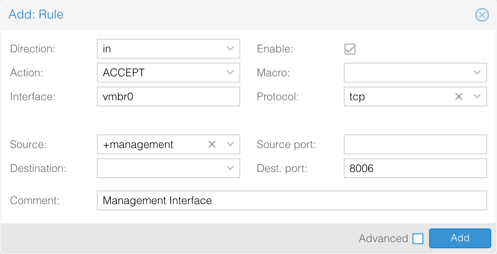
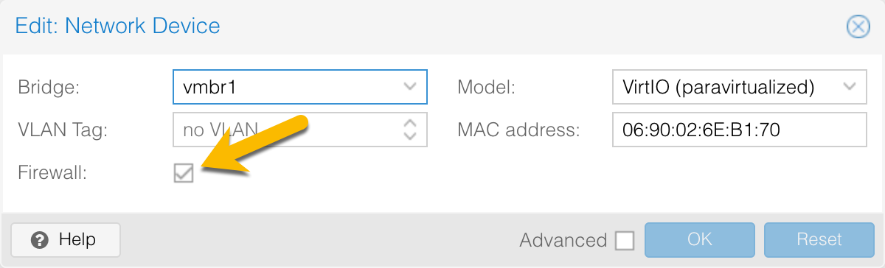

# Securing Proxmox VE with the built-in firewall

Proxmox has a built-in firewall that can be used to protect your node from unauthorized access. This guide will walk you through the basics of configuring it.

!!! danger "Review this article first before implementing anything."
    The Proxmox firewall is configured by default to block all incoming connections. If you don't configure your firewall rules first, **you *will* get locked out**.

We strongly recommend that you plan your rules before enabling anything. If you mess up a rule at the data center or node, you can lock yourself out.

## Understanding Zones

The firewall is broken up into two zones: host and VM. Host zone is from the data center to the node. The VM zone is at the VM and container level. There are objects at the data center level that filter down such as IPSets, Aliases, and Security Groups. Rules are strictly zoned.

## Protecting the Node

To protect the node, go to Data Center > Firewall and then click on IPSet. Create a new IPSet called management and add your IP address along with any other IPs that should have management access. You can add individual IPs or subnets in CIDR notation. Save the IPSet.

Click on Firewall and add a new rule. Create your rule so it looks like this:

!!! note
    Interface is set to vmbr0 as this is the default public interface. If you leave the interface name blank, this rule will apply on all interfaces, including any private interfaces you may have setup.

Source is using the IPSet you created. You can put in a single IP address in the rule, but using an IPSet will let you update IPs in all rules using that IPSet.

Click on add and this rule will be added. This rule will give any IP in the IPSet management access to the management interface. When the firewall is enabled, no one will be able to connect unless their IP is in the IPSet.

## Setting rules for VMs

Setting rules on VMs is like setting rules at the host level. Since your VMs may have similar rules, use Security Groups to hold multiple rules. For example, you might have a Security Group called "webserver" and it contains rules to allow ports 80 and 443 from anywhere, locks down port 22 to your system administrator, and restricts SQL to your SQL servers. Then you might have a Security Group called "systemmanagement" and it contains rules to allow remote administration from your orchestration tools. Now when you create a VM, you can apply security groups and update your rules by modifying one security group and then add one-off rules to the VM.

### Check VM Network Device

When you create a VM, you are given the option if you want to have the firewall on it. If the firewall checkbox is not set, then the VM firewall will not affect the VM. If you want the Proxmox firewall to affect it, make sure the firewall is enabled on the Network Device.

If your VM has both an internal network and an external network, you may want to disable the firewall on the internal NIC so external rules are not applied.

## Enabling the Firewall

When you've reviewed your rules and you're sure you won't get locked out, enable the firewall under the options tab. Once the firewall is enabled, it takes effect immediately. Same when you add new rules or update existing rules. When you enable the firewall under Data Center, that will apply the firewall rules for the host. The firewall for each VM needs to be individually turned on following the same process.

## Troubleshooting Common Issues

Occasionally, you may find that a firewall rule or rules are not working as expected. There can be any number of reasons, but these are the most common.

### Traffic is being passed despite a rule not allowing it.

If you find traffic is being passed, check the order of your rules. With firewalls, the order of the rule matters and they're processed top down. For example, consider we have the following rules on a VM:

1. In ACCEPT 80
2. In DROP 80 Source 192.168.1.0/24
3. In ACCEPT 443
4. In DROP 22
5. In ACCEPT 22 Source 10.12.14.16
6. In DROP (Implicit default rule)

If a device with the IP 192.168.1.53 tries to access this VM, the firewall will always permit access even though there is a rule to not allow anyone from 192.168.1.0/24 network. The firewall looks at the traffic, sees it matches rule 1 and stops processing all the other rules because it matched. If you want to block anyone on 192.168.1.0/24 from accessing port 80, then rule 2 needs to be first. Similarly, the sysadmin will never be able to connect because the firewall will check the traffic against rules 1, 2, 3, and then will match on 4. The accept rule would need to come first.

Notice the rule at the bottom. By default, the inbound list has a DROP rule that is implied. Meaning, if none of the rules you define match, all traffic will always match the DROP rule. So in our example, rule 4 isn't needed. We can just say ACCEPT only 10.12.14.16 on port 22. Anyone else trying to use port 22 will match on the implicit DROP rule.

If your order of rules looks good, then usually the problem is you forgot to enable the rule. Edit the rule and click the checkbox in the upper right.