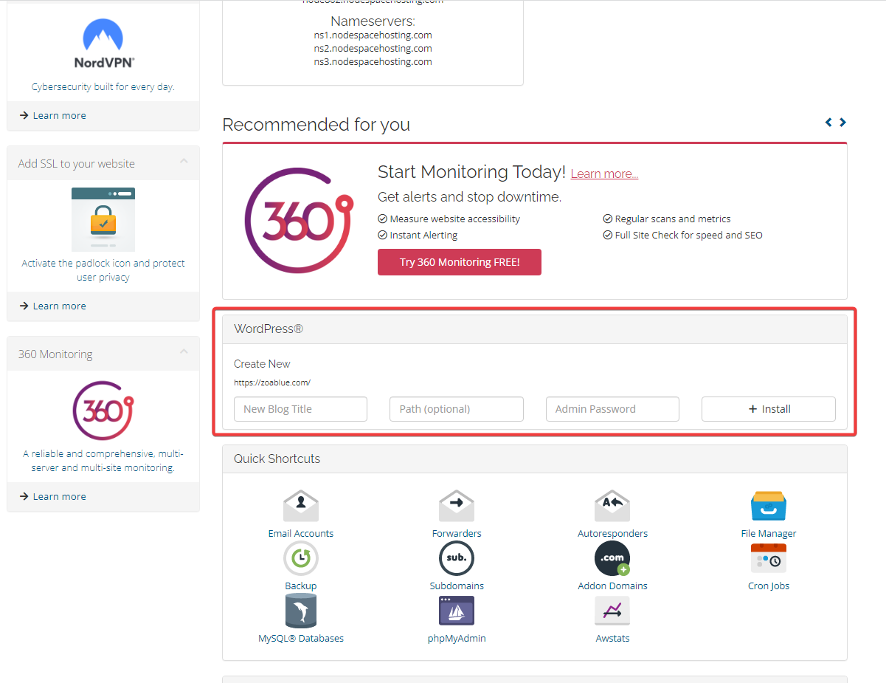

# Install WordPress on cPanel

!!! abstract "About"
    This guide will walk you through installing WordPress on a cPanel server. This guide assumes that you have purchased a [shared hosting account](https://www.nodespace.com/hosting/shared/) with us and have access to cPanel.

## Installing from Client Area

1. Login to the [Client Area](https://my.nodespace.com/clientarea.php) and navigate to the [Services](https://my.nodespace.com/clientarea.php?action=services) page. Click on the service that you wish to install WordPress on.

2. Scroll down the service page and you will see "WordPress" right above the "Quick Shortcuts" section. Fill out the fields and click "Install".
    
        

3. You can then access your WordPress installation by navigating to the URL that you specified in the "Install Directory" field. For example, if you specified "blog" as the install directory, you would navigate to `https://example.com/blog`. If you want to access the WordPress admin panel, you would navigate to `https://example.com/blog/wp-admin`. To install WordPress in the root directory, leave the "Install Directory" field blank.

## Installing from cPanel (WP Toolkit)

!!! note
    All of our shared hosting plans come with the [WP Toolkit](https://www.cpanel.net/products/add-ons/wp-toolkit/) plugin for cPanel. This plugin allows you to install and manage WordPress installations from within cPanel. It's available free of charge on all of our shared hosting plans.

1. Login to cPanel (either directly from the [Client Area](https://my.nodespace.com/clientarea.php) or by navigating to `https://example.com/cpanel` - replacing `example.com` with your domain name).

2. From the sidebar, click on "WP Toolkit" or search for "WP Toolkit" in the search bar.

3. Click on "Install" and fill out the fields. There are a few different fields you will want to pay attention to. These are **plugin/theme set** and **version**. These fields are explained in details below.

4. Click on "Install" and wait for the installation to complete.

### Plugin/Theme Set

The plugin/theme set field allows you to install a set of plugins and themes when you install WordPress. You can choose from a few different sets, or you can choose "none" and you will have a stock WordPress installation.

| Set | Description |
| --- | ----------- |
| None | Installs a stock WordPress installation. |
| WordPress Essentials | Installs: <ul><li>WP Super Cache</li><li>Yoast SEO</li><li>Contact Form 7</li><li>Limit Login Attempts Reloaded</li><li>Site Kit by Google – Analytics, Search Console, AdSense, Speed</li></ul> |
| E-Commerce Pack | Installs: </ul><li>WP Super Cache</li><li>Yoast SEO</li><li>Contact Form 7</li><li>Limit Login Attempts Reloaded</li><li>WooCommerce</li><li>WooCommerce Stripe Payment Gateway</li><li>WooCommerce Menu Cart</li><li>Site Kit by Google – Analytics, Search Console, AdSense, Speed</li></ul> |
| WordPress Classic | Installs: <ul><li>Classic Editor</li></ul> |
| Jetpack | Installs: <ul><li>Jetpack</li></ul> |
| WordPress Essentails with Jetpack | Installs: <ul><li>WP Super Cache</li><li>Yoast SEO</li><li>Contact Form 7</li><li>Limit Login Attempts Reloaded</li><li>Site Kit by Google – Analytics, Search Console, AdSense, Speed</li><li>Jetpack</li></ul> |
| E-commerce Pack with Jetpack | Installs: <ul><li>WP Super Cache</li><li>Yoast SEO</li><li>Contact Form 7</li><li>Limit Login Attempts Reloaded</li><li>WooCommerce</li><li>WooCommerce Stripe Payment Gateway</li><li>WooCommerce Menu Cart</li><li>Site Kit by Google – Analytics, Search Console, AdSense, Speed</li><li>Jetpack</li></ul> |
| WordPress Classic with Jetpack | Installs: <ul><li>Classic Editor</li><li>Jetpack</li></ul> |

### Version

The version field allows you to install a specific version of WordPress. You can choose from a few different versions, or you can choose "latest" and you will have the latest version of WordPress installed.

!!! warning
    You should only install an older version of WordPress if you have a specific reason to do so. You should always install the latest version of WordPress. Older versions of WordPress may have security vulnerabilities that have been patched in newer versions.

