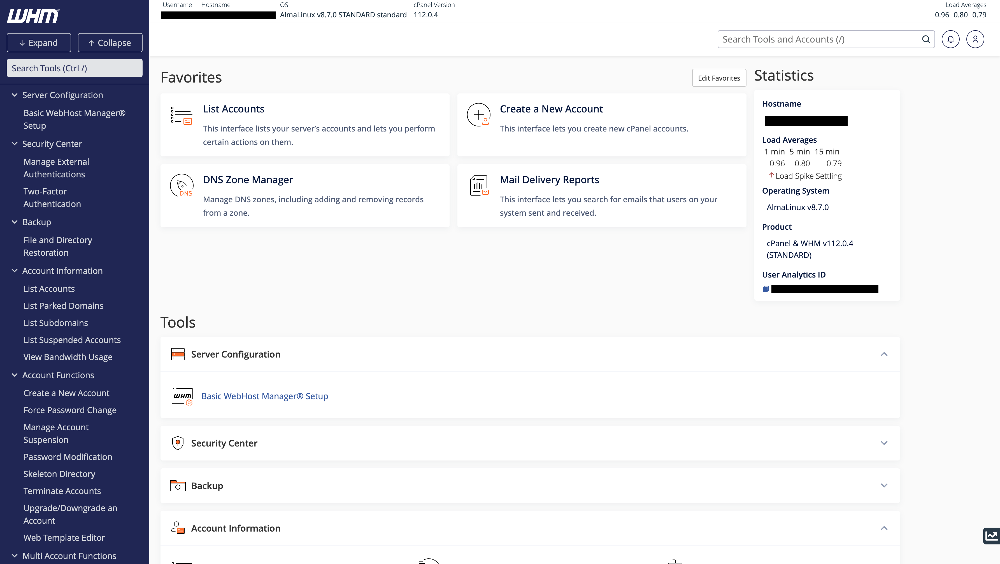

# WHM - Web Host Manager (Reseller)

!!! note
    We are still building this documentation. If you have any questions, please [contact us](https://my.nodespace.com/submitticket.php) or refer to the [cPanel documentation](https://docs.cpanel.net/whm/). **You can help us build this documentation by [contributing](../../../contributing/index.md).**

## What is WHM?

WHM is a web-based control panel that allows you to manage your reseller hosting account. You can create, suspend, and delete cPanel accounts. You can also set resource limits for each cPanel account. You can also manage your DNS zones, SSL certificates, and more. Every reseller hosting account includes WHM.

## How do I access WHM?

You can access WHM through a few different ways. You can access WHM through the [NodeSpace Client Area](https://my.nodespace.com) or you can access WHM directly. If you access WHM through the NodeSpace Client Area, you will be automatically logged in. If you access WHM directly, you will need to enter your username and password.

### Accessing WHM through the NodeSpace Client Area

1. Log in to the [NodeSpace Client Area](https://my.nodespace.com).
2. Click on the **Services** menu and then click on **My Services**.
3. Click on the **View Details** button next to your reseller hosting account.
4. Click on the **Login to WHM** button.

### Accessing WHM directly

1. Go to https://yourdomain.com:2087 (replace yourdomain.com with your domain name). If you're not using your domain with our hosting, you can use the server's hostname instead. You can find the server's hostname from the [NodeSpace Client Area](https://my.nodespace.com) by clicking on the **Services** menu and then clicking on **My Services**. Click on the **View Details** button next to your reseller hosting account. The server's hostname will be listed under **Server Information**.
2. Enter your username and password.

## WHM Features

::cards:: cols=2

- title: Create cPanel Accounts
  content: You can create cPanel accounts for your customers.

- title: Manage cPanel Accounts
  content: You can manage cPanel accounts for your customers.

- title: Manage DNS Zones
  content: You can manage DNS zones for your customers.

- title: Manage SSL Certificates
  content: You can manage SSL certificates for your customers.

- title: Manage Packages
  content: You can manage packages for your customers.

::/cards::

!!! note "Some features are limited"
    Keep in mind that some features have limited access or are disabled. For example, you cannot install cPanel plugins. If you need to install a cPanel plugin, please [contact us](https://my.nodespace.com/submitticket.php).