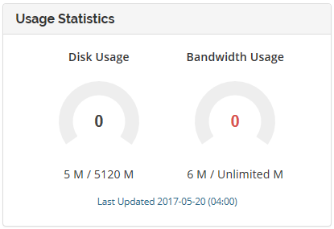

# How to check your account usage

You can view your disk space and bandwidth usage within the My NodeSpace customer portal or within cPanel on the right hand side under Statistics.

Statistics are updated inside My NodeSpace customer portal once a day at 4 AM Eastern.

Please keep in mind that Bandwidth will show an unlimited amount because we utilize soft limits. While disk space is a hard limit (that means once you reach your quota, you will not be able to upload any more files without freeing disk space), we use soft limits for bandwidth as we do not want to take your website offline. We assess additional fees for overages.