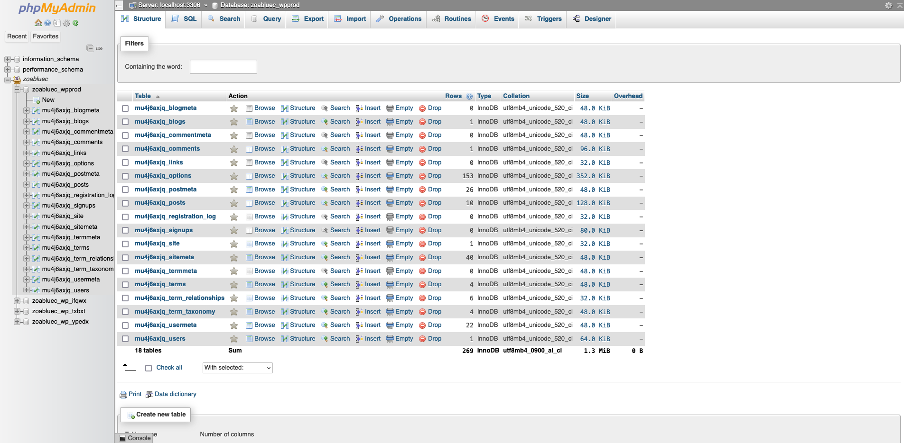
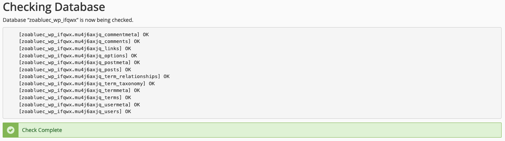

# cPanel Databases

This section contains tools for managing MySQL databases and users. You can create databases, users, and assign users to databases. You can also manage remote MySQL connections.

!!! note
    Be careful before making any changes to your databases. If you are not sure what you are doing, please contact support. You can also create a backup of your database before making any changes.

## phpMyAdmin

phpMyAdmin is a web-based tool for managing MySQL databases. You can use phpMyAdmin to create databases, tables, and users. You can also import and export databases. phpMyAdmin is a powerful tool and you should be careful when using it. If you are not sure what you are doing, please contact support.

phpMyAdmin will open in a new tab. You can use the left sidebar to navigate through your databases and tables. You can use the top menu to create databases, tables, and users. You can also import and export databases. You can use the search box to search for specific tables or rows. 

## MySQL Databases

You can use this tool to create MySQL databases and users. You can also assign users to databases. This tool is easier to use than phpMyAdmin and is recommended for daily use. 

### Create a Database

Under the **Create New Database** section, enter a name for your database and click **Create Database**. Your database will be created with a prefix of your cPanel username. For example, if your cPanel username is `example` and you create a database named `test`, then your database will be named `example_test`.

### Create a User

At the top of the page, click the jump link to jump to MySQL Users. Under the **Add New User** section, enter a username and password for your user and click **Create User**. Your user will be created with a prefix of your cPanel username. For example, if your cPanel username is `example` and you create a user named `test`, then your user will be named `example_test`.

### Assign a User to a Database

When you create a user, it is not assigned to any databases. You can assign a user to a database by clicking the **Add** link under the **Add User To Database** section. Select a user and a database and click **Add**. You will be taken to a page where you can set the privileges for the user. You can select **All Privileges** or you can select specific privileges. When you are finished, click **Make Changes**.

### Check Databases

You can check a database by selecting the database from the Check Database list and then clicking on the Check Database. The tool will then run some diagnostics on the database and return the results.

### Repair Databases

You can repair a database by selecting the database from the Repair Database list and then clicking on the Repair Database. The tool will then attempt to repair the database and return the results.

### Current Users

The Current Users section lists all of the users that have been created. You can delete a user by clicking the **Delete** link next to the user. You can also change the user's password by clicking the **Change Password** link next to the user. Additionally, you can remove a user by clicking the **Delete** link. This will delete the user and unassign them from any assigned databases. 

## MySQL Database Wizard

This tool makes it handy to create a database, user, and assign the user to the database. You can also set the user's privileges. This tool is recommended for the ease of use and simplicity of creating a database and user in a single step. For more complex setups or if you need to assign a user to multiple databases, you should use the MySQL Databases tool.

## Remote MySQL

You can use this tool to allow remote connections to your MySQL databases. This is useful if you have a script or application that needs to connect to your database from a remote server. You can enter the IP address of the remote server and click **Add Host**. You can also delete a host by clicking the **Delete** link next to the host.

!!! warning
    Make sure that you trust the remote server before adding it to the list. If you are connecting from a home or office, make sure you use your public IP address. If you are not sure what your public IP address is, you can use the [IP Address tool](https://www.nodespace.com/ip-address/) on the NodeSpace website.

!!! tip
    If your connection eventually drops and you are unable to get reconnected, it's possible that the server's firewall blocked your connection. Use the [IP Address tool](https://www.nodespace.com/ip-address/) to get your public IP address and then contact support to have your IP address unblocked.

