# cPanel Domains
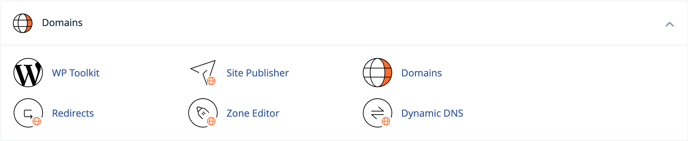

The cPanel Domains tool allows you to manage your domains, subdomains, alias domains, and also contains other domain-related functions such as redirects and zone file editing.

## WordPress Toolkit
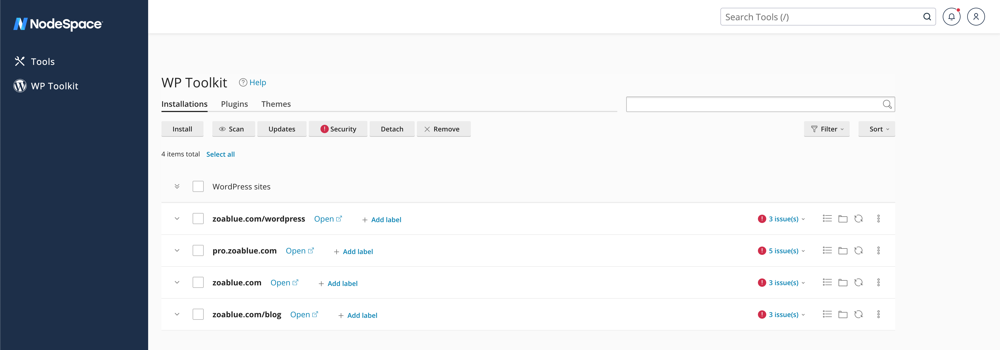

The WordPress Toolkit allows you to manage your WordPress installations, plugins, themes, and more. It also allows you to manage your WordPress installations' security, performance, and more. You can install WordPress, clone WordPress, and even manage your WordPress installations' staging environments. The WordPress Toolkit is a very powerful tool that allows you to manage your WordPress installations with ease.

!!! note
    NodeSpace offers WordPress Toolkit Deluxe for free with all of our cPanel hosting plans.

??? note "For Resellers:"
    All of our reseller cPanel servers also include the WordPress Toolkit Deluxe for free. You can enable this feature for your customers by going to **WHM > Feature Manager** and adding the **WordPress Toolkit** feature to your feature list. Some resellers use this feature as a selling point for their customers, and some resellers choose to disable this feature for their customers. It is completely up to you. We also offer Softaculous WordPress Manager as well, and some resellers choose to use that instead of the WordPress Toolkit and use the WordPress Toolkit as an upsell.

### Installing WordPress
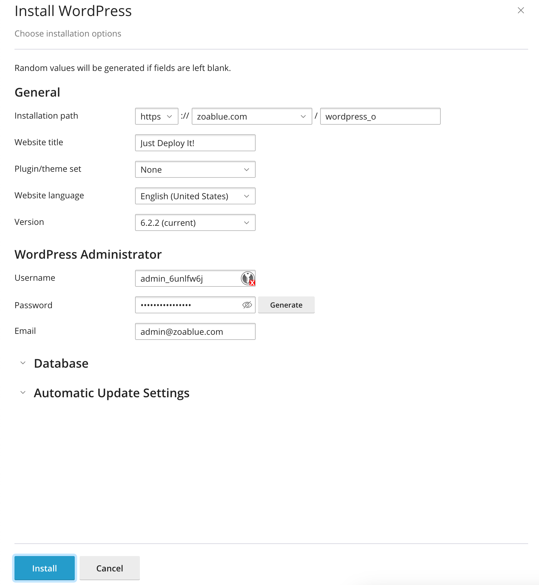

To install WordPress, click on the **Install** button in the WordPress Toolkit. You will be presented with a form to fill out with the details of your WordPress installation. Once you have filled out the form, click **Install** and WordPress will be installed for you.

There are some additional options that can help you install or configure WordPress.

#### Plugin/Theme Set

The plugin/theme set field allows you to install a set of plugins and themes when you install WordPress. You can choose from a few different sets, or you can choose "none" and you will have a stock WordPress installation.

| Set | Description |
| --- | ----------- |
| None | Installs a stock WordPress installation. |
| WordPress Essentials | Installs: <ul><li>WP Super Cache</li><li>Yoast SEO</li><li>Contact Form 7</li><li>Limit Login Attempts Reloaded</li><li>Site Kit by Google – Analytics, Search Console, AdSense, Speed</li></ul> |
| E-Commerce Pack | Installs: </ul><li>WP Super Cache</li><li>Yoast SEO</li><li>Contact Form 7</li><li>Limit Login Attempts Reloaded</li><li>WooCommerce</li><li>WooCommerce Stripe Payment Gateway</li><li>WooCommerce Menu Cart</li><li>Site Kit by Google – Analytics, Search Console, AdSense, Speed</li></ul> |
| WordPress Classic | Installs: <ul><li>Classic Editor</li></ul> |
| Jetpack | Installs: <ul><li>Jetpack</li></ul> |
| WordPress Essentails with Jetpack | Installs: <ul><li>WP Super Cache</li><li>Yoast SEO</li><li>Contact Form 7</li><li>Limit Login Attempts Reloaded</li><li>Site Kit by Google – Analytics, Search Console, AdSense, Speed</li><li>Jetpack</li></ul> |
| E-commerce Pack with Jetpack | Installs: <ul><li>WP Super Cache</li><li>Yoast SEO</li><li>Contact Form 7</li><li>Limit Login Attempts Reloaded</li><li>WooCommerce</li><li>WooCommerce Stripe Payment Gateway</li><li>WooCommerce Menu Cart</li><li>Site Kit by Google – Analytics, Search Console, AdSense, Speed</li><li>Jetpack</li></ul> |
| WordPress Classic with Jetpack | Installs: <ul><li>Classic Editor</li><li>Jetpack</li></ul> |

#### Version

The version field allows you to install a specific version of WordPress. You can choose from a few different versions, or you can choose "latest" and you will have the latest version of WordPress installed.

!!! warning
    You should only install an older version of WordPress if you have a specific reason to do so. You should always install the latest version of WordPress. Older versions of WordPress may have security vulnerabilities that have been patched in newer versions.

#### Database
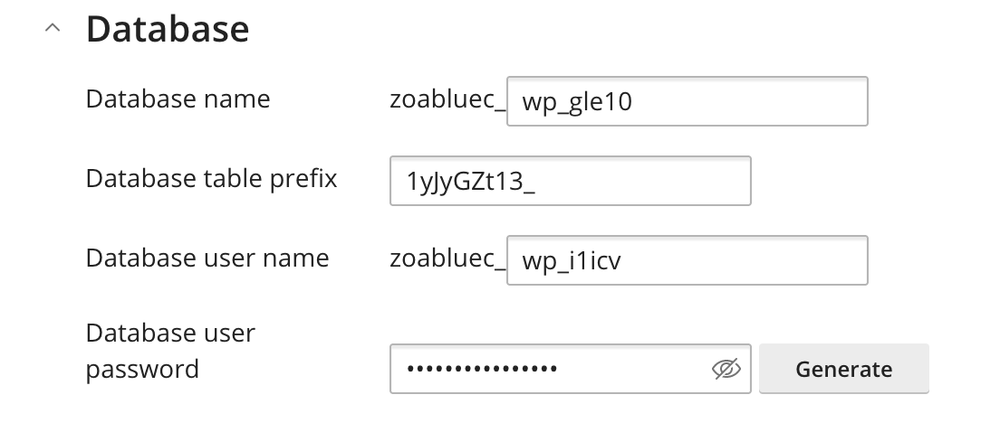

The database section will allow you to adjust the settings for the WordPress database. 

| Setting | Description |
| ------- | ----------- |
| Database Name | The name of the database that WordPress will use. This is randomly generated for security purposes. |
| Database Table Prefix | The prefix that will be used for the database tables. This is randomly generated for security purposes. |
| Database User Name | The user that will be created and assigned to the database. |
| Database User Password | The password that will be assigned to the database user. **A secure password is randomly generated. You should not change this.** |

!!! warning "Security Note"
    These items are randomly generated for security purposes. It's recommended that you do not change these values. In most circumstances, it does not matter what these values are. Using the generated values helps prevent attacks on your WordPress installation using security through obscurity. This makes automated attacks more difficult.

#### Automatic Update Settings
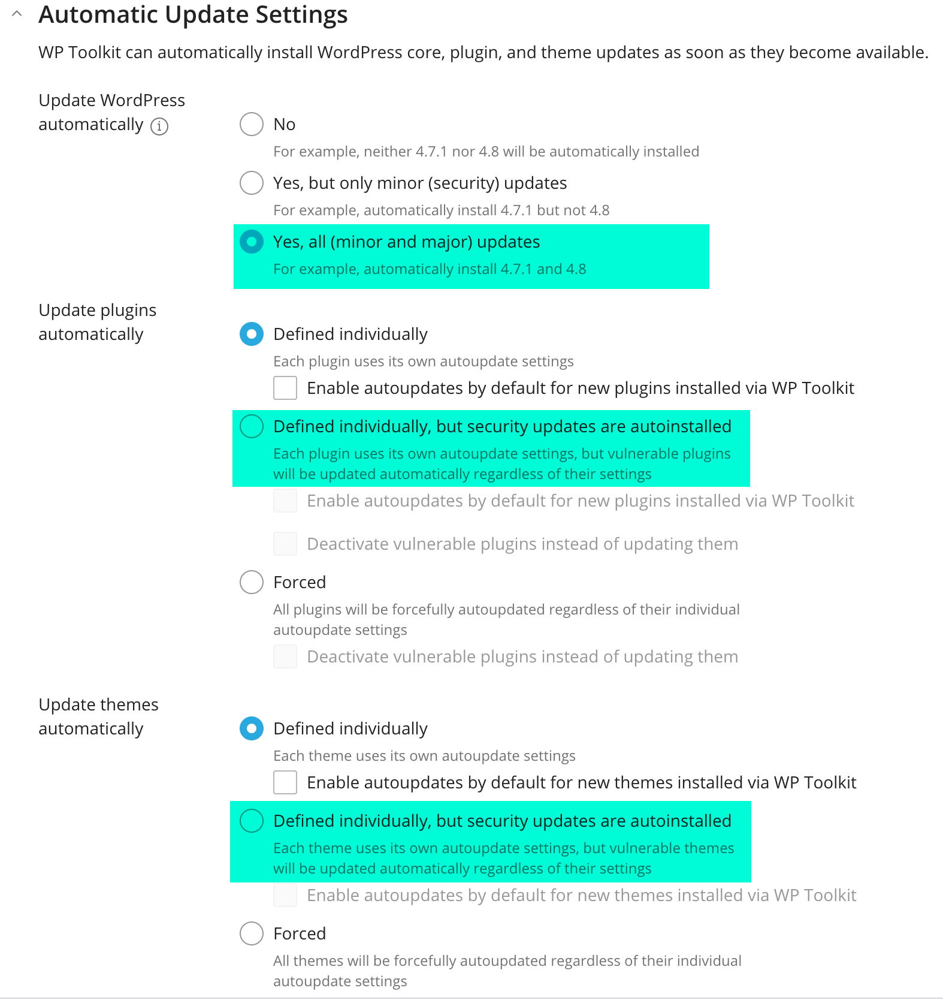

The automatic update settings section allows you to configure how WordPress will be updated. You can choose to automatically update WordPress, plugins, and themes. You can also choose to automatically update WordPress, plugins, and themes only when a minor version is available. You can also choose to disable automatic updates.

We've highlighted the recommended settings in the screenshot above. We recommend that you automatically update WordPress for all minor and major versions. Security updates are usually pushed in both minor and major versions. Major versions may also include new features. If you need to make sure you stay on a major version (e.g. 6.1.1 but *not* 6.2.0 or 7.0.0), then at a minimum, you should automatically update WordPress for minor versions (e.g. 6.1.1 or 6.1.2).

Plugins and themes are sometimes tied into the major version of WordPress. Therefore, we suggest that you define each plugin and theme individually, but security updates are autoinstalled. This will make sure you have the ability to test your plugins and themes before updating them, but if a security update is released, it will be automatically installed to prevent your site from being compromised.

!!! warning "Automatic Updates Helps Mitigate Security Risks"
    Like with any software, automatic updates can help mitigate security risks - it doesn't eliminate them or guarantee that your site will not be compromised. It's important to keep your WordPress installation, plugins, and themes up to date. It's also important to make sure you have a backup of your site in case something goes wrong.

### Finding WordPress Installations

If you already have WordPress installed but you do not see it in the WordPress Toolkit, you can click on the **Scan** button to scan for WordPress installations. This will scan your account for WordPress installations and add them to the WordPress Toolkit.

### Mass Updates & Mass Updates Settings

If you have a large number of WordPress sites, you can use the **Updates** button to update all of your WordPress installations at once. You can also use the **Updates** button to update all of your plugins and themes at once. Additionally, you can use the **Updates** button to update the update settings for all of your WordPress installations at once.

### Security Check
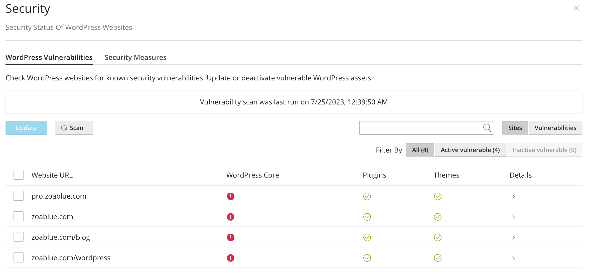

If you click on the **Security** button, you will be presented with a list of vulnerable WordPress installations. It is broken down by website, and it will show you if your WordPress Core, Plugins, and Themes have any known vulnerabilities. If you see a green checkmark, that means there are no known vulnerabilities in that section. If you see a red exclamation point, that means there are known vulnerabilities in that section. You can click on the **Details** button to see more information about the vulnerabilities.

#### WordPress Vulnerabilities
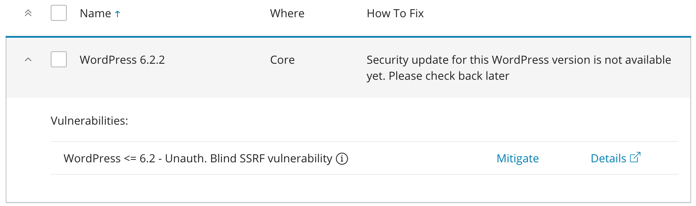
If there are any known vulnerabilities in your WordPress Core, clicking the details section will show you a list of the vulnerabilities and how to fix them. Some vulnerabilities can be fixed by updating WordPress, while others may require you to update your PHP version or update your server's software. 

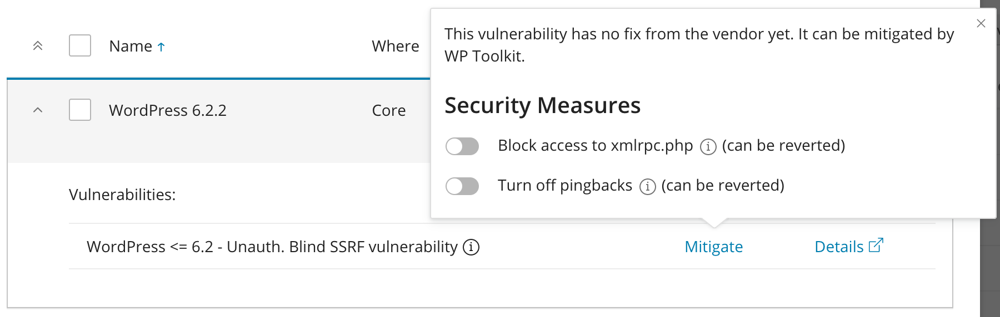

If you click on the **Mitigate** link, you will be presented with a list of steps to mitigate the vulnerability. You can click on the slider to apply the mitigation steps.

### Detach WordPress Installation

If you place a check in the box next to an installation and click on **Detatch**, you will be prompted if you want to detatch the installation from WordPress Toolkit. If you click **Yes**, the installation will be removed from WordPress Toolkit. This will not remove the WordPress installation from your account. It will only remove it from WordPress Toolkit.

#### Re-attach WordPress Installation

If you have detached a WordPress installation, you can re-attach it by going to the [File Manager](cpanel-files.md#file-manager) and navigating to the WordPress installation's directory. You will see a file called `.wp-toolkit-ignore`. If you delete this file, the WordPress installation will be re-attached to WordPress Toolkit when you click on the **Scan** button.

### Remove WordPress Installation

If you place a check in the box next to an installation and click on **Remove**, you will be prompted if you want to remove the installation from WordPress Toolkit. If you click **Yes**, the installation will be removed from WordPress Toolkit and the WordPress installation will be removed from your account. This will delete all files and databases associated with the WordPress installation. **This cannot be undone. Make sure you have a backup of your WordPress installation before removing it.**

### Manage an Installation
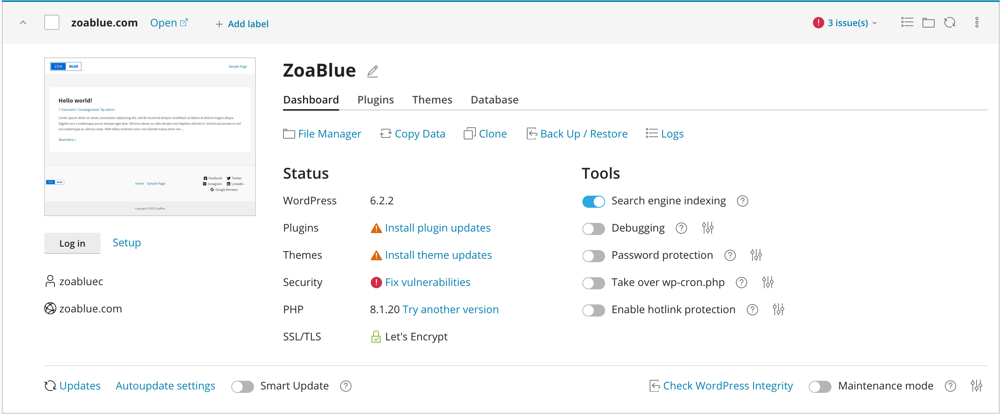

If you click on the down arrow next to your domain name, you will be able to manage your WordPress installation. You will see a screenshot of your website. Directly below the screenshot, you will see a **Log in** button. Clicking on this button will take you to the WordPress admin panel. You will also see a **Setup** link. The setup link will allow you to reset the password for the main admin user as well as change the administrator's email. 

There are a few different tabs with options for managing your WordPress installation. We will go over each tab below.

#### Dashboard

The Dashboard tab contains quick links to the File Manager, copy data to or from this site, cloning this site (create a staging site), backing up or restoring this site, and viewing the site's logs.

The Status column shows you the status of your WordPress installation. You can see your installed WordPress version, if there are any plugin updates available or any vulnerabilities, if there are any theme updates available or any vulnerabilities, and if there are any security recommendations. You will also see the version of PHP that is running and the status/issuer of your SSL certificate.

The Tools column will give you quick access to enable/disable search engine indexing, debug mode, password protection, taking over the wp-cron.php, and enabling hotlink protection.

| Tool | Description |
| ---- | ----------- |
| Search Engine Indexing | This will allow you to enable or disable search engine indexing. If this slider is ON, then search engines can index your site. |
| Debugging | This will allow you to enable or disable debug mode. Debugging is only needed if you're doing development work or trying to track down the cause of an error. Use the settings icon to adjust debugging options. |
| Password Protection | Restrict public access to your website by requiring all visitors to provide username and password. This is useful, for example, if your website is work in progress and you only want selected people to be able to view it. |
| Take Over wp-cron.php | WordPress uses its wp-cron.php file for running routine tasks like checking for updates, sending email notifications, and so on. The file is executed every time site visitor loads a page, which can be an issue if there are critical tasks that must run on time. This option will disable the default wp-cron.php execution and provide the means to create a regular scheduled task instead. |
| Hotlink Protection | Hotlink protection prevents other websites from displaying, linking or embedding your files (usually images). This practice is called hotlinking, and it can quickly drain your bandwidth and make your website unavailable. |

#### Plugins / Themes

These tabs will show you a list of your installed plugins and themes. You can update, delete, activate, or deactivate plugins and themes from these tabs. You can also install new plugins and themes from these tabs by clicking on the **Install** button. You can also manage individual settings for auto-updates for plugins and themes from these tabs. Click the **Manage in WordPress** link to manage the plugins or themes from the WordPress admin panel.

#### Database

The Database tab will show you details about the database and allow you to manage the database in phpMyAdmin.

!!! warning
    You should not make any changes to the database unless you know what you're doing. Making changes to the database can break your WordPress installation.

### Site Security/Updates
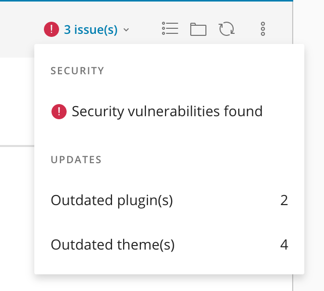

The icon in the top right corner of the WordPress card will show you if there are any security issues with your WordPress installation. If there are any security issues, you will see a red exclamation point. If there are no security issues, you will see a green checkmark. Clicking on the icon will show you a list of items that should be addressed.

### Copy Data from this Site

You can copy data from this site by clicking on the **Copy Data** link. This can be used to copy data from a staging site to a production site or from a production site to an existing staging site.

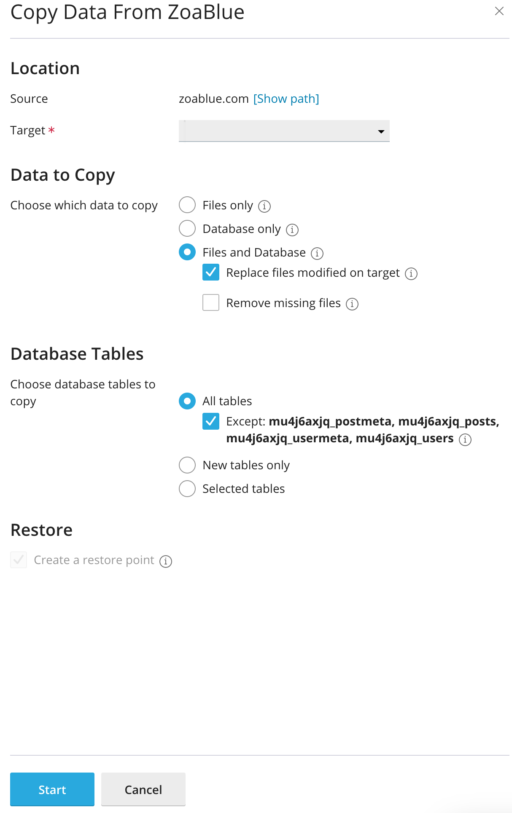

- **Source**: This is the WordPress installation you're copying from.
- **Target**: This is the WordPress installation you're copying to.
- **Data to Copy**: This is the data you want to copy. You can choose to copy the database, files, or both. If you choose to copy files, you can replace files modified on the target or remove missing files from the target. If you choose to copy the database, you can choose to copy all tables, all tables except postmeta, posts, usermeta, and users, new tables only, or selected tables. If you choose to copy selected tables, you can choose which tables to copy.
- **Create a Restore Point**: This will create a restore point before copying the data. This is useful if you need to revert the changes.

### Clone / Create Staging Site

Click on the **Clone** link to clone the WordPress installation. This will allow you to create a staging site using the existing WordPress installation. 

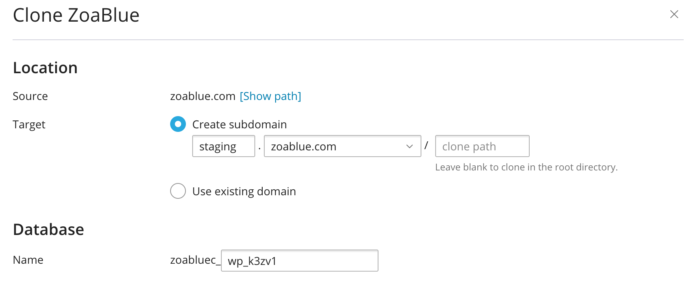

- **Source**: This is the WordPress installation you're cloning from.
- **Target**: You can create a new subdomain or use an existing domain/subdomain.
- **Database**: A new database will be created for the staging site. A random name will be generated for the database. You can change the database name if you wish.

!!! note
    Cloning a site will copy over the entire site, including the database and files - even those not part of WordPress.

### Backup / Restore

Click on the **Backup / Restore** link to backup or restore the WordPress installation. This will allow you to create a backup of the WordPress installation that will be stored in the `wordpress-backups` directory in your account. You can also restore a backup from this page by clicking on the **Restore** button (circular arrow icon). If you need to download a backup, you can click on the **Download** button (down arrow icon). Additionally, to free up disk space you can delete a backup by clicking on the **Delete** button (trash can icon).

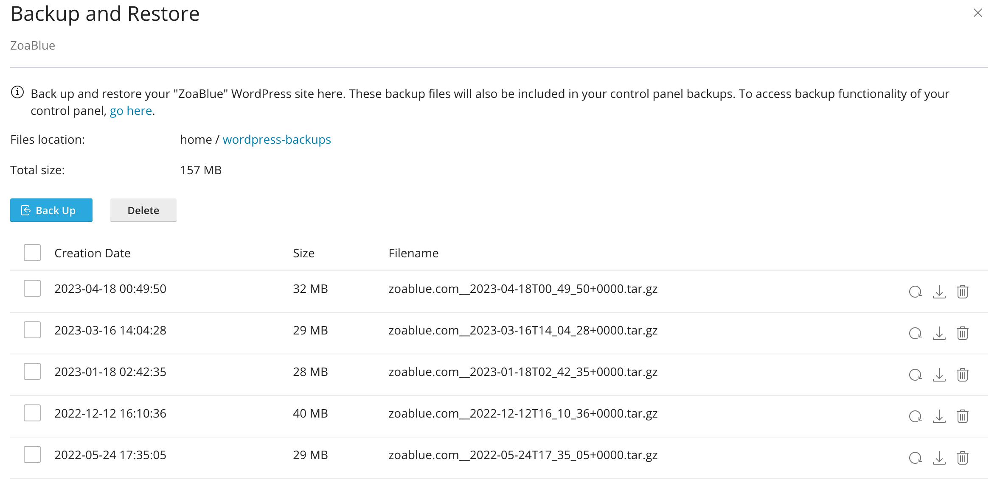

### Smart Update

Smart Update is a feature that allows you to update your WordPress installation, plugins, and themes by cloning your site, updating the clone, allowing you to test the clone, and then pushing the changes to your live site. This is useful if you want to test updates before pushing them to your live site.

This feature will also provide a report of any issues that may have occurred during the update process. This will allow you to fix any issues before pushing the changes to your live site.

### Check WordPress Integrity

This feature can help you should you suspect that your WordPress installation has been compromised or accidentally modified. It will check your WordPress installation for any changes and will report any changes that it finds. You can then reinstall the WordPress core files to fix any issues without affecting your database or other files.

### Maintenance Mode

The Maintenance Mode option allows you to place your site into maintenance mode or show a coming soon page. This is useful if you're doing maintenance on your site or if you're building a new site and you want to show a coming soon page. There are various templates and customization options available.

## Site Publisher

The Site Publisher tool allows you to create a simple website using a template. This is useful if you want to create a simple website quickly. You can also use this tool to create a simple website while you're working on a more complex website. The template can be customized in a limited fashion. You can change the title, description, and background image. You can also change the color scheme. You can also add your own content to the template.

## Domains

This section allows you to manage your domains, subdomains, and alias domains. When you click on the **Create a Domain** button, you will be presented with a form to fill out with the details of your domain. 

### Parked (Alias) Domain

Type in the domain you would like to park (make an alias of) on top of your main domain. Tick the checkbox, "Share document root" and click on Submit.

!!! note
    In order to park a domain, your domain's name servers must be pointing to your assigned name servers. If you want to park a domain that is using external DNS such as Cloudflare, please contact support and we can park the domain for you without requiring you to change your name servers.

### Addon Domain

Type in the domain you would like to add to your account. **Uncheck** the checkbox, "Share document root" and specify the directory you would like the domain to point to. Click on Submit.

!!! note
    In order to add a domain, your domain's name servers must be pointing to your assigned name servers. If you want to add a domain that is using external DNS such as Cloudflare, please contact support and we can add the domain for you without requiring you to change your name servers.

!!! note
    If your hosting plan does not allow for addon domains or you have reached your addon domain limit, you will not be able to add an addon domain. You will need to upgrade your hosting plan or remove an existing addon domain.

### Subdomain

Type in the subdomain you would like to create and **uncheck** the checkbox, "Share document root" and specify the directory you would like the subdomain to point to. Click on Submit.

!!! note
    A subdomain is created if you enter a sudomain of an existing domain on your account. For example, if you have example.com and you enter subdomain.example.com, the subdomain "subdomain" will be created. You can create a subdomain of a subdomain, a subdomain of a parked domain, and a subdomain of an addon domain.

!!! note "External DNS"
    If your DNS is hosted externally, such as Cloudflare, you will need to manually create the subdomain in your DNS zone. You will need to create an A record for the subdomain and point it to the IP address of your server. You can find the IP address of your server in the [NodeSpace Client Area](https://my.nodespace.com) by clicking on the **Services** menu and then clicking on **My Services**. Click on the **View Details** button next to your hosting account. The IP address will be listed under **Server Information**.

### Redirects

The Redirects option allows you to create redirects for your website, such as redirecting `example.com` to `www.example.com` or redirecting `example.com` to `example.net`. You can also redirect specific pages to other pages. For example, you can redirect `example.com/page1` to `example.com/page2`.

To create a redirect, select a redirect type. There are two types of redirect options:

- *Permanent (301)* - This notifies search engines and browsers that the requested page has moved to a new location. This is the most common type of redirect.
- *Temporary (302)* - This type of redirect is used for temporary purposes, for example, when a page is temporarily moved to a different location for maintenance or testing.

Next, select the domain you want to redirect. You can choose any domain or subdomain in your account or all domains.

Enter the path that you want to redirect from. For example, if you want to redirect `example.com/support` to `helpdesk.example.com`, enter `support` in the first box. The `/` implies the root of your website (e.g. `example.com/`).

Enter the URL that you want to redirect to, **including** the protocol (e.g. https://). For example, if you want to redirect `example.com/support` to `helpdesk.example.com`, enter `https://helpdesk.example.com` in the second box.

The www redirection option allows you to apply the redirect only with www, with or without www, or only without www. For example, if you select "Only redirect with www", then `www.example.com/support` will redirect to `helpdesk.example.com`, but `example.com/support` will not redirect to `helpdesk.example.com`.

The Wild Card Redirect option allows you to redirect all files within a directory to the same filename in the redirected directory. For example, if you redirect `example.com/support` to `helpdesk.example.com`, then `example.com/support/file1.html` will redirect to `helpdesk.example.com/file1.html`. This is useful if you're moving a website to a new domain and you want to redirect all of the files to the same file on the new domain.

!!! note "Redirects cannot be modified"
    Redirects cannot be modified. If you need to modify a redirect, you will need to delete the redirect and create a new one.

### Zone Editor

The Zone Editor allows you to manage your DNS records for all the domains within your account. You can quickly add A, CNAME, and MX records, get your DNSSEC settings, as well as manage the entire DNS zone file to add or update other records such as TXT, SRV, and more.

!!! warning "External DNS Users"
    If you are using external DNS such as Cloudflare, you will need to manage your DNS records in your DNS provider's control panel. You will need to create an A record for your domain and point it to the IP address of your server. You can find the IP address of your server in the [NodeSpace Client Area](https://my.nodespace.com) by clicking on the **Services** menu and then clicking on **My Services**. Click on the **View Details** button next to your hosting account. The IP address will be listed under **Server Information**.

!!! warning "Modify Records Carefully"
    Modifying, adding, or removing DNS records can cause your website or email to stop working. If you are unsure of what you are doing, please [contact us](https://my.nodespace.com/submitticket.php) for assistance.

### Dynamic DNS

The Dynamic DNS option allows you to create a DNS record that is updated automatically when your IP address changes. This is useful if you want to point a DNS record to a dynamic IP address such as a home or office internet connection. You can use this to point a subdomain to your home or office internet connection. When you create a dynamic DNS record, you will be given a web URL that you will need to configure your router with to update the IP address. 

- [OPNsense](https://docs.opnsense.org/manual/dynamic_dns.html)
- [pfSense](https://docs.netgate.com/pfsense/en/latest/book/services/dynamic-dns.html)
- [DD-WRT](https://wiki.dd-wrt.com/wiki/index.php/Dynamic_DNS)

!!! note
    Other routers may support dynamic DNS as well. Please check your router's documentation for more information. **NodeSpace does not provide support for configuring your router.**

