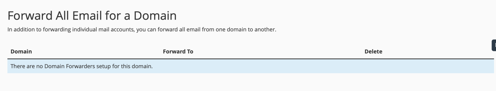
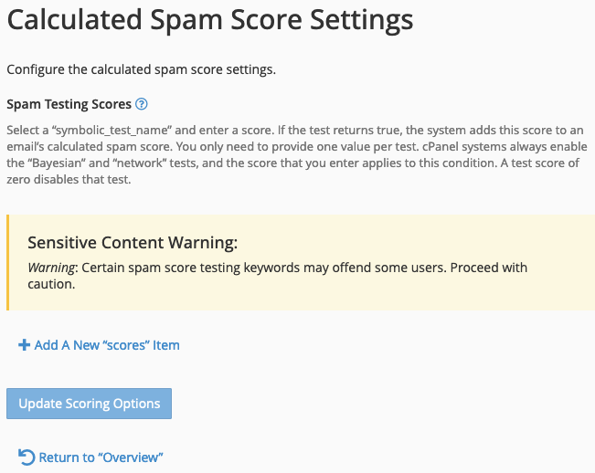

# cPanel Email

The Email section lets you manage all tools related to email with your account.

## Email Accounts

Email Accounts lets you add, remove, and restrict email accounts from within your account. By default, your account will have a system account. This `<cpanel username>@<domain>` account also doubles as a catchall email account by default. 

!!! note
    We recommend that you disable the catchall account as it can quickly use up your disk space. You can disable the catchall account by clicking on the "Manage" button next to the account and then clicking on the "Disable" button.

### Create Email Account

To create an email account, you will want to click on the Create button. When you create an account, you will be able to select a domain name, set a username, and password. You can also set a quota for the account. The quota is the amount of disk space that the account can use. If you do not set a quota, then the account will be able to use as much disk space as it wants (up to the account's disk space limit).

In most cases, just selecting a domain name (if you have more than one domain on your account), setting a username, and a password are enough. 

!!! warning
    **Help prevent spam:** select a strong password for your email accounts. Accounts that are hacked are used to send spam and our systems will suspend entire hosting accounts that are found to be sending spam.

If you want to set additional options, select Optional Settings.

You can set a quota and enable creation of folders for Plus Addressing.

!!! note
    Email accounts use your disk space quota. If your disk space quota is met, users will not be able to send or receive emails.

### Connect Email Accounts

Once you create an email account, you will want to either provide instructions for the user of the email address to connect to it or add it to programs like Microsoft Outlook or Mail on your phone. 

On the email account you want to connect, click the "Connect Devices" button. You will see several options to connect. 

Clicking on a link will automatically configure the device for the the protocol selected.

### Manual Connection Settings (Most Common)

This section shows you what settings are required to be configured to connect most email clients to the email address. 

!!! note
    We do not recommend using non-SSL/TLS settings. NodeSpace may disable insecure authentication in the future.

Enter the settings as shown. Your email application should connect.

!!! note
    You may have issues if you're using external DNS such as Cloudflare. The server name may be different than what is shown or require additional configuration. Our support team can assist.

## Forwarders

Email Account Forwarders allow you to create forwarders for either an email address or an entire domain. You can setup the appropriate type for forwarder based on what you are trying to accomplish.

Email Account Forwarders let you forward email for an email address on the system to another email address. The email address that you forward to can be external. For example, you can forward bob@example.com to bobsp@example.org. You can also forward bob@example.com to bob_smith@example.com. 

!!! note
    Forwarders do not store email. If you want to store email, you will want to use an email account.

### Create an Email Forwarder

At the top of the page, click on the Add Forwarder.

Type in the email address to forward and then select the destination. The destination can be an external email address or another email address in your account. The forwarding address does not have to exist on the system either. 

!!! note
    Forwarders can be used if you do not use a catch all address or if you want email for a certain address going to a certain account. Forwarders can be used if a user changes their name or you need to redirect email.

Advanced options allow you to forward to a system account or pipe to a program. 

!!! note
    Piping to a program is an advanced feature. 

### Email Domain Forwarders

Email Domain Forwarders allow you to forward all email for a domain to another domain. For example, you can forward all email for example.com to example.org.

To create an email domain forwarder, click on the Add Domain Forwarder button.

Enter the domain you want to forward to. For example, if you want to forward all email addresses to a new domain, enter the new domain name. 

## Email Routing

The Email Routing feature tells the system how to process email for the domain selected. Typically, this setting does not need to be adjusted or changed.

| Routing Setting | Description |
| --------------- | ----------- |
| Automatically Detect Configuration | This setting will automatically detect the best setting for your domain. |
| Local Mail Exchanger | This setting will deliver email locally if the email address exists on the system. If the email address does not exist, the email will be sent to the remote mail exchanger. |
| Backup Mail Exchanger | This setting will deliver email locally if the email address exists on the system. If the email address does not exist, the email will be sent to the remote mail exchanger. |
| Remote Mail Exchanger | This setting will deliver email to the remote mail exchanger. |

### Email Routing With Office 365/Google Workspace

If you're using Office 365, Google Workspace, or another external email provider, you should set the setting to Local Mail Exchanger. 

## Autoresponders

The Autoresponders function allows you to setup an automatic reply on an email address. Typically, this is used for out of office or vacation replies. This can also be used to send a reply that the email was received. Like for example, you can setup an autoresponder for support@example.com that thanks the user for their email and that it has been received and your team will reply to them shortly. 

### Create an Autoresponder

To create an autoresponder, click on the Add Autoresponder button.

Enter the email address you want to setup the autoresponder for. You can also select a domain if you have more than one domain on your account.

Enter the From, Subject, and Body of the autoresponder. You can use the following variables in the body of the autoresponder:

| Variable | Description |
| -------- | ----------- |
| %subject% | The subject of the email. |
| %from% | The email address of the sender. |
| %email% | The email address of the recipient. |
| %date% | The date the email was received. |
| %time% | The time the email was received. |

You can also select the start and stop time for the autoresponder. This is useful if you want to setup an autoresponder for a vacation or out of office.

## Default Address

The Default Address option works as the catchall address in cPanel. If the system receives an email for your domain and a forwarder or mailbox doesn't exist for the email, then the message will be delivered to the default address. By default, this is your cPanel's username at your primary domain name. You may want to disable this functionality or change the default address to a person or shared mailbox like info@example.com.

This mailbox can easily fill up and is one of the main contributors to running out of disk space in your account. You should check this account or delete email from it often.

!!! warning
    If you choose to forward the default account to a user, they may suddenly receive a lot of spam. Spammers will blast emails to addresses that don't exist.

!!! note
    While it's not recommended to discard the messages sent to the default address, this option can help ensure your account doesn't fill up with spam.

### Change the Default Address

To change the default address, click on the Change button.

Select the option you want to use for the default address. You can also select the Discard option to discard the email.

## Mailing Lists

Mailing Lists on cPanel are not like the traditional distribution lists you may be familiar with. The mailing lists are powered by Mailman, which is a type of list server software. While sending an email to a mailing list address will distribute it to all members, its primary function is to act like a discussion mailing list. Discussion mailing lists predate Internet forums and this is what they are still typically used for. 

### Create a Mailing List

Give your list a name and select a strong password. The list name is the email address of the list. This password is the administrator password for managing the list. Select the access type. Public means that any one is permitted to register and join the list. Private means that they must be admitted by the list administrator.

To post to the list, users send an email to the name you gave the list and the domain, just like a regular email.

### Manage a Mailing List

From the Mailing Lists page, find your existing list under Current Lists and click on Manage. If prompted, this is where you would need to enter the list password you set. 

A new browser tab will open and you'll be taken to the administrative interface for the mailing list. This interface contains a lot of different options for the list and allows you to customize a lot of different parts.

### Public Mailing List

It's important that if you make any list public, not only can members of the general public subscribe to the list, the messages posted to the list also become public and indexable by search engines. This also includes full email addresses. The following is a screenshot of an example posted to a public list.

!!! warning 
    Mailing list public archives may violate privacy laws such as GDPR. Use with caution.

## Track Delivery

The Track Delivery function allows you to see if an email was delivered or not. This is useful for troubleshooting email delivery issues. This will give you an Email Deliverability Report.

!!! note
    This is a helpful troubleshooting tool you can use to determine if an email message was delivered or not.

You can enter the recipient's email address and run a report or you can run a report for all emails. Additionally, you can run a report for just blocked and failed emails.

The information in this report can help Technical Support diagnose any issues. You can include information from this report in a ticket to assist with troubleshooting.

This report can be very technical and if you don't understand everything in the report, please open a ticket with technical support.

## Email Filters

Email filters allow you to setup rules for how email is handled. You can setup rules to delete email, forward email, or send an autoresponder. You can also setup rules to move email to a specific folder.

### Global Email Filters

This is an advanced feature that lets you take action on emails based on the rules that you setup here. Global Email Filters apply to all email accounts.

You can add multiple rules to a filter as well as different actions such as redirecting the message to another email address, discarding the message, deliver to a folder, etc.

### Email Filters

These work similarly to Global Email Filters except they apply only to the email address they're created under. Functionally, they work the same as Global Email Filters and have the same functionality. 

## Email Deliverability

!!! note
    This is different from the Track Delivery feature.

This feature will check and allow you to update your SPF and DKIM DNS records. This is important for ensuring your email is delivered and not marked as spam. If you use an external DNS service like Cloudflare, this is where you will get the records to add to your DNS. 

## Address Importer

The Address Importer allows you to import email addresses and passwords from other email providers. This is useful if you're migrating from another email provider. It also allows you to quickly on-board a large number of email accounts. 

### Importing Email Addresses

To import CSV/XLS files, certain data must be provided. You must provide the field "Email Address" and optionally "Domain", "Password", and "Quota". 

Example:

* [Download an example XLS file](resources/example_email.xls)
* [Download an example CSV file](resources/example_email.csv)

### Importing Email Forwarders

You must provide the source and destination email addresses in the fields "Email" and "Forward To", respectively.

Example:

* [Download an example XLS file](resources/example_fwd.xls)
* [Download an example CSV file](resources/example_fwd.csv)

!!! note
    These example files can also be found within the cPanel interface.

## Spam Filters

Spam Filters allow you to control how spam is handled. You can set the spam score threshold and how spam is handled. You can also whitelist and blacklist email addresses and domains.

The spam filtering is powered by SpamAssassin. SpamAssassin is a powerful spam filtering tool that uses a variety of methods to determine if an email is spam or not. It uses a scoring system to determine if an email is spam or not. The higher the score, the more likely it is spam. For additional guidance, you can read the [SpamAssassin documentation](https://spamassassin.apache.org/). SpamAssassin is a very powerful tool and can be customized to your needs. The default cPanel configuration is a good starting point and will work for most users.

### Overview

The Overview tab gives you a quick overview of the current configuration. You can also enable or disable SpamAssassin from this tab.

!!! note
    It's not recommended to disable SpamAssassin.

By default, "Move New Spam to a Separate Folder (Spam Box)" is enabled. This will move any emails that are marked as spam to a folder called "spam" in your email account. You can access this folder via webmail or an email client. You can also enable "Automatically Delete New Spam (Auto-Delete Spam)" to automatically delete any emails marked as spam. This is not recommended as it can result in false positives and legitimate emails being deleted.

### Spam Box Settings

This tab allows you to configure how the spam folder is handled. You can enable or disable the spam folder. The system will automatically send messages that have a spam score of 5 or higher to the spam folder. 

!!! note
    You can configure the spam score threshold on the Score tab.

You can also use this itnterface to clear the spam folder for the main email account. You can also empty the spam folder for all email accounts. 

### Auto-Delete Settings

This tab allows you to configure how spam is handled. You can enable or disable the auto-delete feature. If enabled, any emails that have a spam score of 5 or higher will be automatically deleted. This is not recommended as it can result in false positives and legitimate emails being deleted. However, if you do wish to enable it, we recommend using a higher threshold such as 10 or 15 as the likelihood of false positives is lower.

### Additional Configuration (Advanced)

This section contains advanced configuration options. You should not need to change any of these settings. If you do, please contact technical support for assistance or read the [SpamAssassin documentation](https://spamassassin.apache.org/). Misconfiguration of these settings can result in false positives and legitimate emails being marked as spam or legitimate emails not being received by your users.

!!! warning "Inclusivity language"
    The following section contains language that may be considered offensive. This language is used in the SpamAssassin documentation and is not our own. Projects like SpamAssassin are open source and we do not control the language used in the documentation and many are working to change this language. We are working to change this language in our documentation as well. We use the language in the documentation to ensure accuracy and to avoid confusion. As the language is updated, we will update it here. We apologize for any offense this may cause. Please read our [Diversity & Inclusion Statement](../../diversity.md) for more information.

#### Whitelist

Email addresses and domains listed here will not be marked as spam. You can add email addresses and domains to the whitelist by clicking the "Add A New "whitelist_from" Item" button. You can also add email addresses and domains to the whitelist by clicking the "Configure SpamAssassin" button on the Overview tab.

#### Blacklist

Email addresses and domains listed here will be marked as spam. You can add email addresses and domains to the blacklist by clicking the "Add A New "blacklist_from" Item" button. You can also add email addresses and domains to the blacklist by clicking the "Configure SpamAssassin" button on the Overview tab.

#### Calculate Spam Score

This option allows you to change or add values to spam scoring.

!!! warning
    This section may contain offensive language. If you are not comfortable reading this language, please contact support for assistance.

## Encryption

The Encryption interface allows you to manage GnuPG encryption keys for your email accounts. GnuPG is a free and open-source implementation of the OpenPGP standard. It allows you to encrypt and sign your email messages. The encryption works by generating both a private and public key. The public key is typically uploaded to public key servers or shared with others. The private key is kept secret and is used by you to decrypt messages sent to you or verify the messages received if they are signed.

### Generate a New Key

!!! note
    If you plan on using the webmail interface only and not using an email client, you can use this tool to create a GnuPG key pair. If you plan on using an email client, you should generate a key locally on your computer and import it. You can also import an existing key pair if you already have one.

When you generate a new key, you will need to provide your name, email address, a comment or nickname, a key passphrase for the private key, an expiration date of the public key (which this can be extended without generating a new key unlike SSL certificates), and the key size. The larger the key size, the more secure it is. However, larger keys take longer to generate and use more resources. We recommend using a key size of 2048 or 4096. 2048 is the default and is still considered secure. Never generate a key size less than 2048.

### Import a Key

If you already have a key, you can import it. You will need to provide the key and the passphrase for the key. You can generate a key locally on your computer using a tool like [GPG Suite](https://gpgtools.org/) or [GnuPG](https://gnupg.org/). If you plan on using an existing key and not using the webmail interface, you do not need to upload a key. You can simply continue using the key locally on your computer's email client.

## BoxTrapper

!!! warning
    The BoxTrapper interface is not recommended for most users. It is not recommended to enable BoxTrapper unless you are familiar with it and understand how it works. It can result in legitimate emails being blocked and not delivered to your users. It can also result in legitimate emails being delayed. If you do not understand how BoxTrapper works, please do not enable it. It can also result in your domain being added to blocklists.

!!! note
    You should probably use the [Spam Filters](#spam-filters) interface instead of BoxTrapper. It is much easier to use and does not have the same issues as BoxTrapper.

BoxTrapper is an email verification system that requires anyone who sends you an email to verify that they are a real person and not a spammer. When someone sends you an email, they will receive an email asking them to verify that they are a real person. They will need to click a link in the email to verify that they are a real person. Once they verify, their email will be delivered to your inbox. If they do not verify, their email will be deleted after a set period of time. You can also whitelist email addresses and domains so that they are not required to verify.

You can already probably see the problem with this system. While it may seem like a good idea, it can result in legitimate emails being blocked or delayed. It can also result in your domain being added to blocklists. This is because it can confuse senders and they may end up marking your email as spam or blocking your domain. It can also result in legitimate emails being delayed as the sender may not see the verification email or may not understand it. It can also result in legitimate emails being deleted if the sender does not verify within the set period of time.

### Enable BoxTrapper

To enable BoxTrapper, click the "Manage" button next to the email account you wish to enable it for. Then click the "Enable" button.

### Configure BoxTrapper

Once enabled, you can configure BoxTrapper by clicking the "Manage" button next to the email account you wish to configure it for. You can then configure the settings for BoxTrapper. There are several main options:

- Configure Settings
- Edit Confirmation Messages
- Edit White/Black/Ignore Lists
- Forward List
- Review Log
- Review Queue

#### Configure Settings

The Configure Settings section allows you to set email addresses for the account. For example, if the account has alias addresses, they can be added here. You can then add Your Name so that the confirmation email messages are personalized. Further, you can adjust the number of days you wish to keep logs and messages in the queue and configure the minimum Apache SpamAssassin score required to bypass BoxTrapper.

!!! warning
    It's never a good idea to reply to spam messages. But setting the minimum score can help ensure that fully legtimate email never sees the BoxTrapper system.

You can also enable automatic whitelisting and choose to automatically whitelist the *To* and *From* lines from whitelisted senders ("whitelist by association").

#### Edit Confirmation Messages

BoxTrapper has several messages that are sent to senders. You can edit these messages here. You can also edit the subject line of the messages.

- blacklist - This message is sent to senders who are blacklisted.
- returnverify - This message is sent in reply to a verification request and did not contain the verification code.
- verifyrelease - This message is sent in reply to a verification request and contained the verification code and the sender is then added to the whitelist.
- verify - This message is sent when a sender is not on the whitelist and they send an email to the account. It contains a verification code that the sender must click to verify that they are a real person.

#### Edit White/Black/Ignore Lists

You can edit the white, black, and ignore lists here. You can add email addresses and domains to the lists. You can also remove email addresses and domains from the lists. You can use Perl-formatted regular expressions to match email addresses and domains. For example, you can use `subject I Love You` to match all email messages with the subject "I Love You". You can use `from .+\@example\.com` to match all email messages from the example.com domain.

#### Forward List

The Forward List is a list of email addresses to which whitelisted and verified email should be sent, in addition to the address BoxTrapper is protecting. For example, if you have a support email address that is protected by BoxTrapper, you can add your personal email address to the Forward List so that you receive the emails as well.

#### Review Log

The Review Log shows all of the emails that have been sent to the account and their status displayed by day. You can see if they were verified, whitelisted, blacklisted, or ignored. You can also see if they were deleted or forwarded. You can also see the date and time the email was received and the date and time the email was deleted or forwarded.

#### Review Queue

The Review Queue shows all of the emails that are currently in the queue. You can see the sender, subject, date and time received, and the date and time the email will be deleted if it is not verified. You can also see the status of the email. You can also delete emails from the queue as well as whitelist and deliver them automatically. This is useful for emails that you know are legitimate and do not want to wait for the sender to verify or are sent from an automated system that cannot verify.

## Email Disk Usage

The Email Disk Usage interface allows you to see how much disk space each email account is using. You can also see how much disk space each folder is using. This can help you determine which email accounts and folders are using the most disk space. You can then delete emails from those accounts and folders to free up disk space.

