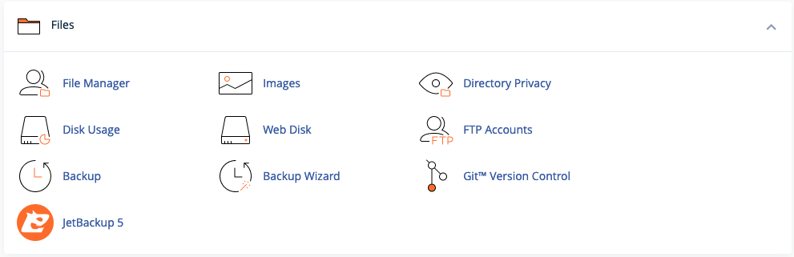
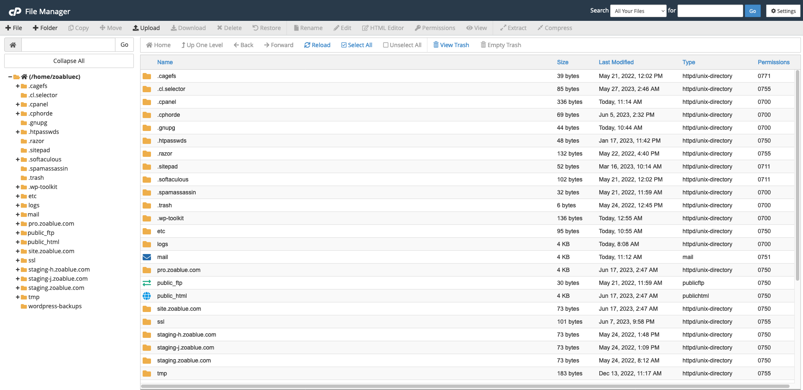
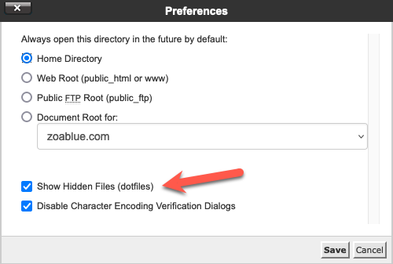
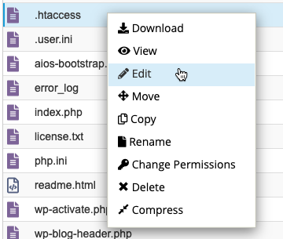
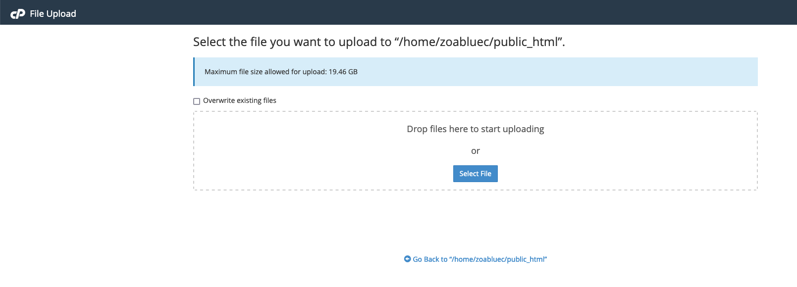
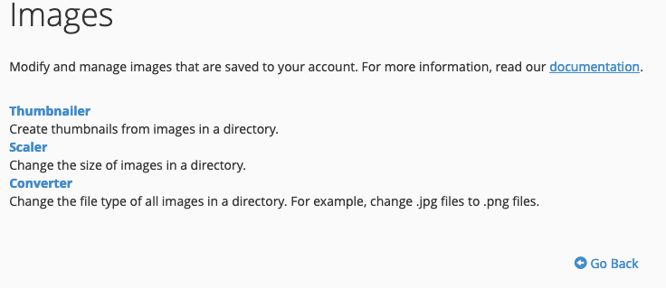
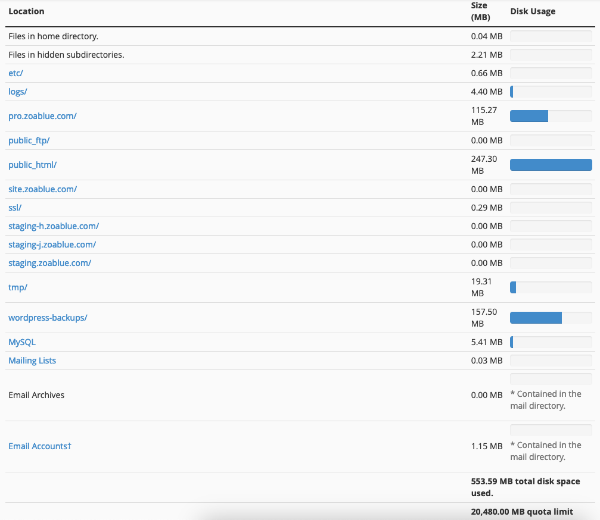
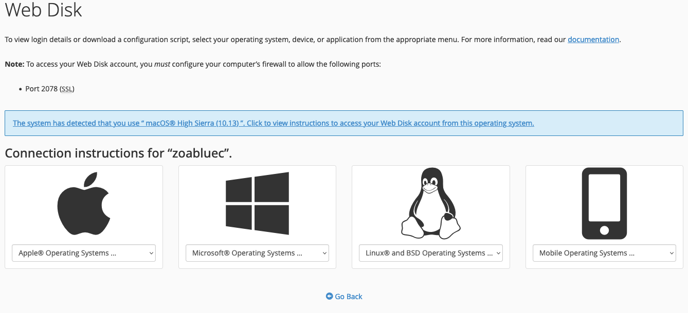
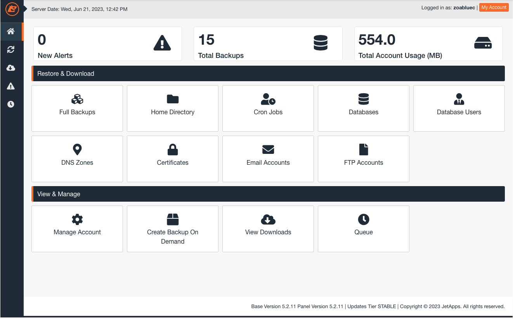

# cPanel Files

This section contains tools for managing your files. You can upload files, create files, and manage your files. You can also manage you disk usage, backups, directory privacy, and more.

!!! note
    This section displays the third-party backup tool "JetBackup". This may not be available on your account.

## File Manager

The File Manager allows you to manage your files. You can upload files, create files, and edit your files from your web browser. The File Manager is a very powerful tool and can be used to manage your files without the need for a third-party FTP client. It makes it easy to manage your files from anywhere.

### Hidden Files

By default, the File Manager does not display hidden files. You can enable hidden files by clicking the "Settings" button in the top right corner of the File Manager and then checking the "Show Hidden Files (dotfiles)" checkbox.

As soon as this is enabled, you should see all hidden files in your account, including the `.htaccess` file.

### Edit Files

You can edit files by right clicking on the file and then clicking "Edit". This will open the file in a text editor. You can make changes to the file and then click "Save Changes" to save the file.

Editing the file will open the file in a web-based text editor that is source code aware. This means that it will highlight the syntax of the file and make it easier to edit the file. It will also provide general warnings about potential issues with the file. For example, if you are editing a PHP file and forget to add a semicolon at the end of a line, it will warn you about this. Remember that this is not a full-fledged IDE so the warnings and help will be limited.

### Upload Files

You can upload files by clicking the "Upload" button in the top left corner of the File Manager. This will open a new window where you can drag and drop files to upload them. You can also click the "Select File" button to select files to upload.

If you are uploading files that might have the same name and you want to overwrite them, don't forget to check the "Overwrite existing files" checkbox. Otherwise the files will be uploaded with a number appended to the end of the file name.

### Create Files and Folders

You can create files and folders by clicking the "New File" or "New Folder" buttons in the top left corner of the File Manager. This will open a new window where you can enter the name of the file or folder. You can also create files by right clicking on a folder and then clicking "New File". You can create folders by right clicking on a folder and then clicking "New Folder".

When you create a file or folder, you will need to provide a name for it. You can also provide a path for the file or folder. If you do not provide a path, the file or folder will be created in the current directory. If you provide a path, the file or folder will be created in the specified directory. You can also provide a file extension for the file. If you do not provide a file extension, the file will be created without a file extension.

### Copy and Move Files and Folders

You can copy and move files and folders by right clicking on the file or folder and then clicking "Copy" or "Move". This will open a new window where you can select the destination directory. You can also copy and move files and folders by dragging and dropping them to the destination directory.

### Rename Files and Folders

You can rename files and folders by right clicking on the file or folder and then clicking "Rename". This will open a new window where you can enter the new name for the file or folder. You can also rename files and folders by clicking the "Rename" button in the top left corner of the File Manager.

### Delete Files and Folders

You can delete files and folders by right clicking on the file or folder and then clicking "Delete". This will open a new window where you can confirm the deletion. You can also delete files and folders by clicking the "Delete" button in the top left corner of the File Manager. When you delete items, they will go to a trash folder. You can restore items from the trash folder or permanently delete them. The trash folder is located at `/.trash`. You also have the option to permanently delete items when you delete them.

!!! warning "Trash items count towards your disk usage"
    Items in the trash folder count towards your disk usage. If you are running out of disk space, you should empty your trash folder.

### Compress Files and Folders

You can compress files and folders by right clicking on the file or folder and then clicking "Compress". This will open a new window where you can select the compression type. You can also compress files and folders by clicking the "Compress" button in the top left corner of the File Manager. When you compress items, they will be compressed into a zip file. You can then download the zip file and extract it on your computer.

### Extract Files and Folders

You can extract files and folders by right clicking on the file or folder and then clicking "Extract". This will open a new window where you can select the extraction type. You can also extract files and folders by clicking the "Extract" button in the top left corner of the File Manager. When you extract items, they will be extracted into a folder with the same name as the zip file. You can then delete the zip file.

### Change Permissions

You can change the permissions of files and folders by right clicking on the file or folder and then clicking "Change Permissions". This will open a new window where you can select the permissions. You can also change the permissions of files and folders by clicking the "Change Permissions" button in the top left corner of the File Manager. When you change the permissions of a file or folder, you can select the permissions for the owner, group, and others. You can also select whether to apply the permissions recursively to all files and folders in the directory.

### View File Details

You can view the details of files and folders by right clicking on the file or folder and then clicking "View". This will open a new window where you can view the details of the file or folder. You can also view the details of files and folders by clicking the "View" button in the top left corner of the File Manager. When you view the details of a file or folder, you can view the file size, permissions, owner, group, and last modified date.

### Search Files and Folders

You can search for files and folders by clicking the "Search" button in the top left corner of the File Manager. This will open a new window where you can enter the search term. You can also search for files and folders by right clicking on the file or folder and then clicking "Search". When you search for files and folders, you can search for files and folders by name, size, permissions, owner, group, and last modified date.

### HTML Editor

You can edit HTML files by right clicking on the file and then clicking "HTML Editor". This will open a new window where you can edit the HTML file. You can also edit HTML files by clicking the "HTML Editor" button in the top left corner of the File Manager. When you edit an HTML file, you can edit the HTML file in a web-based HTML editor. This editor will highlight the syntax of the HTML file and make it easier to edit the file. It will also provide general warnings about potential issues with the file. For example, if you forget to close a tag, it will warn you about this. Remember that this is not a full-fledged IDE so the warnings and help will be limited. This will also give you a WYSIWYG editor to edit the HTML file. This will allow you to see what the HTML file will look like when it is rendered in a browser.

!!! note
    This editor is not a full website builder. It is only meant to be used to edit HTML files.

## Images

The images tool allows you to modify and manage images in your account. You can access the images tool by clicking the "Images" button in the "Files" section of the cPanel home screen.

### Thumbnailer

The thumbnailer tool allows you to create thumbnails of images. When you access the tool, you will navigate to a folder where images are stored. Then you can run the Thumbnailer tool to create thumbnail images.

### Scaler

The scaler tool allows you to resize images. When you access the tool, you will navigate to a folder where images are stored. Then you can run the Scaler tool to resize images.

### Converter

The converter tool allows you to convert images to different formats. For example, if you have a bunch of JPG images you wish to convert into PNG, this tool can easily convert them. When you access the tool, you will navigate to a folder where images are stored. Then you can run the Converter tool to convert images.

## Directory Privacy

This tool allows you to set a password to protect certain directories. When you access the tool, you will see a list of directories. You can click on a directory to set a password for it. You can also click on a directory to remove the password for it. When this is enabled, anyone who tries to access the directory will be prompted for a username and password. If they do not enter the correct username and password, they will not be able to access the directory.

## Disk Usage

This tool allows you to view the disk usage of your account. When you access the tool, you will see a list of directories and the amount of disk space they are using. You can click on a directory to view the disk usage of that directory. You can also click on a directory to view the disk usage of all subdirectories of that directory. This is a useful tool for helping you determine what is using up the most disk space in your account.

## Web Disk

The Web Disk tool allows you to access your account's files as if they were on your computer. When you access the tool, you will see a list of directories. You can click on a directory to view the files in that directory. You can also click on a file to download it. You can also click on a file to edit it. 

You will also need to create a special web disk account to use this feature. By default, your main cPanel account username and password can access the web disk. You should create additional users if others will be using this tool or you want to restrict where they are able to access.

### Connect to Web Disk

Click on the "Configure Client Access" link under Actions next to the web disk account you wish to connect to. This will open a new window where you can download the configuration file. You can then use this file to connect to the web disk.

cPanel will attempt to detect the operating system you are using and provide you with the appropriate configuration file. If it does not detect your operating system correctly, or you are configuring access for a different system, you can use the drop down link for each appropriate system.

!!! note "macOS 10.14 and later"
    If you are using macOS 10.14 or later, you will need to use the "macOS 10.13 High Sierra" configuration. If you are using an older version, use the appropriate configuration for your version.

## FTP Accounts

The FTP Accounts tool allows you to create and manage FTP accounts. When you access the tool, you will see a list of FTP accounts. By default, you will see your main cPanel account's FTP account. You can create additional FTP accounts by clicking the "Add FTP Account" button. You can also delete FTP accounts by clicking the "Delete" button next to the FTP account you wish to delete. Special FTP accounts, like the main cPanel account's FTP account, cannot be deleted. Web Disk accounts will also appear in this list as they are a type of FTP account.

### Create an FTP Account

You can create a FTP account so that you don't have to use your main cPanel account's FTP account. This is useful if you want to give someone access to your account but don't want to give them access to your main cPanel account. You can also create FTP accounts for different directories. This is useful if you want to give someone access to a specific directory but not the entire account.

On the FTP Accounts page, add a log in. This will resemble an email address but it is not an email address. It is just a username. Then enter a password. You can use the password generator to generate a strong password. Then enter the directory you want the FTP account to have access to. If you want the FTP account to have access to the entire account, enter a forward slash (/). Then click the "Create FTP Account" button.

### Delete an FTP Account

You can delete an FTP account by clicking the "Delete" button next to the FTP account you wish to delete. Special FTP accounts, like the main cPanel account's FTP account, cannot be deleted.

## Backup

The Backup tool allows you to create and restore backups of your account. There are several types of backups available in this tool. You can generate a Full Backup, a Home Directory Backup, a MySQL Database Backup, or a Partial Backup. You can also restore backups from this tool.

!!! note
    Full Account backups are not able to be restored from this tool. If you need to have a full account backup restored, please contact support.

### Full Backup

From the Backup page, click on the "Download a Full Account Backup" button. If a full account backup does not exist, you can generate a full backup. You will need to select a destination for the backup. 

- Home Directory: This will place the full backup in your home directory. You can then download it from the File Manager or via FTP. Keep in mind that this will use up disk space in your account so make sure you have enough space available.
- Remote FTP Server: This will place the full backup on a remote FTP server. You will need to enter the FTP server's information. You will also need to enter the directory you want the backup to be placed in. You will also need to enter the username and password for the FTP server. You can also enter a port number if the FTP server uses a non-standard port. Keep in mind that this will use up disk space on the FTP server so make sure you have enough space available.
- Remote FTP Server (Passive Mode Transfer): This will place the full backup on a remote FTP server using passive mode. Passive mode is useful if you are having trouble connecting to the FTP server.
- Secure Copy (SCP): This will place the full backup on a remote server using SCP. You will need to enter the remote server's information. You will also need to enter the directory you want the backup to be placed in. You will also need to enter the username and password for the remote server. You can also enter a port number if the remote server uses a non-standard port. Keep in mind that this will use up disk space on the remote server so make sure you have enough space available.

!!! note
    Typically, placing the backup in the home directory is fine as long as you download it and remove it from your account. If you are having trouble downloading the backup, you can place it on a remote FTP server or remote server using SCP.

You can then enter an email address which will receive a notification as soon as the backup is completed. If you don't want to receive a notification, select the "Do not send email notification of backup completion" option. Then click the "Generate Backup" button.

### Home Directory Backup

The home directory backup will download a snapshot of your account's files. This is useful if you want to download a copy of your account's files. You can then use this backup to restore your account's files if they are lost or corrupted. 

#### Home Directory Backup Restore

You can restore this type of backup yourself by uploading the .tar.gz file under the "Restore a Home Directory Backup" heading. Just browse to the location of the file on your local machine and then upload it. Once uploaded, cPanel will automatically process the backup and restore your account's files. 

!!! warning
    This will overwrite all files in your home directory. If you do not wish to overwrite all files in your home directory, you will need to extract the backup and upload the files you wish to restore manually.

### MySQL Database Backup

The MySQL Database Backup will download a snapshot of the database that you select. You can then use the Restore a MySQL Database Backup tool to restore the database if it is lost or corrupted. You can also use this backup to restore a database with phpMyAdmin.

### Email Forwarders 

You can click on the domain name to download a copy of any email forwarders you have set up. You can then use this backup to restore your email forwarders if they are lost or corrupted. You can also use this backup to restore email forwarders with the Import Forwarders tool.

### Email Filters

You can click on the filter name to download a copy of any filters setup. You can then use this backup to restore your email filters if they are lost or corrupted. You can also use this backup to restore email filters with the Import Filters tool.

## Backup Wizard

This utility is a lot like the Backup tool except that it will ask you a series of questions and then generate a backup based on your answers. This is useful if you are not sure what type of backup you need to generate. It will also allow you to generate a backup of your email forwarders and email filters. It will also help you restore a backup you downloaded.

!!! note
    The Backup Wizard cannot restore full account backups. If you need to restore a full account backup, please contact support.

## Git Version Control

The Git Version Control tool allows you to create and manage Git repositories. You can create a new repository, import an existing repository, or clone an existing repository. You can also manage existing repositories by renaming them, deleting them, or changing their permissions. This is useful if you want to use Git to manage your website's files. Managing your site with Git is an advanced topic and is out of scope for this documentation. If you need help with this, please contact support.

## JetBackup 5

!!! note
    JetBackup 5 is a *third-party tool* and may not be available on your plan.

JetBackup 5 is a backup tool that enables the self-service of your backups. You can restore and download backups of your full account, home directory, cron jobs, databases, database users, DNS zones, SSL certificates, Email Accounts, and FTP accounts. 

!!! note
    NodeSpace specifically retains only 15 days of backups. If you need to restore a backup that is older than 15 days, please contact support.

Backups created and managed by JetBackup are based on the schedule that NodeSpace has setup. If you want to create your own full backup on demand, you should use the [Backup tool](#backup).

### Restore a Backup

If you need to restore all or part of your account, you can use either the full account restore or home directory restore. The full account restore will restore all of your account's files, databases, email accounts, and DNS zones. The home directory restore will restore only your account's files.

#### Full Account Restore

To restore your full account, click on the "Full Account Restore" button. You will then be presented with a list of available backups. Select the backup you wish to restore and then click the "Restore" button. You will then be presented with a list of items that can be restored. Select the items you wish to restore and then click the "Restore" button. You also have the option to restore the backup by merging backup data with live account data. If this is enabled, then files that exist in your account already will have their contents merged with the contents from the backup. This may have unintended consequences. If you are unsure, leave this option disabled. When you click on the "Restore" button, the restore process will be placed in queue. You can monitor the progress of the restore by clicking on the "Restore Queue" button.

#### Home Directory Restore

The Home Directory Restore feature will allow you to selectively restore individual files and folders in your account as well as your entire home directory. To restore, click on the "Home Directory Restore" button. You will then be presented with a list of available backups. Select the backup and then click on "Change Files Selection" if you want to selectively restore files and folders. If you click on Change Files Selection, a window will come up that will allow you to select files and folders. Click on the option to Show Hidden Files in order to view files like .htaccess. 

Once you have made your selections, click on the "Restore" button. The restore process will be placed in queue. You can monitor the progress of the restore by clicking on the "Restore Queue" button.

#### Other Restores

You can also restore other items like databases, email accounts, and DNS zones. To restore these items, click on the appropriate button. You will then be presented with a list of available backups. Select the backup and then click on the Restore button. The restore process will be placed in queue. You can monitor the progress of the restore by clicking on the "Restore Queue" button.

!!! note
    Be careful when performing restores of DNS Zones and certificates. Restoring these items may cause your website to go down. If you are unsure, please contact support. In most cases, it may just be easier to re-add the DNS zone or re-issue the certificate.

### Download a Backup

You can download a backup of your full account, home directory, databases, email accounts, and DNS zones. To download a backup, click on the appropriate button. You will then be presented with a list of available backups. Select the backup and then click on the "Download" button. The backup will then be downloaded to your local machine.

Dowloaded backups will be available for 30 days after they are downloaded. After that, they are deleted permanently.

### Create Backup On Demand

If you need to create a full backup before making changes to your account, you can do so by clicking on the "Create Backup On Demand" button. You will then be presented with a list of items that can be backed up. Select the items you wish to backup and then click the "Create Backup" button. The backup will then be placed in queue. You can monitor the progress of the backup by clicking on the "Backup Queue" button.