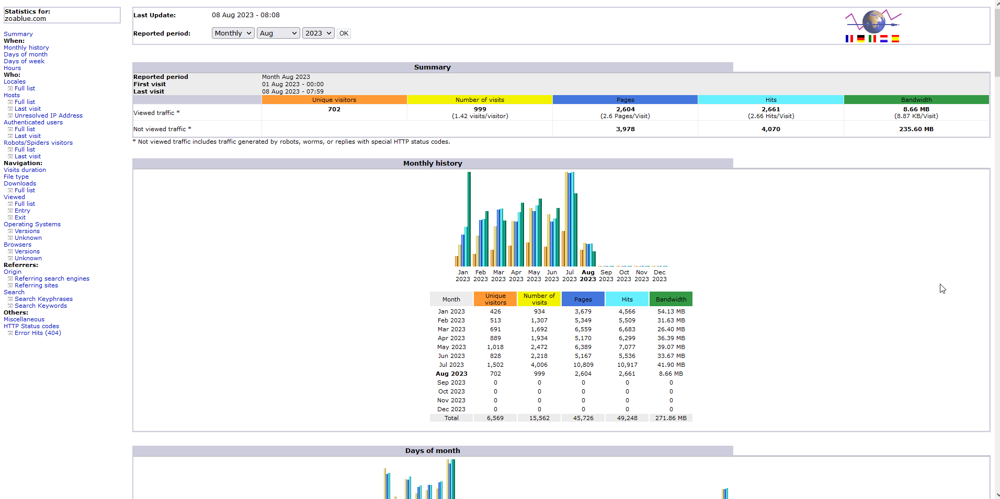
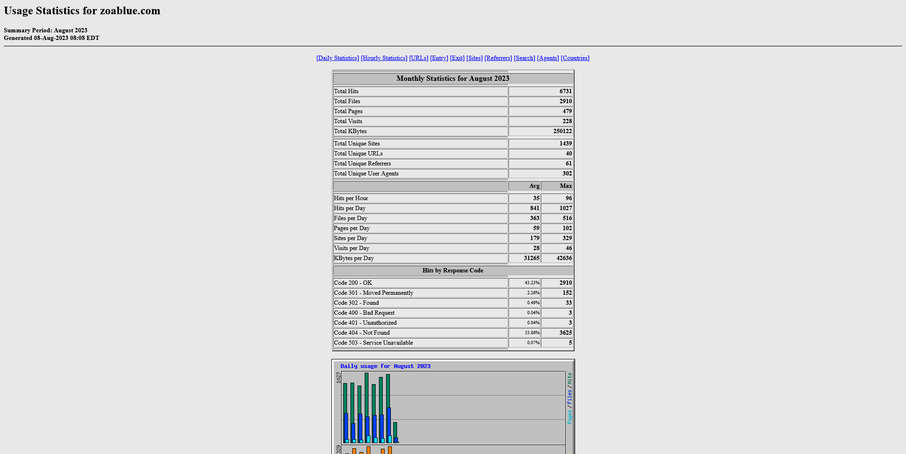

# cPanel Metrics

The metrics section provides you tools that you can use to monitor and track your website's performance, errors, resources usage, and more.

## Visitors

The Visitors tool is a visor log viewer that will allow you to view the latest visitors to your website and details about their visit. For example, the server logs:

- The visitor's IP address
- The date and time of the visit
- The page that the visitor visited
- The size of the page (in bytes)
- The user agent of the visitor's browser

You can use this tool to search for specific visitors or specific URLs. You can also filter the results by date and time.

## Errors

This tool will provide you with a list of web server error log messages and the latest suEXEC event log messages. This can be helpful for troubleshooting issues that cause server errors.

!!! note
    Web server errors are errors logged by Apache. If you need to debug issues with a PHP application, you will need to use the PHP error log instead.

## Bandwidth

This section will show you the bandwidth usage for your website. You can view the bandwidth usage for the current month, or you can view the bandwidth usage for previous months.

The graphs on this page will break down bandwidth usage by service. For example, you can see how much bandwidth was used by HTTP, FTP, and SMTP.

!!! note
    Bandwidth usage resets on the first day of each month, regardless of when your billing cycle starts.

## Raw Access

The Raw Access tool will allow you to download the raw access logs for your website. You can download the logs for the current month, or you can download the logs for previous months. Raw access logs are exactly what they sound like: raw logs of all the requests made to your website. These logs are not very useful on their own, but they can be used with third-party tools to generate reports.

## Awstats

Awstats is a popular log analyzer that can be used to generate reports from your web server logs. Awstats is a very powerful tool that can be used to generate reports on a wide variety of metrics, including:

- Number of visits
- Number of unique visitors
- Number of pages
- Bandwidth usage
- HTTP status codes
- Operating systems
- Browsers
- Referrers
- Search engines
- Search keywords
- Hits by hour and day

Please keep in mind that modern web browsers may not provide all information to the web server so some information within Awstats may be inaccurate or missing.

## Analog Stats

Analog Stats is another popular log analyzer that can be used to generate reports from your web server logs. Analog Stats formats data a little different than Awstats, but it provides many of the same metrics.

## Webalizer

Webalizer is another popular log analyzer that can be used to generate reports from your web server logs. Webalizer provides the stats in a more graphical format than Awstats or Analog Stats that some users may find easier to read and understand. Webalizer provides many of the same metrics as Awstats and Analog Stats.

## Metrics Editor

The metrics editor shows you which programs are available for viewing log files. 

!!! note
    The settings here are not editable. If you need to change a setting, you will need to open a support ticket for assistance.

## Resource Usage

!!! note
    This tool is only available to hosting accounts on servers running CloudLinux. If you do not see this tool, your account is not on a CloudLinux server. You can request a migration, but keep in mind that this may require you to change your hosting plan.

The Resource Usage tool will show you how much CPU, memory, and disk space your account is using. You can also view the entry processes and number of processes that your account is using.

The Dashboard tab will let you know if your site encountered any issues over the last 24 hours. If you see any issues, you can click the View Details button to see more information about the issue.

### Current Usage

This section will show you historical trends about CPU usage, physical memory usage, I/O usage, I/O operations, Entry Processes, number of processes, and any faults that have occurred.

Faults are when your website has reached the limit of the resources that are available to it. For example, if your website has reached the maximum number of processes that it can use, any additional processes will be considered a fault. Some faults are normal, but if you see a lot of faults, you may need to upgrade your hosting plan. You can also use the information in this section to determine if you need to optimize your website.

If you have questions about the information in this section, please contact our support team for assistance.

### Snapshots

This section will show you snapshots of HTTP requests, MySQL queries, and CPU usage. You can use this information to determine if your website is using more resources than it should be. If you see a lot of HTTP requests or MySQL queries, you may need to optimize your website or upgrade your hosting plan.

