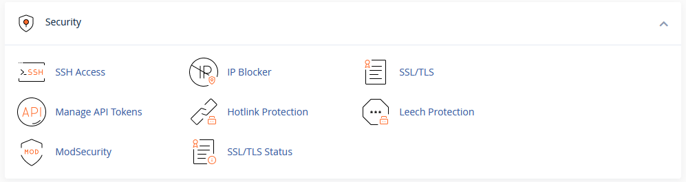

# cPanel Security

The Security section of cPanel allows you to manage the security of your account and website. 

!!! note
    This section only applies to your hosting account and basic website security. It does not prevent bad code, hackers, or other issues that may affect your website. If you need assistance with your website security, please contact our support team for assistance.

## SSH Access

Some users may need to access their account via SSH. SSH is a secure protocol that allows you to access your account via the command line. This section allows you to manage the SSH keys on your account. 

!!! note
    Not all hosting plans allow SSH access. If you do not see this section, your hosting plan does not allow SSH access. You can upgrade your hosting plan to allow SSH access from the Upgrade/Downgrade section in the [My NodeSpace](https://my.nodespace.com) client area.

## IP Blocker

The IP Blocker allows you to block access to your website from specific IP addresses, ranges of IPs, and/or domain names. This can be useful if you are experiencing a lot of spam or other malicious activity from a specific IP address or network.

## SSL/TLS

This tool will allow you to manage settings related to SSL/TLS. You can use this tool to generate a free SSL certificate for your website, install a certificate that you have purchased from a certificate authority, and manage the SSL/TLS settings for your website. 

!!! note
    SSL certificates sold by NodeSpace are automatically installed and managed for you. You do not need to use this tool to install or manage your SSL certificate if you purchased it from NodeSpace.

## SSL/TLS Status

This section will show you the status of the SSL certificate installed on any domain or subdomain managed by cPanel. You can also use this tool to add, remove, or manage SSL certificates with AutoSSL.

### AutoSSL

AutoSSL is a feature that will automatically generate and install free SSL certificates for your website. AutoSSL will also automatically renew your SSL certificates before they expire. This is a great way to ensure that your website is always using a valid SSL certificate.

If you have purchased an SSL certificate from a certificate authority, AutoSSL will monitor the certificate for expiration. If you do not renew the certificate, AutoSSL will automatically replace the certificate with a free SSL certificate from Let's Encrypt. This ensures that your website will always have a valid SSL certificate.

## Manage API Tokens

!!! warning "Experimental Feature"
    This is a new feature in cPanel and may not be fully functional. Please contact our support team if you have any issues with this feature.

This tool allows you to manage API tokens for your account. API tokens are used to allow third-party applications to access your account. For example, you can use API tokens to allow a third-party application to manage your DNS records or manage your files.

## Hotlink Protection

Hotlink protection allows you to prevent other websites from linking directly to files on your website. This can be useful if you are experiencing a lot of bandwidth usage from other websites linking directly to files on your website. A common example is when another website links directly to an image on your website. When a user visits the other website, the image is loaded from your website, which uses your bandwidth. Hotlink protection will prevent this from happening by blocking the other website from loading the image.

## ModSecurity

ModSecurity is a web application firewall that can be used to protect your website from malicious activity. ModSecurity is a very powerful tool that can be used to protect your website from a wide variety of attacks. ModSecurity is enabled by default on all hosting accounts. If you are experiencing issues with ModSecurity, you can disable it here.

!!! warning
    Disabling ModSecurity can leave your website vulnerable to attacks. If you disable ModSecurity, you should make sure that you have other security measures in place to protect your website.

    Instead of disabling ModSecurity, you can also bypass specific rules that are causing issues. This will allow you to keep ModSecurity enabled while still allowing your website to function properly.

## Leech Protection

Leech protection allows you to prevent users from sharing their login information with other users. This can be useful if you are experiencing a lot of bandwidth usage from users sharing their login information with other users.

