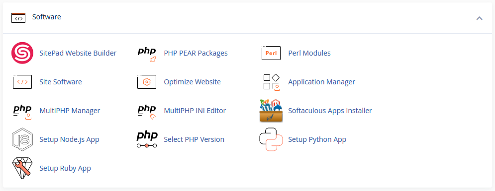

# cPanel Software

This section contains tools that will help you install and manage the software on your account and website. This is where you will also find tools that will help you build your website.

## SitePad Website Builder

!!! note
    This is a tool that is available on standard NodeSpace cPanel shared accounts at no charge. Resellers may need to purchase a license to use this tool. Please contact our support team for more information.

SitePad is a website builder that allows you to build a website without any coding knowledge. SitePad includes over 400 themes that you can use to build your website. You can also use SitePad to create a blog, photo gallery, or online store. You can drag and drop elements to create your website and SitePad will automatically build and publish your website. 

If you require more advanced functionality than SitePad provides, we offer a premium website builder for an additional fee. Please contact our support team for more information.

## PHP PEAR Packages

PHP PEAR packages are a collection of PHP libraries that can be used to add additional functionality to your website. You can use this tool to install and manage PHP PEAR packages on your account.

!!! warning "Code modification may be required"
    When you install a PHP PEAR extension or application pack, you will need to modify the code to load the extension from your account. Please contact our support team if you need assistance with this.

    **NodeSpace does not provide any coding assistance. We will help you load the module only.**

## Perl Modules

Perl modules are a collection of Perl libraries that can be used to add additional functionality to your website. You can use this tool to install and manage Perl modules on your account.

While Perl is installed and available, please understand that not all applications were designed to run in a shared hosting environment. 

## Site Software

!!! note
    This tool is not used by NodeSpace and is disabled.

## Optimize Website

!!! warning "Advanced Tool - You May Break Your Site!"
    This is an advanced tool and a wrong or improper configuration may cause your site to stop working correctly. Only use this tool if you know what you are doing.

The Optimize Website tool will allow you to compress certain types of files on your website. This can help reduce the amount of bandwidth that your website uses.

This works like sending someone a zip file. You compress the content into a zip file before you send it to them. This makes the file size smaller and faster to send. The person receiving the file will then unzip the file to access the content. This is the same concept as the Optimize Website tool. The web server will compress the data before sending it to the visitor and then the visitor's web browser will decompress the data to display it.

!!! note
    This tool will only adjusts compression for Apache. To adjust compression for PHP scripts, use [Multi-PHP INI Editor](#multi-php-ini-editor).

## Application Manager

!!! note "Only available on some plans"
    This tool is only available on some hosting plans. If you do not see this tool, your hosting plan does not support this tool. You can upgrade your hosting plan to use this tool from the Upgrade/Downgrade section in the [My NodeSpace](https://my.nodespace.com) client area.

Application Manager allows you to manage and run [Phusion Passenger](https://www.phusionpassenger.com/) applications. Phusion Passenger is a web application server that can be used to run Ruby, Node.js, and Python applications.

## MultiPHP Manager

The MultiPHP Manager allows you to manage the PHP version and settings for your website. You can use this tool to change the PHP version, enable/disable PHP extensions, and adjust PHP settings at the domain level. 

You will see a list of multiple PHP versions with different names. Some will start with "EA-PHP" and others will start with "ALT-PHP". The "EA-PHP" versions are the PHP versions that are provided by cPanel. The "ALT-PHP" versions are the PHP versions that are provided by CloudLinux. If you select an "ALT-PHP" version, the [MultiPHP INI Editor](#multi-php-ini-editor) will have no effect. You will need to use the [PHP Selector](#php-selector) to manage the PHP settings for your website.

## MultiPHP INI Editor

!!! note
    If you're using PHP Selector (an "ALT-PHP" version), this tool will have no effect. You will need to use the [PHP Selector](#php-selector) to manage the PHP settings for your website.

The MultiPHP INI Editor allows you to adjust the PHP settings for your website. You can use this tool to adjust the PHP settings for a specific domain or location. 

If you select "Home Directory", this configuration will affect your entire account - all domains and subdomains. It is recommended to just select a specific domain or subdomain and adjust the settings for that domain.

### Adjusting File Upload Limits

One of the most common reasons to adjust the PHP settings is to increase the file upload limits. By default, PHP limits the size of files that can be uploaded to 2MB. This is a very small file size and most websites will need to increase this limit.

To increase the file upload limit, you will need to adjust the following settings:

- `upload_max_filesize`
- `post_max_size`
- `memory_limit`

For example, if you want to increase the limit to 100 MB, you would set `upload_max_filesize` to `100M` and `post_max_size` to at least `125M`. Adjust the `memory_limit` to at least `128M`.

!!! tip
    The `post_max_size` value should be larger than the `upload_max_filesize` value. The `memory_limit` value should be larger than the `post_max_size` value. This ensures that the PHP settings will not cause any issues with uploading files. If you set the limit to `100M` for all settings and try to upload a 100 MB file, the `post_max_size` value may be exceeded and the upload will fail or the server may run out of memory and the upload will fail.

### Adjusting Script Execution Time

Another common reason to adjust the PHP settings is to increase the script execution time. By default, PHP limits the amount of time that a script can run to 30 seconds. This is a very short amount of time and most websites will need to increase this limit. You should only increase this limit if you are sure that your website needs more time to run a script. Increasing this limit can cause scripts with issues to hang until they reach the limit. This can cause your website to stop responding.

## Softaculous Apps Installer

The Softaculous Apps Installer allows you to install a wide variety of applications on your website. You can use this tool to install applications such as WordPress, Joomla, Drupal, and many more. You can also use this tool to manage the applications that you have installed.

This tool will allow you to easily install, update, backup, and manage different PHP software. You can also use this tool to import an existing installation of an application. For example, if you have an existing WordPress website, you can use this tool to import the website into Softaculous. This will allow you to easily update and manage the website.

## Setup Node.js App

!!! note "Only available on some plans"
    This tool is only available on some hosting plans. If you do not see this tool, your hosting plan does not support this tool. You can upgrade your hosting plan to use this tool from the Upgrade/Downgrade section in the [My NodeSpace](https://my.nodespace.com) client area.

This tool allows you to deploy a Node.js application to your website. You can use this tool to deploy a Node.js application from a Git repository or upload a ZIP file containing your Node.js application.

We have several different Node.js versions available. If you need a specific version, please contact our support team for assistance.

## PHP Selector

This is also called "Select PHP Version" in cPanel. This tool allows you to manage the PHP version and settings for your website. You can use this tool to change the PHP version, enable/disable PHP extensions, and adjust PHP settings at the account level.

### Differences Between MultiPHP Manager and PHP Selector

The MultiPHP Manager and PHP Selector are very similar tools. The main difference is that the MultiPHP Manager allows you to adjust the PHP settings for a specific domain or subdomain. The PHP Selector allows you to adjust the PHP settings for your entire account - all domains and subdomains.

The versions of PHP that are available through PHP Selector offer additional performance improvements and self-service options. We can also provide older versions as they are receiving security updated and are hardened. However, PHP Selector typically doesn't offer newer PHP versions and modules as fast as MultiPHP Manager. If you need a newer PHP version or module, you should use MultiPHP Manager.

### Switching between MultiPHP Manager and PHP Selector

You can switch between MultiPHP Manager and PHP Selector at any time. However, you should only use one tool at a time. If you use both tools, you may experience issues with your website.

First, access PHP Selector and you'll see a list with all of your domains. Select the version of PHP you would like to use and then click on the button **Use PHP Selector**. This will switch the domain to use PHP Selector. Then open MultiPHP Manager and select the domain you would like to manage. Select the "ALT-PHP" version that you selected in PHP Selector and click **Apply**. This will switch the domain to use PHP Selector.

To switch back to MultiPHP, go to MultiPHP Manager and tick the box next to the domain or subdomain. From the PHP version drop down, select the desired "EA-PHP" version and click apply.

#### Unable to switch to PHP Selector

If you are unable to switch to PHP Selector, it's probably because PHP-FPM is enabled for your domain. To check, see what logos are shown in the Handled By column in PHP Selector. If you see both cPanel and PHP-FPM, please open a support ticket and request PHP-FPM be disabled for your domain.

#### Unable to switch to MultiPHP Manager

If you're in PHP Selector and you wish to switch back to MultiPHP, check that the Handled By column is showing Cloudlinux and the **Use MultiPHP Manager** button is greyed out and disabled. If this is the case, go back to the main cPanel Tools page and go to the Software section. Click on MultiPHP Manager. Select the domain you wish to manage and select the desired "EA-PHP" version from the PHP version drop down. Click apply.

If you wish to have PHP-FPM enabled, you will need to open a support ticket and request PHP-FPM be enabled for your domain. If PHP-FPM is re-enabled, you will not be able to switch back to PHP Selector unless you get PHP-FPM disabled again.

## Setup Python App

!!! note "Only available on some plans"
    This tool is only available on some hosting plans. If you do not see this tool, your hosting plan does not support this tool. You can upgrade your hosting plan to use this tool from the Upgrade/Downgrade section in the [My NodeSpace](https://my.nodespace.com) client area.

This tool allows you to deploy a Python application to your website. You can use this tool to deploy a Python application from a Git repository or upload a ZIP file containing your Python application. 

## Setup Ruby App

!!! note "Only available on some plans"
    This tool is only available on some hosting plans. If you do not see this tool, your hosting plan does not support this tool. You can upgrade your hosting plan to use this tool from the Upgrade/Downgrade section in the [My NodeSpace](https://my.nodespace.com) client area.

This tool allows you to deploy a Ruby application to your website. You can use this tool to deploy a Ruby application from a Git repository or upload a ZIP file containing your Ruby application.