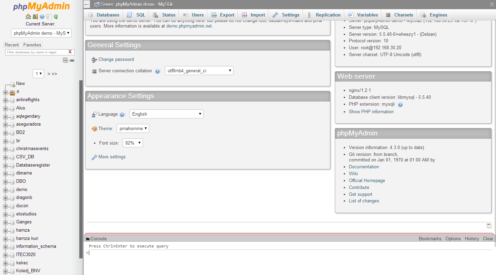

# phpMyAdmin

phpMyAdmin is a web-based application that allows you to manage your MySQL databases. This tool will allow you to create, edit, and delete databases, tables, and fields. It's also a great tool for importing and exporting databases. When you create a MySQL database in cPanel, you can perform all the advanced database management tasks using phpMyAdmin.

!!! warning
    phpMyAdmin is a powerful tool that can be used to make changes to your databases. It is recommended that you make a backup of your database before making any changes.

## Accessing phpMyAdmin

To access phpMyAdmin, you will need to log into your [cPanel](../cpanel-accessing.md) account. Once logged in, click on the **phpMyAdmin** icon under the **Databases** section. phpMyAdmin will open in a new browser tab. From here, you can select the database you want to manage from the left-hand menu. 

## Running SQL Queries

phpMyAdmin allows you to run SQL queries on your database. To run a query, click on the **SQL** tab at the top of the page. Enter your SQL query in the text box and click **Go** to run the query.

## Importing and Exporting Databases

phpMyAdmin allows you to import and export databases. To import a database, click on the **Import** tab at the top of the page. Click on the **Choose File** button and select the database file you want to import. Once you have selected the file, click **Go** to import the database.

To export a database, click on the **Export** tab at the top of the page. Select the database you want to export from the left-hand menu. Select the export method you want to use. The **Quick** method will export the database in SQL format. The **Custom** method will allow you to select the tables you want to export and the export format. Once you have selected the export method, click **Go** to export the database.

!!! note
    It may be easier to use the **Backup Wizard** in cPanel to export your database. [Read about backing up your MySQL databases](../cpanel-files.md#mysql-database-backup).