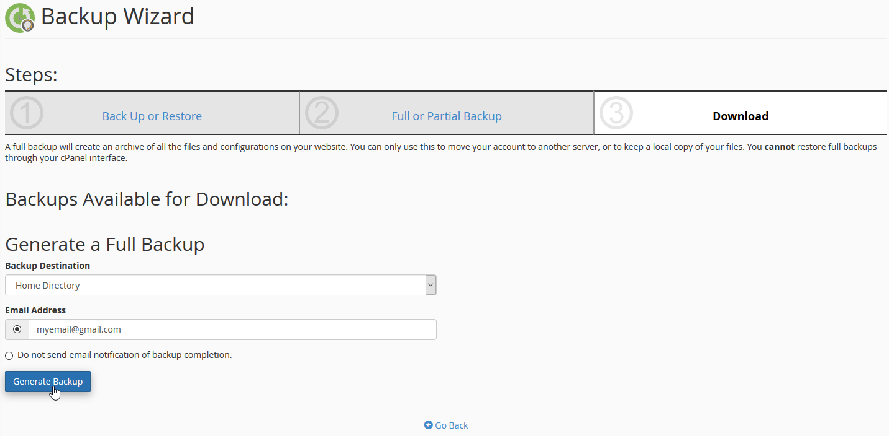

# How to move your website to NodeSpace from another hosting company (using cPanel)

!!! warning "Heads up!"
    NodeSpace offers **FREE** migration. However, we understand that there are times where you may want to do it yourself - and that's okay! We appreciate you willing to take the time to make sure everything is done to your satisfaction. As the saying goes, "if you want something done right, you have to do it yourself." So if you do wish to migrate your website yourself, awesome! If you need help, we're here to help!

Moving from one provider to another can be difficult and NodeSpace wants to make it easy. We offer two different ways to move your site. The first method (cPanel Backup Method) is the fastest and easiest way to get your new site transferred. The second method (Server to Server Transfer) is slower, but is the only option if your website is over 6 gigabytes in size.

!!! danger "Read this first!"
    Please carefully read this section. It's important to understand this information before we do anything else.

    - **Please don't cancel your website hosting from your hold hosting company just yet.** If you do need to give cancellation notice, please do so at least 5 days from when you sign up with NodeSpace. This is important because if your old host deletes your files before we can move them, you might have to build your site again from scratch or restore from the last backup you have.
    - **Please be sure to place WordPress and other dynamic websites into Maintenance Mode.** If you don't, visitors to your site who might place orders, leave comments, sign up, etc. may find that you no longer have their order, comment, registration, etc. if they access your site while the transfer is in progress.
    - **Please don't update, delete, or add content to your site while the transfer is in progress.** This is to help you prevent data loss. If you're writing an awesome article for your site and you post it while our team is moving your site to our servers, it might get left behind. We don't want you to have to work extra hard or wonder where something disappeared to. We'll let you know when it's safe to update your website again.

## cPanel Backup Method (Preferred & Fast)

!!! note
    This guide is being updated. It still requires us to restore the backup file for you.

If your old hosting company is using cPanel, it's really easy to move your site. Login to your old hosting company's cPanel and find the Backup Wizard which may look similar to this:

Keep in mind that your old host may have customized cPanel so the icons might not look like these. 

Once you find the Backup Wizard, click on it and you'll see a screen similar to this. Click on the Backup button.

On the next screen, click on the Full Backup button.

On the next screen, select Home Directory from the Backup Destination dropdown and enter your email address in the Email Address field. Then click the Generate Backup button.

Once you click the backup button, your backup will be worked on in the background. Keep an eye on your email for the notification that your backup is ready.

Once you receive the notification email, follow the instructions to download a copy of your backup file:

Typically, you will just have to go back to cPanel > Backup > Download a Full Website Backup

Click on the Download a Full Website Backup and then click on the backup file name to download the backup file.

Be sure to *save* the file (instead of opening it) to your local hard drive.

Since this file may be quite large (40 MB to over several gigabytes), you will need to find a way to transfer this file to us. [Microsoft OneDrive](https://onedrive.live.com) or [DropBox](https://www.dropbox.com) are great methods. Once you generate a link (if you permit only a specific user, please use support@nodespace.com), please provide the link in your website transfer ticket. If you have sensitive data such as data that meets PCI requirements, GDRP legislation, or other regulations, please contact our support for assistance with securely moving this data. Once you get us this data, we will import it for you.

## Server to Server Copy Method (For Large Sites over 6 GB)

Before proceeding, you will want to place your website into read only or maintenance mode. Any changes made to your site such as new user registrations, new orders, new comments posted, new blog posts posted, etc. are not guaranteed to be included in your site backup and therefore will not be there when your site is restored on our servers!

You will need to open a Site Transfer Ticket and be sure to complete as much of the information as possible that is requested in the custom fields such as FTP username and password, cPanel username and password, and any other information we need. You can use the Secure Notes section to leave us additional details such as other usernames, passwords, and server connection requirements. All these fields are encrypted in our database and once your Site Transfer Ticket is closed, the data is automatically purged from our system. We do not store sensitive information longer than we need to.

!!! note "Provide your cPanel Username & Password"
    We can typically transfer your site by using a special tool provided by cPanel if we have the server hostname, your (old) cPanel username, and your (old) cPanel password.

Once we have all the information, we will begin moving your site from your old host. Please keep in mind that if we are moving several gigabytes of data, it may take a long time to complete!