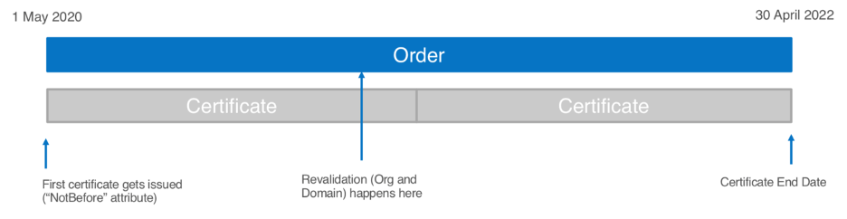

You may be aware that the maximum life of a SSL certificate is 13-months. How can we offer multi-year SSL certificates when they don't exist? You're really just paying for years 2 and 3 at a discounted price. During the term, you will need to re-validate your domain, but you will not have to buy another certificate.

Here's what this process looks like using a 2 year SSL as an example:

Your SSL gets issued once the domain validation happens. Then at 12 months, revalidation occurs. You are then issued a new certificate. After the 2 year period, your certificate expires like normally. You can either sign up for a 1 year term at the current price or elect another 2 or 3 year term and the same process will follow.