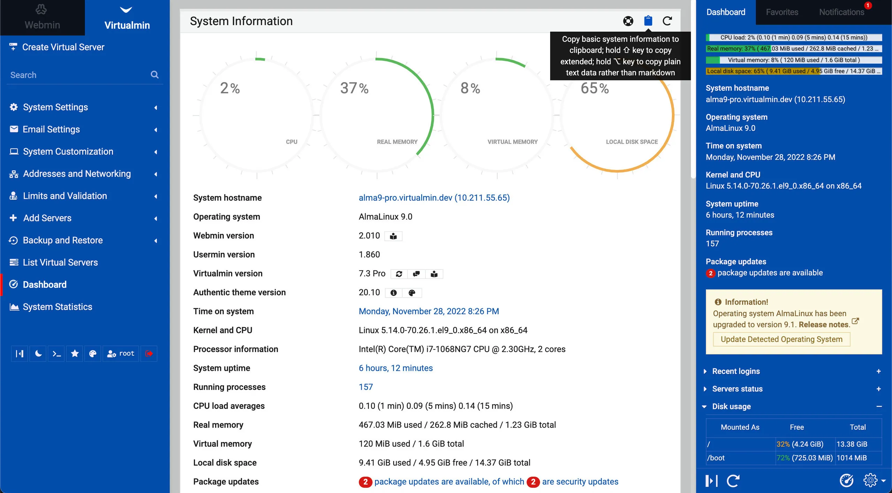

# Virtualmin

){ align=right style="width: 150px; margin: 0 0 10px 10px;" }

Virtualmin is a powerful and flexible web hosting control panel for Linux and BSD systems. Available in an Open Source community-supported version, and a more feature-filled version with premium support, Virtualmin is the cost-effective and comprehensive solution to virtual web hosting management. With Virtualmin, you can manage users, domains, email, databases, and much more.



## Supported Operating Systems

Virtualmin can be installed on basically any Linux, BSD, or UNIX system. However, the following operating systems are officially supported by the install script:

* AlmaLinux 8
* AlmaLinux 9
* Rocky Linux 8
* Rocky Linux 9
* RHEL 8
* RHEL 9
* CentOS 7
* RHEL 7
* Ubuntu 20.04 LTS
* Ubuntu 22.04 LTS
* Debian 10
* Debian 11

## Installing Virtualmin

Virtualmin provides an automated installation script that will install all of the required packages and configure Virtualmin for you. To install Virtualmin, run the following command:

```
curl -sSL wget https://software.virtualmin.com/gpl/scripts/virtualmin-install.sh | bash
```

!!! note
    You must run the installation script as `root`.

!!! note
    The installation script will install all of the required packages and configure Virtualmin for you. You do not need to install any packages or configure anything manually.

!!! note
    The installation script will take a while to complete. This is normal. Do not interrupt the installation script.

Manual installation instructions are available [here](https://www.virtualmin.com/documentation/installation/manual). You should only use the manual installation instructions if you are unable to use the automated installation script.

## Accessing Virtualmin

Once the installation script has completed, you can access Virtualmin by visiting `https://<your-server-ip>:10000` in your web browser. You will be prompted to log in with your system's `root` user and password.

!!! note
    If you are using a firewall, you will need to open port `10000` to access Virtualmin.

## Upgrade to Virtualmin Pro

Virtualmin Pro is the premium version of Virtualmin. It includes additional features and premium support. You can upgrade to Virtualmin Pro at any time by following the instructions [here](https://www.virtualmin.com/documentation/installation/upgrade).

## Using Virtualmin

If you are familiar with cPanel, you should have no trouble using Virtualmin. Virtualmin uses slightly different terminology than cPanel, but the concepts are the same. 

### Creating a Virtual Server

In Virtualmin, a virtual server is a domain. To create a virtual server, click the **Create Virtual Server** button on the left side of the page. You will be prompted to enter the domain name, username, and password for the virtual server. You can also configure additional options such as the home directory, database, and mail server.

### Managing a Virtual Server

To manage a virtual server, click the **Edit Virtual Server** button on the left side of the page. You will be presented with a list of options that you can configure for the virtual server. You can also manage the virtual server's files, databases, and email accounts.

### Creating a Sub-Server

In Virtualmin, a sub-server is a subdomain. To create a sub-server, click the **Create Virtual Server** button on the left side of the page. You will be prompted to enter the subdomain name, username, and password for the sub-server. You can also configure additional options such as the home directory, database, and mail server.

### Managing a Sub-Server

To manage a sub-server, click the **Edit Virtual Server** button on the left side of the page. You will be presented with a list of options that you can configure for the sub-server. You can also manage the sub-server's files, databases, and email accounts.

### Creating a User

To create a user, click the **Edit Users** button on the left side of the page. You will be presented with a list of users that you can manage. Click the **Add a user to this server** button to create a new user. You will be prompted to enter the user's name, username, and password. You can also configure additional options such as the home directory, database, and mail server.

### Managing a User

To manage a user, click the **Edit Users** button on the left side of the page. You will be presented with a list of users that you can manage. Click the **Edit** button next to the user you want to manage. You will be presented with a list of options that you can configure for the user. You can also manage the user's files, databases, and email accounts.

### Creating a Database

To create a database, click the **Edit Databases** button on the left side of the page. You will be presented with a list of databases that you can manage. Click the **Add a database to this server** button to create a new database. You will be prompted to enter the database name, username, and password. You can also configure additional options such as the database type and size.

### Managing a Database

To manage a database, click the **Edit Databases** button on the left side of the page. You will be presented with a list of databases that you can manage. Click the **Edit** button next to the database you want to manage. You will be presented with a list of options that you can configure for the database. You can also manage the database's tables and users.

### Creating an Email Account

To create an email account, click the **Edit Users** button on the left side of the page. You will be presented with a list of users that you can manage. Click the **Add a user to this server** button to create a new user. You will be prompted to enter the user's name, username, and password. You can also configure additional options such as the home directory, database, and mail server.

### Managing an Email Account

To manage an email account, click the **Edit Users** button on the left side of the page. You will be presented with a list of users that you can manage. Click the **Edit** button next to the user you want to manage. You will be presented with a list of options that you can configure for the user. You can also manage the user's files, databases, and email accounts.

