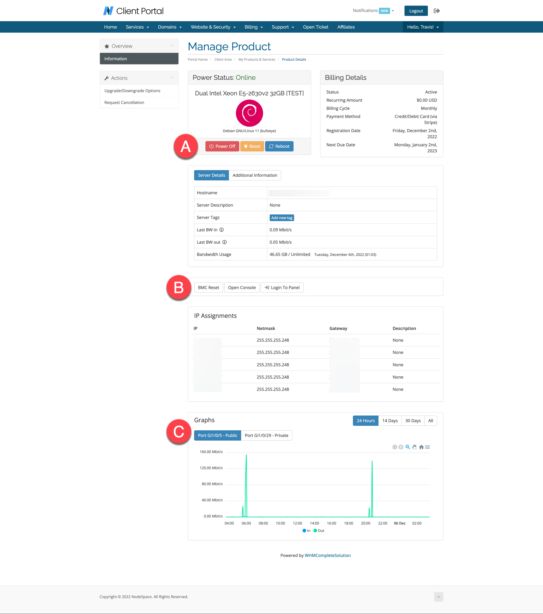

# Server Management Platform

## What is Server Management Platform?

Server Management Platform is a web-based control panel for managing your servers. It is designed to be easy to use and to provide a consistent experience across all of your servers. It manages both your [VPS](../vps/index.md) and [dedicated servers](../dedicated/index.md).

!!! note
    This is a new feature for dedicated server clients and is starting to become available for virtual server clients. Some features and functionality are not yet implemented for all server hardware models and configurations and some features may not be available in all pods.

A. This will let you quickly control the power of your server.

B. These quick actions will let you open your IPMI console, reset the BMC, and directly login to the Server Management Panel. Please note that virtual servers have a server console, but BMC reset options are not available on virtual servers.

C. Your bandwidth graphs (if enabled).