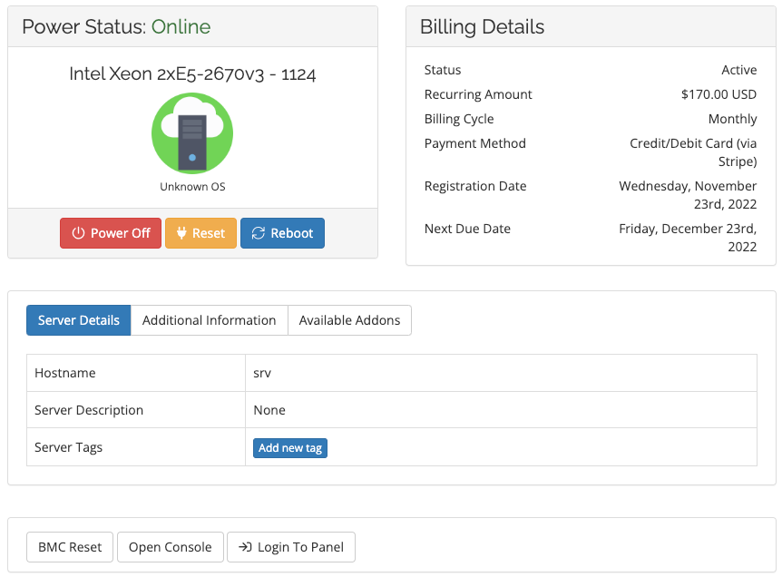

# Server is not showing bandwidth graphs

If you view your dedicated server details and do not see any bandwidth details, it means that your server is currently located in an overflow rack. Due to the configuration of overflow racks, our dedicated server management system does not have full visibility into the switches in these racks so you will see limited details. 

!!! note
    This is a temporary situation. Once your server is moved to a standard rack, you will see bandwidth graphs.

If you would like to know your current bandwidth details, please submit a support request and our team will be happy to pull bandwidth graphs for you manually. 