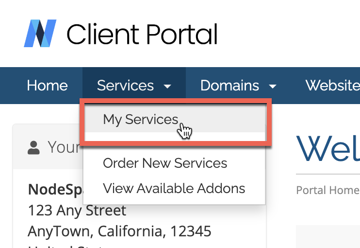
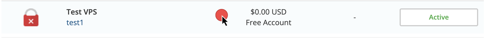
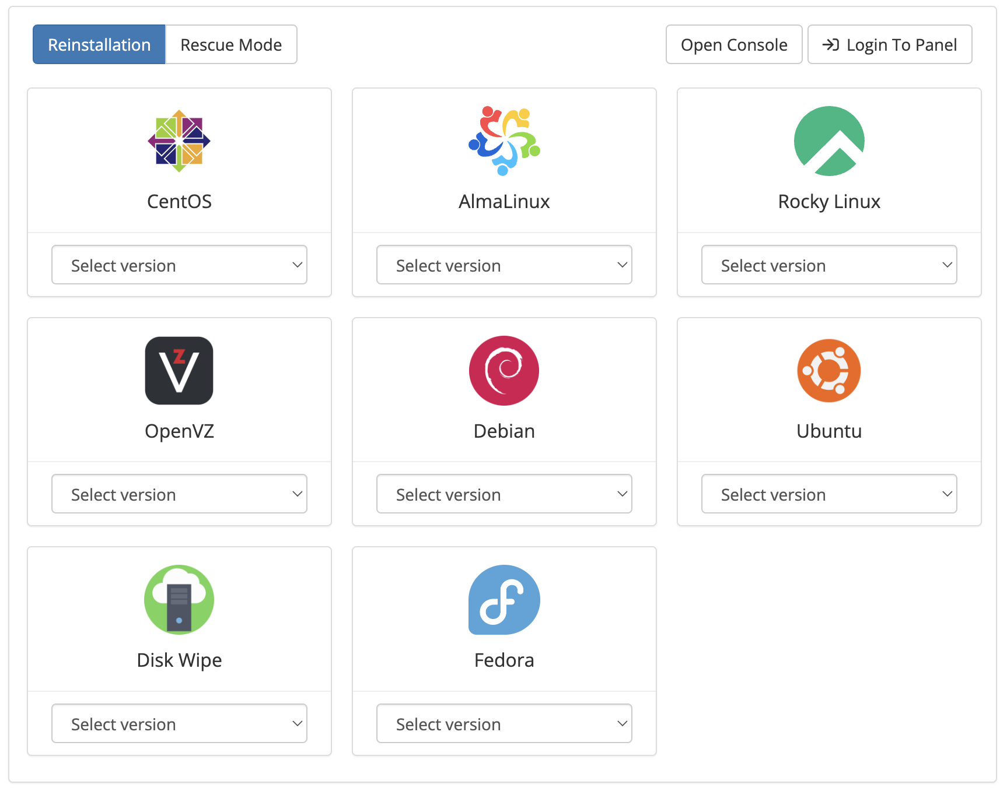
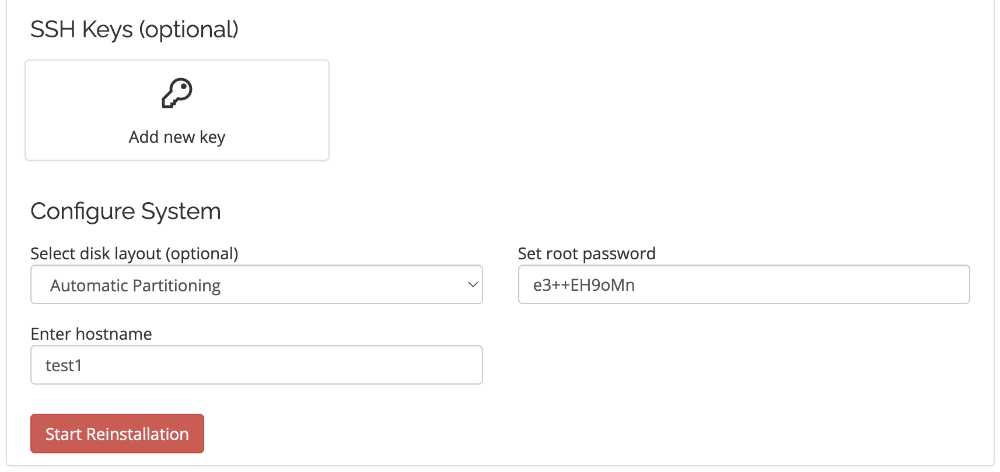
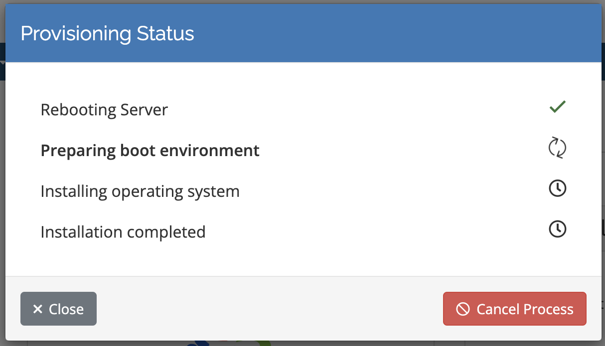

# How to OS Reload your Server

First, login to your NodeSpace Client Portal account at https://my.nodespace.com. Once you are logged in, go to your services.

=== "VPS"
    Select your Virtual Server.

    

=== "Dedicated"
    Select your Dedicated Server.

    

Under Reinstallation, select an OS and an OS version.

=== "VPS"
    

    !!! note
        If you don't see your OS of choice listed, you can contact support to have a custom installation done for you. Please note that custom installations may take longer to complete.

=== "Dedicated"
    

    If you don't see your OS of choice listed, you can use IPMI to install your OS of choice. Please see our [IPMI guide](ipmi.md) for more information.

Select an SSH key and/or a root password. Most operating systems have a default disk layout, but you can see if a custom layout is available. Click on Start Reinstallation.

You will be given a live status of the OS installation.

Closing this window or leaving this page will **not** stop the installation. You can safely navigate away from this page and come back later to check on the status of the installation.

!!! note
    Operating systems can take 10+ minutes to fully install. Please be patient.

