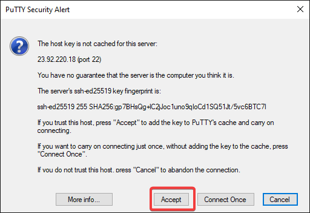

# How to connect with SSH

If you have a Linux server, you can connect to it using SSH. SSH is a secure protocol that allows you to connect to your server and run commands on it. SSH is the preferred method of connecting to your server. Follow the steps under the operating system you are using to connect to your server.

=== "Using Windows"
    Windows does not include an SSH client by default. You will need to install an SSH client to connect to your server. We recommend using [PuTTY](https://www.putty.org/). You can download PuTTY from [here](https://www.chiark.greenend.org.uk/~sgtatham/putty/latest.html).

    Once you have downloaded PuTTY, you can connect to your server by following these steps:

    1. Open PuTTY.
    2. Enter your server's IP address in the "Host Name (or IP address)" field.
    
    3. Enter your server's SSH port in the "Port" field. The default SSH port is 22.
    4. Select "SSH" as the "Connection type".
    5. Click the "Open" button.

    You will be prompted check the SSH key fingerprint. Click the "Accept" button to continue.

    

    !!! warning
        Don't blindly accept the SSH key fingerpint if you've connected to this server before and you know you have not reinstalled the operating system. 

    Next, you will be prompted to enter your username and password. Enter your username and password and press enter. You will not see your password as you type it.

    

    You should now be connected to your server.

    

=== "Using macOS"
    macOS includes an SSH client by default. You can connect to your server by following these steps:

    1. Open the Terminal application.
    
    2. Enter the following command, replacing `username` with your username and `server` with your server's IP address:
        ```
        ssh username@server
        ```
    3. Press enter.
    4. You will be prompted to accept the SSH key fingerprint. Type `yes` and press enter to continue.
    
    5. Next, you will be prompted to enter your password. Enter your password and press enter. You will not see your password as you type it.
        
    6. You should now be connected to your server.

=== "Using Linux"
    Linux includes an SSH client by default. You can connect to your server by following these steps:

    1. Open the Terminal application.
    
    2. Enter the following command, replacing `username` with your username and `server` with your server's IP address:
    ```
        ssh username@server
        ```
    3. Press enter.
    4. You will be prompted to accept the SSH key fingerprint. Type `yes` and press enter to continue.
    
    5. Next, you will be prompted to enter your password. Enter your password and press enter. You will not see your password as you type it.

    You should now be connected to your server.
    

=== "Using iOS"
    You can connect to your server using an SSH client on iOS. We recommend using [Termius](https://termius.com/). You can download Termius from the [App Store](https://apps.apple.com/us/app/termius-ssh-client/id549039908).

    Once you have downloaded Termius, you can connect to your server by following these steps:

    1. Open Termius.
    2. Tap the "+" button in the top right corner.
    3. Tap "Host".
    4. Enter your server's IP address in the "Host" field.
    5. Enter your server's SSH port in the "Port" field. The default SSH port is 22.
    6. Enter your username in the "Username" field.
    7. Tap "Save".
    8. Tap your server to connect to it.
    9. You will be prompted to accept the SSH key fingerprint. Tap "Yes" to continue.
    10. Next, you will be prompted to enter your password. Enter your password and tap "Done". You will not see your password as you type it.

    You should now be connected to your server.

=== "Using Android"
    You can connect to your server using an SSH client on Android. We recommend using [Termius](https://termius.com/). You can download Termius from the [Play Store](https://play.google.com/store/apps/details?id=com.server.auditor.ssh.client).

    Once you have downloaded Termius, you can connect to your server by following these steps:

    1. Open Termius.
    2. Tap the "+" button in the bottom right corner.
    3. Tap "Host".
    4. Enter your server's IP address in the "Host" field.
    5. Enter your server's SSH port in the "Port" field. The default SSH port is 22.
    6. Enter your username in the "Username" field.
    7. Tap "Save".
    8. Tap your server to connect to it.
    9. You will be prompted to accept the SSH key fingerprint. Tap "Yes" to continue.
    10. Next, you will be prompted to enter your password. Enter your password and tap "Done". You will not see your password as you type it.

    You should now be connected to your server.

## Setting up SSH Keys (Passwordless Login)

SSH keys allow you to connect to your server without entering a password. This is more secure than using a password, and it is also more convenient. You can set up SSH keys by following these steps based on your operating system:

=== "Using Windows"
    If you have installed PuTTY, you can use the PuTTYgen application to generate SSH keys. You can open PuTTYgen by searching for it in the Start menu.

    Once you have opened PuTTYgen, you can generate SSH keys by following these steps:

    1. Click the "Generate" button.
    2. Move your mouse around the blank area to generate randomness.
    3. Once the key has been generated, you can enter a passphrase to protect your key. This is optional, but recommended.
    4. Click the "Save public key" button to save your public key. This is the key you will add to your server.
    5. Click the "Save private key" button to save your private key. This is the key you will use to connect to your server.

    You will now need to add your public key to your server. You can do this by following the steps in the "Adding SSH Keys to Your Server" section below.

=== "Using macOS"
    You can generate SSH keys using the `ssh-keygen` command. You can generate SSH keys by following these steps:

    1. Open the Terminal application.
    2. Enter the following command, replacing `username` with your username:
    ```
        ssh-keygen -t rsa -b 4096 -C "username"
        ```
    3. Press enter.
    4. You will be prompted to enter a file to save the key in. Press enter to accept the default location.
    5. You will be prompted to enter a passphrase to protect your key. This is optional, but recommended.
    6. You will be prompted to enter the passphrase again to confirm it.
    7. Your public key will be saved in a file with the same name as the private key, but with a `.pub` extension. You will need to add this public key to your server. You can do this by following the steps in the "Adding SSH Keys to Your Server" section below.

=== "Using Linux"
    You can generate SSH keys using the `ssh-keygen` command. You can generate SSH keys by following these steps:

    1. Open the Terminal application.
    2. Enter the following command, replacing `username` with your username:
    ```
        ssh-keygen -t rsa -b 4096 -C "username"
        ```
    3. Press enter.
    4. You will be prompted to enter a file to save the key in. Press enter to accept the default location.
    5. You will be prompted to enter a passphrase to protect your key. This is optional, but recommended.
    6. You will be prompted to enter the passphrase again to confirm it.
    7. Your public key will be saved in a file with the same name as the private key, but with a `.pub` extension. You will need to add this public key to your server. You can do this by following the steps in the "Adding SSH Keys to Your Server" section below.

### Adding SSH Keys to Your Server

Once you have generated your SSH keys, you will need to add your public key to your server. Follow the steps for your operating system below:

=== "Using Windows"
    If you have installed PuTTY, you can use the PuTTYgen application to generate SSH keys. You can open PuTTYgen by searching for it in the Start menu.

    Once you have opened PuTTYgen, you can add your public key to your server by following these steps:

    1. Click the "Load" button.
    2. Select your public key file and click "Open".
    3. Click the "Save public key" button to save your public key in a format that can be added to your server.
    4. Copy the contents of the "Public key for pasting into OpenSSH authorized_keys file" box.
    5. Open Notepad.
    6. Paste the contents of the "Public key for pasting into OpenSSH authorized_keys file" box into Notepad.
    7. Save the file as `authorized_keys` in the `.ssh` directory in your home directory. For example, if your username is `username`, you would save the file as `C:\Users\username\.ssh\authorized_keys`.

    Your public key will now be added to your server. You can now connect to your server without entering a password.

=== "Using macOS"
    You can add your public key to your server by following these steps:

    1. Open the Terminal application.
    2. Enter the following command, replacing `username` with your username and `server` with your server's IP address:
    ```
    ssh-copy-id username@server
    ```
    3. Press enter.
    4. You will be prompted to enter your password. Enter your password and press enter. You will not see your password as you type it.

    Your public key will now be added to your server. You can now connect to your server without entering a password.

=== "Using Linux"
    You can add your public key to your server by following these steps:

1. Open the Terminal application.
2. Enter the following command, replacing `username` with your username and `server` with your server's IP address:
    ```
    ssh-copy-id username@server
    ```
3. Press enter.
4. You will be prompted to enter your password. Enter your password and press enter. You will not see your password as you type it.

Your public key will now be added to your server. You can now connect to your server without entering a password.

