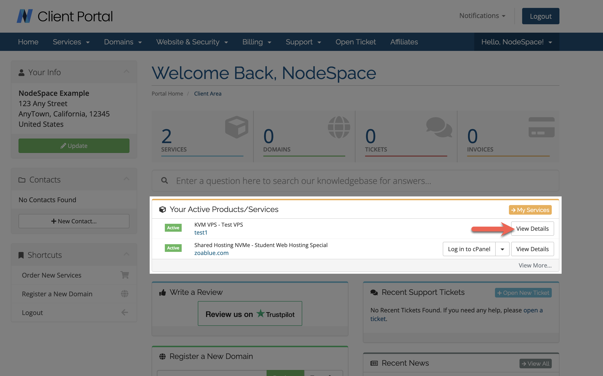

# How to manage your VPS

In order to manage your VPS, you will need to login to your Client Portal account and then select "View Details" from the list of active services.

Please reference the following overview to learn about each of the sections in detail.

A. VPS Overview

1. Operating System - This will show you the logo of the currently installed operating system.

2. Power Controls - You are able to control the power of your VPS using these buttons.

B. Server Details

1. Server Details Tab - This will show you all the details about your server.

2. Metrics Billing Tab - This will show you pricing for any metric billing (if applicable to your plan). For example, if your plan contains a bandwidth limit, this will show your current usage (updated once per day) and the price for any overages.

3. Hostname - This will show you the hostname of your server. You can click the name to change it (this will not update the hostname on your invoice or within your VPS. This is a cosmetic label.).

4. Sever Description - This field will let you add notes to remind yourself what this server does.

5. Server Tags - You can apply tags to this server.

6. Last BW In - This shows the last recorded inbound bandwidth in Mbits/s for your VPS.

7. Last BW Out - This shows the last recorded outbound bandwidth in Mbits/s for your VPS.

8. Bandwidth Usage - This is the total amount of bandwidth utilized by your VPS. It's updated once per day.

C. OS/Rescue Controls

1. Reinstallation Tab - This will allow you to reinstall an available operating system from the list.

2. Rescue Mode Tab - This will allow you to place your VPS into rescue mode. For example, you can use Grml Linux (Debian Live CD) or System Rescue CD. If you happen to see Memtest86+, this should not be ran on a VPS as it's designed to test physical server memory.

3. Open Console - This will launch a new window to allow you to connect to your VPS console session.

4. Login to Panel - This will launch the Server Management Panel. If you have other virtual or dedicated servers with us, you'll find them in this panel. This panel offers the same features here so you will not necessarily need to access it.

5. OS Installation - Find the OS that you want to reinstall. Select the version from the drop down menu. If you do not see a version, please let us know and we'll work on adding it.

D. IP Assignments

You will find all your server's IP assignments listed here.

E. Graphs

1. Timeframe - You can select the timeframe to view data.

2. Graph Data - You can download the graph as an image (SVG or PNG) or the data as a CSV.