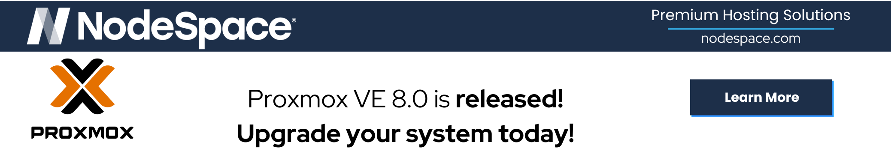

NodeSpace offers Proxmox Virtual Environment (PVE), Proxmox Backup Server (PBS), and Proxmox Mail Gateway (PMG) on our platform. This section covers each of these products in detail for our platform.

!!! note "Refer to official documentation"
    The information contained in this site is geared towards configuring your service to work with [NodeSpace Hosting](https://www.nodespace.com). If you're following our guides for another service provider or a self-hosted environment, your configuration may differ. Please refer to the official documentation for your service provider. If your service provider doesn't have documentation or support for Proxmox, you may want to consider switching to NodeSpace Hosting.

Please refer to the appropriate section:

::cards:: cols=3

- title: Proxmox VE
  content: Proxmox Virtual Environment (PVE) is a high-performance virtualization platform based on KVM and LXC.
  image: images/proxmox.png
  url: pve/index.md

- title: Proxmox Backup Server
  content: Proxmox Backup Server (PBS) is a backup solution based on Debian and BorgBackup.
  image: images/proxmox.png
  url: pbs/index.md

- title: Proxmox Mail Gateway
  content: Proxmox Mail Gateway (PMG) is a mail gateway based on Debian and Postfix.
  image: images/proxmox.png
  url: pmg/index.md

::/cards::
