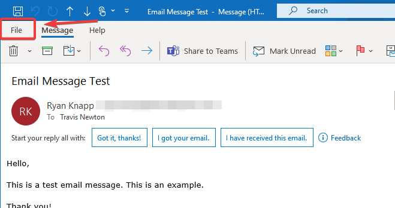
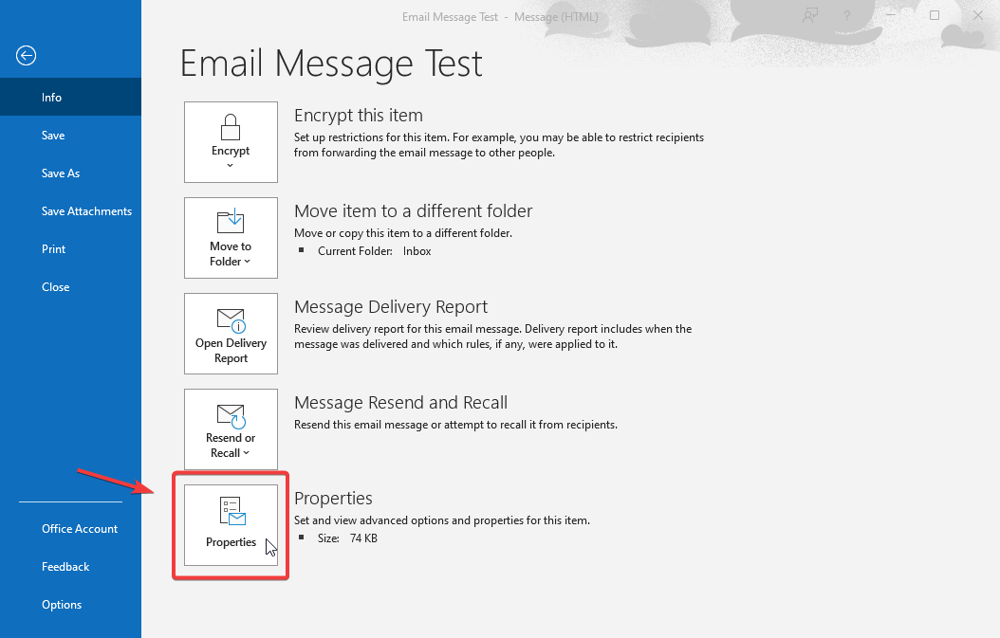
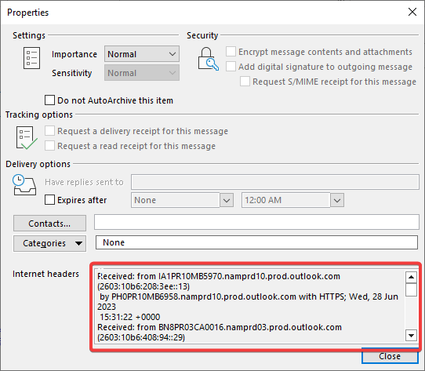
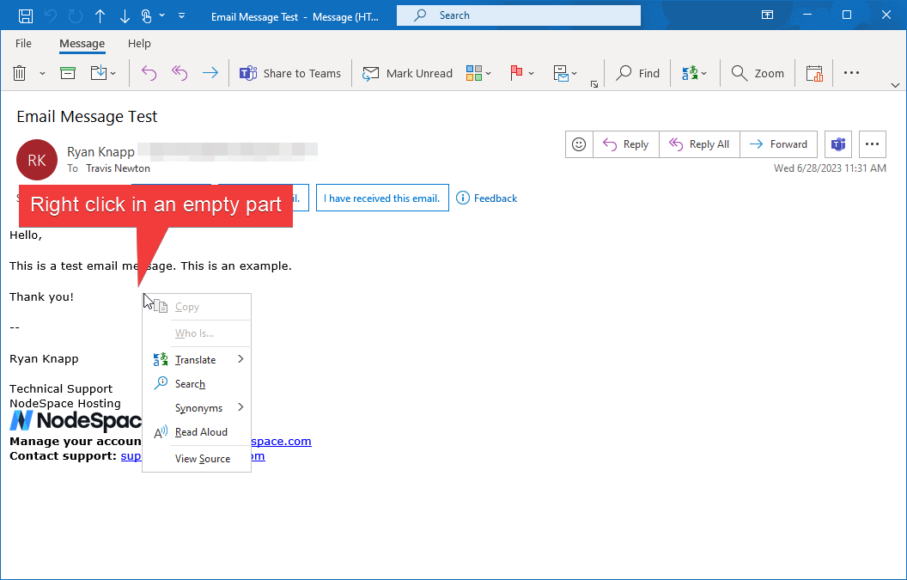
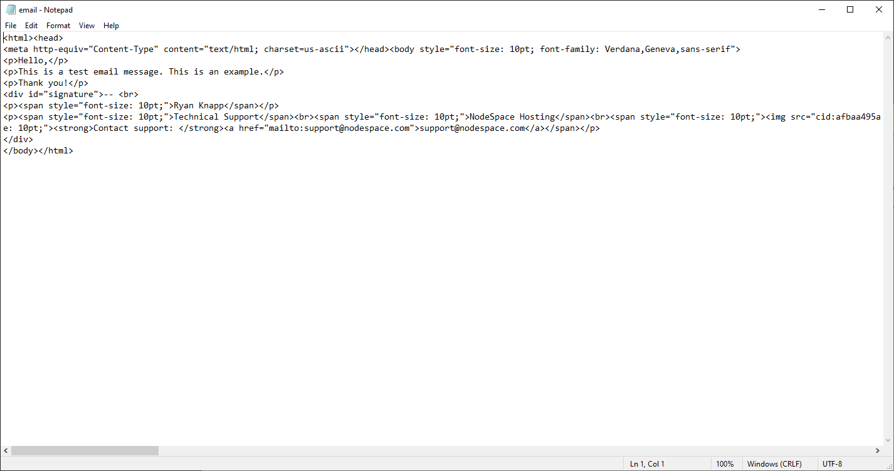
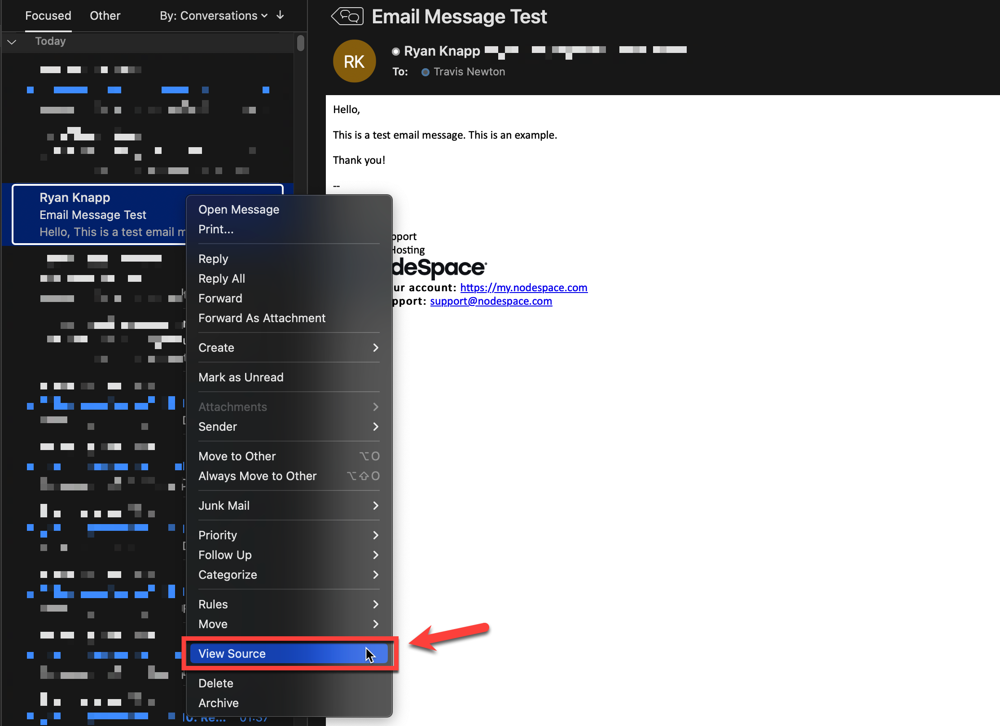
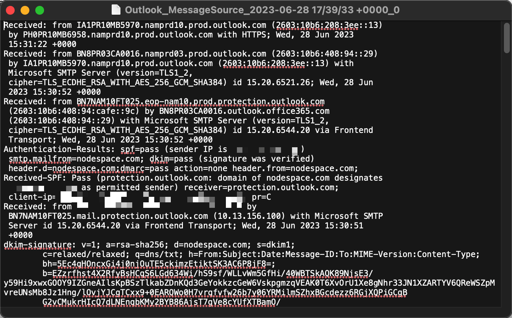
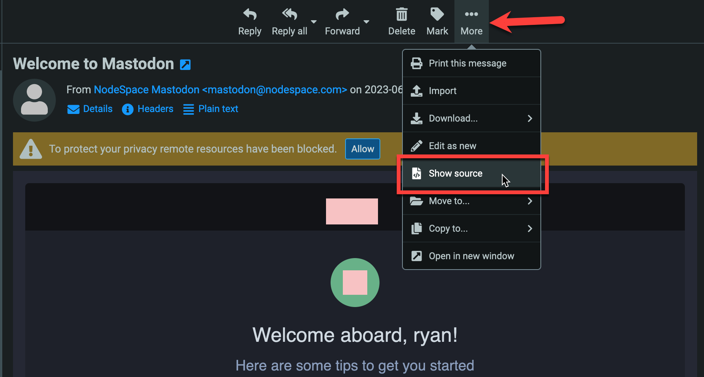

# Advanced Configuration &amp; Tips

## Training SpamAssassin

PMG currently does not have a way to train SpamAssassin with false-negatives (spam that makes it into your inbox) and false-positives ("ham" or not-spam messages that get marked or blocked as spam). But since PMG does have SpamAssassin installed and running, you can actually train SpamAssassin manually. 

!!! note
    SpamAssassin will need a significant amount of training data so it will take some time to help train it. PMG does have other methods such as auto-whitelisting where it will automatically learn on regular email flow.

### Classifying Spam Messages

To manually classify a message as spam, you can follow this procedure:

1. Obtain the full message source, including all headers, and copy it to the PMG server. You can use `/tmp`, `/root`, or another user's home directory.

    !!! note "Full message source required"
        You will need to have the full message source. A forwarded message will not retain the headers of the original message. 

        === "Outlook on Windows"
            Open the message in a new window by double clicking on it if Outlook is configured to use the reading pane. Click on File.

            

            In the File menu, click on Properties.

            

            From the Properties window, copy all the headers. You can save these to a Notepad text file.

            

            Next, go back to the message and right click in an empty part of the actual message body and select View Source.

            

            A Notepad window will open with the source of the message. Copy the source and add it to your other text file with the headers. Paste the message source below the message headers.

            

        === "Outlook on macOS"
            In Outlook, right click on the message in the list and click on View Source.

            

            This window will show you the full message source, including the headers. Copy the contents to a new text file.

            

        === "Thunderbird"
            Thunderbird instructions are coming soon.

        === "Apple Mail"
            Apple Mail instructions are coming soon.

        === "RoundCube (webmail)"
            In RoundCube, select the message and click on the 3 dots. Select the "View Source" option.

            

            A new browser tab will open with the full message source. Select all the text and copy to a text file.

2. SSH to the PMG server and login. 

3. Create a new file in `/tmp/`, `/root/`, or your user's home directory if you're not using root. 

    ```
    touch email.txt
    ```

4. Open the file you created and paste in the message source. Save the file.

    ```
    nano email.txt
    ```

5. Run the following command:

    ```
    sa-learn --spam email.txt
    ```

    !!! note
        Replace `email.txt` with the name of the file you created that has the message source in it.

6. You just trained SpamAssassin on this message. You can now delete the file from the PMG server.

    ```
    rm email.txt
    ```

!!! note
    Keep in mind that you will need about 200 spam messages to really see improvements.

### Classifying Ham Messages

!!! question "What is ham?"
    Ham is the opposite of spam. It's a message that is not spam but was marked as spam, also known as a false-positive.

To manually classify a message as ham, the procedure is nearly identical to classifying spam messages. The only difference is the command you run. Follow the same steps as above, but instead of running `sa-learn --spam email.txt`, run `sa-learn --ham email.txt`, where `email.txt` is the name of the file you created with the message source.

!!! note
    Keep in mind that you will need about 200 ham messages to really see improvements.

