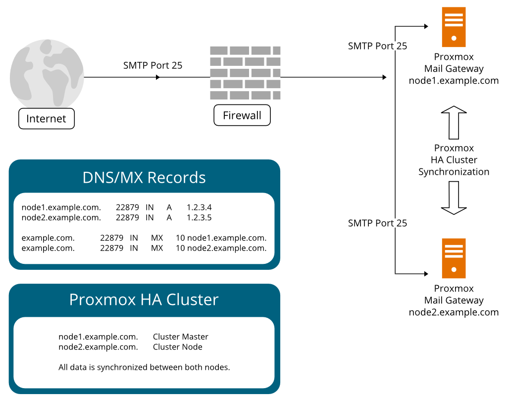

# Configuration Settings

Configuration contains all the settings for PMG.

## Configuration

The main configuration tab contains the sections **Network/Time** and **Options**.

### Network/Time

The **Network/Time** section will allow you to adjust the network settings for your PMG server. You can also set the time zone for your server. 

#### Time

This section allows you to change the time zone for your server. It also shows you the current time on your server.

#### DNS

This section allows you to set the DNS servers for your server. You can also set the search domain for your server. The DNS servers you set here will be used for DNS resolution for email messages and for the server itself. If you encounter issues with DNS resolution, you can try to set different DNS servers here.

#### Interfaces

This section allows you to manage the network interfaces for your server. You can add, edit, and delete network interfaces here. You can also set the IP address, netmask, and gateway servers for each interface.

### Mail Proxy

The Mail Proxy section is for adjusting the settings for Postfix and message relaying.

#### Relaying

The relaying tab has several default options that you can adjust. If you have one domain, it's recommended that you set those settings here. If you have additional domains, you can use the **Transports** tab to set the relaying settings for those domains.

| Setting | Description |
| ------- | ----------- |
| Default Relay | This is the server that PMG will relay messages to. |
| Relay Port | This is the port the server you're relaying to is listening on. |
| Relay Protocol | SMTP or LMTP. Typically, you'll use SMTP. |
| Disable MX Lookup (SMTP) | If you're using SMTP, you can disable MX lookups here. The default is disabled ("yes"). |
| Smarthost | If you're using a smarthost, you can set it here. |

#### Relay Domains

This section contains the domain names that PMG is allowed to relay messages for. This is the setting that prevents your server from being an open relay. If there are no domains listed here, your server will not relay messages for any domains. You can add domains here by clicking the **Add** button. 

#### Ports

This allows you to adjust the ports that PMG listens on.

| Setting | Description |
| ------- | ----------- |
| External SMTP Port | This is the port that PMG listens on for SMTP connections from other email servers. |
| Internal SMTP Port | This is the port that PMG listens on for SMTP connections from *your* email server(s). |

!!! note
    The default ports are 25 for external SMTP and 26 for internal SMTP. Both ports **cannot** be the same. This is how PMG knows if mail is flowing inbound or outbound.

#### Options

The following options are available:

| Setting | Description |
| ------- | ----------- |
| Message Size (bytes) | This is the maximum size of a message that PMG will accept. The default is 10485760. |
| Reject Unknown Clients | This toggles the Postfix setting `reject_unknown_client_hostname`. This will reject messages when the client IP to name mapping fails, or the name to address mapping fails, or the name to address mapping does not match the client IP address. The default is disabled. |
| Reject Unknown Senders | This toggles the Postfix setting `reject_unknown_sender_domain`. This will reject messages when the sender domain name has no DNS A or MX record. The default is disabled. |
| SMTP HELO Checks | This toggles the Postfix setting `smtpd_helo_required`. This will reject messages when the client does not send a HELO or EHLO command. The default is enabled. |
| DNSBL Sites | This is a list of DNSBL sites that PMG will check against. The default is `zen.spamhaus.org`. Add additional lists to check against. Read instructions for RBL lists and how to use as some RBLs may need registration or have lookup limits. |
| DNSBL Threshold | This is the value that a message must reach in order to be rejected. The default is 1. Value shouldn't exceed number of DNSBLs configured. Example: 3 DNSBLs, threshold set to 3, IP matches 2 DNSBLs, threshold not reached and message will be allowed. |
| Verify Receivers | Toggles postfix options `reject_unknown_recipient_domain`, `reject_unverified_recipient`, and `unverified_recipient_reject_code`. Default: `No`. |
| Use Greylisting for IPv4 | Toggles greylisting for IPv4. Default: `Yes`. |
| Netmask for Greylisting IPv4 | The default netmask to apply to IPv4 hosts. Default: `24`. |
| Use Greylisting for IPv6 | Toggles greylisting for IPv6. Default: `No`. Only enable if you receive mail from IPv6-enabled email servers. |
| Netmask for Greylisting IPv6 | The default netmask to apply to IPv6 hosts. Default: `64`. |
| Use SPF | Toggles SPF checks. Default: `Yes`. |
| Hide Internal Hosts | Toggles removing internal hosts from message headers. Default: `Yes`. |
| Delay Warning Time | Postfix option `delay_warning_time`. The time which the sender receives a copy of the message headers of mail that is still queued. Default: `4h`. |
| Client Connection Count Limit | The number of simultaneous connections from a single client. Default: `50`. Set to `0` to disable. |
| Client Connection Rate Limit | The number of simultaneous connections from a single client per minute. Default: `0`. Set to `0` to disable. |
| Client Message Rate Limit | The number of messages from a single client per minute. Default: `0`. Set to `0` to disable. |
| SMTPD Banner | The banner that PMG will use when connecting to other email servers. Default: `ESMTP Proxmox`. This should match your RDNS record. |
| Send NDR on Blocked E-Mails | Toggles sending NDRs to blocked email addresses. Default: `No`. Caution: Can cause backscatter. |
| Before Queue Filtering | Toggles before queue filtering. This allows the system to reject a message with code `554` and leave the task of notifying the sender to the sending mail server. Default: `No`. |

#### Transports

Transports are used to set relaying settings for specific domains. This is useful if you have multiple domains and want to set different relaying settings for each domain. If you only have one domain, you can set the relaying settings in the **Relaying** tab and leave this section blank. Domains not set here will use the default relay.

#### Networks

This section allows you to set the networks that PMG will relay messages for. These are trusted IP networks or hosts (if you use a /32 netmask or /128 for IPv6). These should be networks where you mail servers reside or the IP addresses of your mail servers. Hosts in the same subnet as your PMG server do not need to be added here as they are trusted by default.

#### TLS

This section allows you to set the TLS settings for your server. You can set the TLS policy, the minimum TLS version, and the cipher list. The default settings are recommended. If you need to force TLS for a specific domain, you can set that in the **TLS Destination Policy** section. 

!!! note
    Please be aware that NodeSpace currently has a known issue with outbound TLS emails. Please see [our network limitations](../../networking/limitations.md) for more information.

#### DKIM Signing

This section allows you to set DKIM signing for your domains. You can set the selector, the domain, and the private key. By default, DKIM is off, but you can enable it, set the selector, and the option to sign all outgoing mail. Under **Sign Domains**, you can set the domains that you want to sign. Domains not listed here will not be signed.

!!! note
    PMG will share the same DKIM key for all domains. If you need to use different keys for different domains, you will need to use a different MTA.

#### Whitelist

This section allows you to whitelist email addresses, domains, and networks. All SMTP checks are disabled for those entries (e.g. Greylisting, SPF, DNSBL, …). 

!!! note
    If you use a backup MX server (for example, your ISP offers this service for you), you should add those servers here.

!!! tip
    If you want to disable all DNSBL checks entirely, remove any servers in the `DNSBL Sites` field in Mail Proxy Options.

### Spam Detector

The **Spam Detector** tab allows you to set the spam detection settings for your server. The default settings are recommended.

#### Options

| Setting | Description |
| ------- | ----------- |
| Use auto-whitelist | Toggles the use of the auto-whitelist. Auto-whitelists track the long-term average score for each sender and then shift the score of new messages toward that long-term average. This can increase or decrease the score for messages, depending on the long-term behavior of the particular correspondent.  Default: `Yes`. |
| Use Bayesian filter | Toggles the use of the Bayesian filter. The Bayesian filter is a statistical filter based on the analysis of the message's content. Default: `Yes`. |
| Use RBL checks | Toggles the use of RBL checks. RBLs are Real-time Block Lists and these lists are predefined in the Postfix config. Default: `Yes`. |
| Use Razor2 checks | Toggles the use of Razor2 checks. Razor2 is a collaborative spam-tracking database, which works by taking a signature of the message and querying the Razor2 database. Default: `Yes`. |
| Extract Text from Attachments | Toggles the extraction of text from attachments. Default: `No`. |
| Max Spam Size (bytes) | The maximum size of a message that will be checked for spam. Messages larger than this size will be passed through without checks. Default: `262144`. |
| Languages | The languages that will be checked for spam. Default: `all`. |
| Backscatter Score | The score that will be used to determine if a message is backscatter. Default: `0`. |
| Heuristic Score | The score that will be used to determine if a message is spam. This score comes from ClamAV heuristics (Encrypted Archives/Documents, PhishingScanURLs, …) Default: `3`. |

#### Quarantine

| Setting | Description |
| ------- | ----------- |
| Lifetime (days) | The number of days that quarantined messages will be kept. Default: `7`. |
| Authentication mode | The authentication type that will be used to access the quarantine. Mode `ldap` requires to login using an LDAP account. Finally, mode `ldapticket` allows both ways. Default: `Ticket`. |
| User Spamreport Style | Specifies the style of the daily spam report sent to users. Options are `custom`, `none`, `short`, and `verbose`. Default: `verbose`. |
| Quarantine Host | The FQDN that will be used to access the quarantine. Default: `PMG Hostname`. |
| Quarantine Port | The port that will be used to access the web interface. Default: `8006`. |
| Email 'From:' | The email address that will be used as the sender for the daily spam report. Default: `quarantine@<hostname>`. |
| View images | Allows viewing of images in the quarantine. Default: `Yes`. |
| Allow HREFs | Allows links in the quarantine. Default: `Yes`. |

#### Status 

Shows the configured spam detection channel signatures and when they were last updated and if an update is available. You can manually update the signatures by clicking the **Update Now** button.

#### Custom Scores

This allows you to override the default scores for spam detection. While SpamAssassin has a large number of rules, you may want to override the default scores for some of them or disable them if they are causing too many false positives.

!!! example
    Your system receives spam mails which are scored at 4.9 and you have a rule which puts all mails above 5 in the quarantine. The one thing the spam mails have in common is that they all hit `URIBL_BLACK`. By increasing the score of this rule by 0.2 points the spam mails would all be quarantined instead of being sent to your users.

!!! example
    Your system tags many legitimate mails from a partner organization as spam, because the organization has a policy that each mail has to start with *Dear madam or sir* (generating 1.9 points through the rule `DEAR_SOMETHING`). By setting the score of this rule to 0, you can disable it completely. 

You can create a custom rule by giving the rule the [SpamAssasin rule name](https://apache.googlesource.com/spamassassin/+/trunk/rules) and the score you want to assign to it. You can also disable a rule by setting the score to `0`.

### Virus Detector

This section allows you to set the virus detection settings for your server. The default settings are recommended. PMG uses ClamAV for virus detection.

#### Options

| Setting | Description |
| ------- | ----------- |
| Block encrypted archives and documents | Whether to mark encrypted archives and documents as heuristic virus match. A match does not necessarily result in an immediate block, it just raises the Spam Score by `clamav_heuristic_score`. Default: `No`. |
| Max recursion | Nested archives are scanned recursively, e.g. if a ZIP archive contains a TAR file, all files within it will also be scanned. This options specifies how deeply the process should be continued. Warning: setting this limit too high may result in severe damage to the system.  Default: `5`. |
| Max files | The maximum number of files that will be scanned. Default: `10000`. |
| Max file size (bytes) | The maximum size of a file that will be scanned. Default: `250000000`. |
| Max scan size (bytes) | The maximum size of a message that will be scanned. Messages larger than this size will be passed through without checks. Default: `100000000`. |
| Max credit card numbers | This option sets the lowest number of Credit Card or Social Security numbers found in a file to generate a detect. Default: `5`. |

#### ClamAV

| Setting | Description |
| ------- | ----------- |
| Database Mirror | The mirror that will be used to download the ClamAV database. Default: `http://database.clamav.net`. |
| Incremental Download | Whether to use incremental download of the ClamAV database. Default: `No`. |

This section will show you the status of the ClamAV databases for the daily and main databases. You can manually update the databases by clicking the **Update Now** button.

#### Quarantine

This section contains the settings related to the virus quarantine.

| Setting | Description |
| ------- | ----------- |
| Lifetime (days) | The number of days that quarantined messages will be kept. Default: `7`. |
| View images | Allows viewing of images in the quarantine. Default: `Yes`. |
| Allow HREFs | Allows links in the quarantine. Default: `Yes`. |

### User Management

This section allows you to manage the users on your server. You can add, edit, and delete users from this section. This will allow you to manage the root user and any other admin accounts as well as user accounts. You can manage two factor authentication, connect PMG to an LDAP server, and configure Fetchmail.

!!! question "What is Fetchmail?"
    Fetchmail is a utility that retrieves email from a remote POP3, IMAP, ETRN, or ODMR-capable server and forwards it to your local SMTP server. It is used to retrieve mail from external accounts and deliver it to the local mail server.

Users created in the PMG interface are for administrating PMG only. You can assign one of four roles to a user:

| Role | Description |
| ---- | ----------- |
| Administrator | Is allowed to manage settings of Proxmox Mail Gateway, excluding some tasks like network configuration and upgrading. |
| Quarantine manager | Is allowed to manage quarantines, blacklists and whitelists, but not other settings. Has no right to view any other data. |
| Auditor | With this role, the user is only allowed to view data and configuration, but not to edit it. |
| Helpdesk | Combines permissions of the Auditor and the Quarantine Manager role. |

If you want to allow end users to be able to access their quarantine by logging in, you can setup a LDAP connection. 

!!! note
    If you don't or can't setup LDAP, then users will be able to access their quarantine by the link in the daily spam report. This link contains their token that allows access. Users can save that link to access their quarantine without looking up an old spam report.

!!! tip
    PMG supports Active Directory accounts for LDAP authentication.

### Cluster

This section allows you to manage the cluster settings for your server. You can add, edit, and delete nodes from this section. You can also manage the cluster settings for your server. Clustering allows for high availability and load balancing. This requires you to have at lest two public IPs that can listen on port 25 and that you can set DNS records for.

!!! warning
    Joining a cluster with two-factor authentication enabled for the `root` user is not supported. Remove the second factor when joining the cluster.

To create a cluster, you need to have two or more PMG servers. Click on the **Create** button to create a new cluster. To add a node to the cluster, click on the **Add** button. You will be shown the information needed to join a node to the cluster. On the node you want to add, click on the **Join** button and enter the information from the cluster you want to join. You will be asked to confirm the join and then the node will be added to the cluster.

### Subscription

This section allows you to add or manage your subscription for PMG. You can add a new subscription by clicking on the **Add** button. You will be asked to enter your subscription key. You can also remove your subscription by clicking on the **Remove** button.

If you need to order a subscription, you can copy your Server ID and paste it into the order form. You can order a subscription from the [Proxmox website](https://www.proxmox.com/en/proxmox-mail-gateway/pricing) or directly from NodeSpace.

!!! note
    You do not need to have a subscription to use PMG. You can use the free version of PMG without a subscription. The subscription is only needed for the enterprise support.

### Backup/Restore

This section allows you to backup and restore your PMG server. Backups allow you to backup your configuration and restore it should you rebuild this PMG server. If you have a Proxmox Backup Server, you can also backup your PMG server to it.

!!! note
    If you're hosting your PMG server on a Proxmox VE node that is backed up with Proxmox Backup Server, you do not need to backup your PMG server. You can restore the entire VM from the Proxmox Backup Server.

### Certificates

This section allows you to manage the certificates for your PMG server. You can add, edit, and delete certificates from this section. You can also set the default certificate for your server. You can also generate a self-signed certificate for your server or obtain a Let's Encrypt certificate for your server. These certificates are used for the web interface and for the MTA.