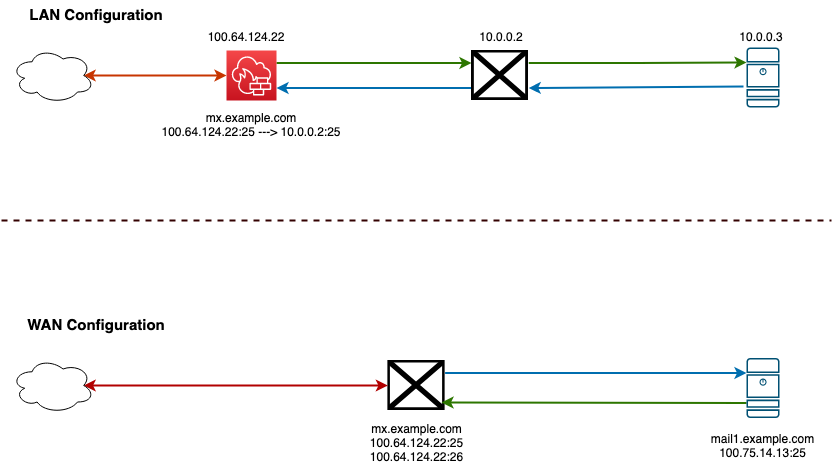

# Proxmox Mail Gateway (PMG)

Proxmox Mail Gateway is an open-source mail gateway that protects your mail server against all email threats the moment they emerge. The full featured mail proxy can be easily deployed between the firewall and your internal mail server in only a few minutes. It is based on Debian Buster and comes with a web-based management interface.

## Getting Started

Proxmox Mail Gateway, once installed and configured, is a very strong email filter and SMTP relay. PMG is designed to sit between the Internet and your mail server on an internal network. PMG can also act as your MX, providing inbound spam and virus filtering before sending email to a cloud email provider such as Office 365 or Google Workspace (Gmail). 

!!! note "PMG is not designed for consumer email"
    PMG is not designed to protect consumer email accounts such as Gmail, Yahoo, or outlook.com. It is designed to sit between the Internet and a mail server.

First, you should decide if you are going to have a LAN configuration or WAN configuration.

PMG is designed for a LAN deployment, however it is possible to deploy PMG in a WAN configuration. In a LAN configuration, PMG will sit between your firewall and your mail server. In a WAN configuration, PMG will accept mail for your domain and then route it to your mail server.

You can also use PMG for outbound filtering. To use oubound filtering, you will need to configure your mail server to send outbound email to PMG on port 26. PMG will then scan the email and send it to the Internet.

## Installing PMG

PMG can be installed either from the PMG ISO for bare metal or KVM virtualization or from the LXC container template provided on Proxmox VE servers. The installation proces is straight forward like installing any other operating system from ISO. During the installation process, you will need to provide a static IP address and root password during the install.

### Hardware considerations

- Scanning messages uses CPU and RAM and if you have a high inbound of messages, you may want to allocate additional CPU and RAM.
- Provide adequate disk space for log files and quarantined emails.

### Networking

Typically, PMG should be installed *behind* a firewall in a DMZ but it will also work with a public IP address directly connected to the Internet.

## Port Requirements

PMG has very simple port requirements.

| Port Number | Purpose      |
| ----------- | ------------ |
| 25          | Accepts email from the Internet. |
| 26          | Accepts email from **your mail server** for outbound filtering. |
| 8006        | Web admin interface. **Should not be exposed to the Internet**  |
| 80/443      | Reverse proxy for SPAM quarantine. |

## Configuring PMG 

### Add your domain

PMG will only relay email for domains that you allow. This prevents PMG from operating as an open relay that spammers can use. To add your domain, go to **Configuration > Mail Proxy > Relay Domains**. Add any domains you want to protect here. 

Next, you will need to go to the **Transports** tab and click on **Create** to add a new transport. Enter your *Relay Domain*, the IP or hostname of the mail server. Leave the protocol as SMTP unless you need to change it. Enter the port number that your mail server will listen on for SMTP. By default it is `25`. Only change this value if you know your server is configured for a different value. The option for `Use MX` can be a bit confusing. If you are sending the mail directly to a mail server, you should uncheck this value. If you're sending to another domain, such as if `example.com` accepts mail for `example.org` and you want to use `example.com`'s MX records, then you would enter `example.com` as the host and leave `Use MX` checked.

=== "Inbound Protection"
    For Inbound protection, no other configuration is needed in this section. 

=== "Outbound Protection"
    If you want to protect outbound email, you should select the **DKIM** tab and configure a DKIM key and signing domain. DKIM will sign your outgoing mail to prove that it was sent by an authorized mail server. Take the values that PMG gives you and create an appropriate DNS record on your domain.

    !!! note
        You currently cannot create multiple DKIM keys for different domains. All domains on PMG will share the same key. 

    Once DKIM is setup, you need to configure your mail server to send to PMG on port 26. 

### Create your MX record

At this point, you can create a MX record for your domain or update your existing MX record.

!!! warning "Changing your MX record will disrupt email flow"
    Prepare for your MX cutover by lowering the TTL (in seconds) on your DNS to 5 minutes (300) ahead of the change. How early you should make the change is based on your existing TTL value. If your existing value is 3600, then your TTL is 1 hour. 

Your MX record should be an `A` record that points to your PMG server. Then when you are ready, change your MX record to point to your the `A` record you created.

### Configure your mail server (for outbound protection)

If you are using PMG for outbound protection, you will need to configure your mail server to send to PMG on port 26. This is typically done by creating a new send connector or smart host. If your mail server exists within your LAN, you should configure your firewall to either redirect SMTP traffic to the mail server and only allow the mail server to connect to PMG on port 26 - all other clients should be blocked. 

## Next Steps

!!! warning "Configure SPF, DKIM, and DMARC"
    You should configure SPF, DKIM, and DMARC on your domain. This will help prevent spammers from spoofing your domain and ensure that your PMG server is marked as allowed to send email for your domain.

!!! note "RDNS and HELO"
    You should also configure RDNS and HELO on your mail server. This will help prevent your mail from being marked as spam. Currently, you need to contact support to configure RDNS on your IP and HELO can be configured PMG's web interface.

