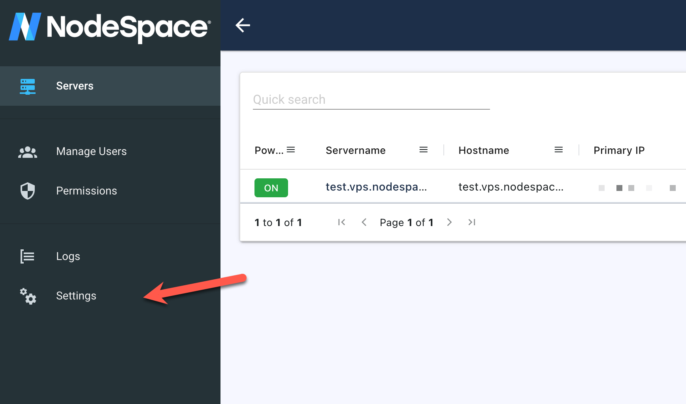
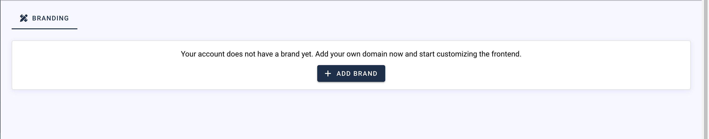
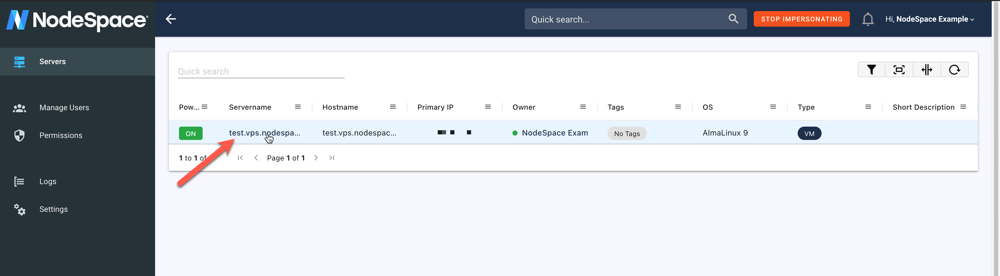
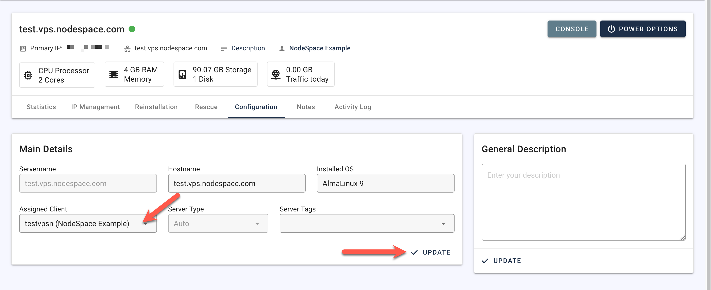

# Reseller Server Management

As a reseller, you can provide your customers access to our server management system. This will allow them to manage their own servers, and you can manage them as well. You can brand the system with your own logo and colors. There are no direct links to us, so your customers will not know that we are providing the service.

## Get Started

First, contact us to get your account converted to a reseller account. You need at least one active server. Once your account is setup, you can login to the server management system at https://manage.nodespace.com. If you don't know your password, you can login from the client area at https://my.nodespace.com.

## Branding

To setup your branding, once you are logged into the server management panel, click on settings.

Once here, you will need to click on the "Add Brand" button to start setting up a new brand.

Once you've clicked that, you will need to create a DNS CNAME record for the domain or subdomain you want to use. You will need to point it to `manage.nodespace.com` and then enter the domain or subdomain you want to use in the "Domain" field. Once you've done that, click "Save".

Once you've done that, our system will validate the CNAME record so we can issue an SSL certificate. 

When this is done, you will be able to fully customize the branding of the server management system. You can upload your own logo, change the colors, and more.

## Adding Customers

You can add customers to your account by clicking on the "Manage Users" link in the left menu. This will allow you to create a new user, or manage existing users.

## Managing Servers

To manage servers and assign them to customers, click on "Servers" in the left menu. You will see a list of servers that you have access to. If you click on the Server Name, you can then manage the server.

!!! note
    Servers will not show up here until they have been provisioned and assigned to your account.

!!! warning "Check Server Name before assigning"
    We generally name servers base on our internal naming scheme. This typically includes the domain name including `nodespaceservers.com`. If you have servers that have this domain name and wish to keep our services hidden from your customers, please contact us and we can change the name of the server for you. We need to keep the first part of the name the same, but we can change the domain name to something else, such as your domain name. The server hostname is assignable by you, so you can change that to whatever you want.

### Reassigning Servers

If you need to reassign a server to a different customer, go to the server management page and then click on the "Configuration" tab. From here, you can assign the server to a different customer under your account. Click on "Update" to save.

!!! note
    Tags, notes, etc. are not transferred when reassigning a server. They are only visible to you.

## RDNS Management

Currently, RDNS management is not available in the server management system. You can contact us to have RDNS records set for your servers. Please keep in mind that RDNS records may initially be set to `nodespaceservers.com` until you contact us to have them changed. We can also set RDNS records to your domain name if you wish to keep our services hidden from your customers. Please place any RDNS requests in the order notes when ordering a server and we will set them during provisioning.

## Billing System Integration

If you utilize WHMCS (or if you would like to, we can provide a discounted license with the requirement that it **must** be hosted on our servers), you can integrate our server management system with WHMCS exactly like we do. This module is completely private-label and will allow you to manage your servers directly from WHMCS. You can also allow your customers to manage their servers from WHMCS as well.

!!! note
    At this time we only support WHMCS. If you use another billing system, we can provide API documentation or you can provide your customers direct access to the server management system using your branded URL.

If you need assistance with the WHMCS module, please contact us and we can assist you with the setup.