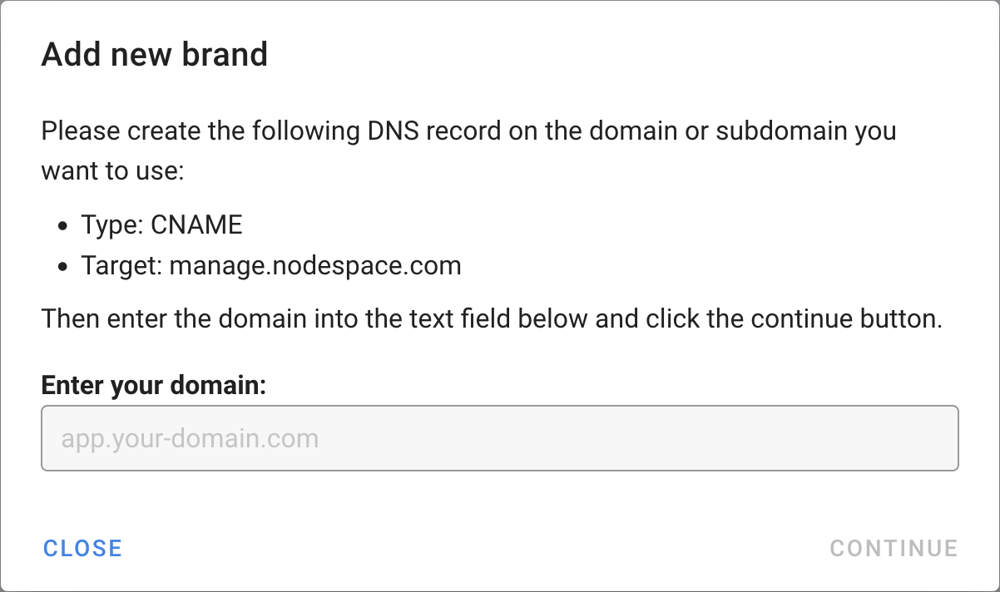

# Reseller Server Management

As a reseller, you can provide your customers access to our server management system. This will allow them to manage their own servers, and you can manage them as well. You can brand the system with your own logo and colors. There are no direct links to us, so your customers will not know that we are providing the service.

## Get Started

First, contact us to get your account converted to a reseller account. You need at least one active server. Once your account is setup, you can login to the server management system at https://manage.nodespace.com. If you don't know your password, you can login from the client area at https://my.nodespace.com.

## Branding

To setup your branding, once you are logged into the server management panel, click on settings.

Once here, you will need to click on the "Add Brand" button to start setting up a new brand.

Once you've clicked that, you will need to create a DNS CNAME record for the domain or subdomain you want to use. You will need to point it to `manage.nodespace.com` and then enter the domain or subdomain you want to use in the "Domain" field. Once you've done that, click "Save".

Once you've done that, our system will validate the CNAME record so we can issue an SSL certificate. 

When this is done, you will be able to fully customize the branding of the server management system. You can upload your own logo, change the colors, and more.