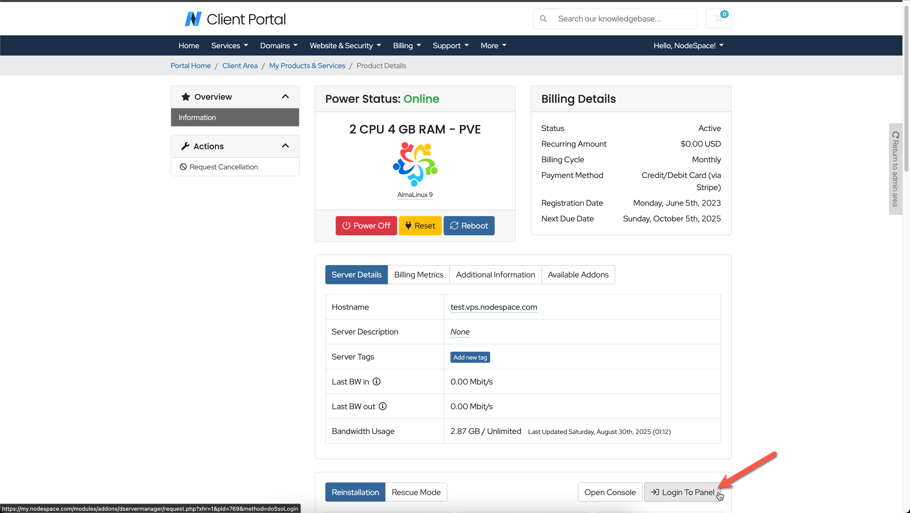
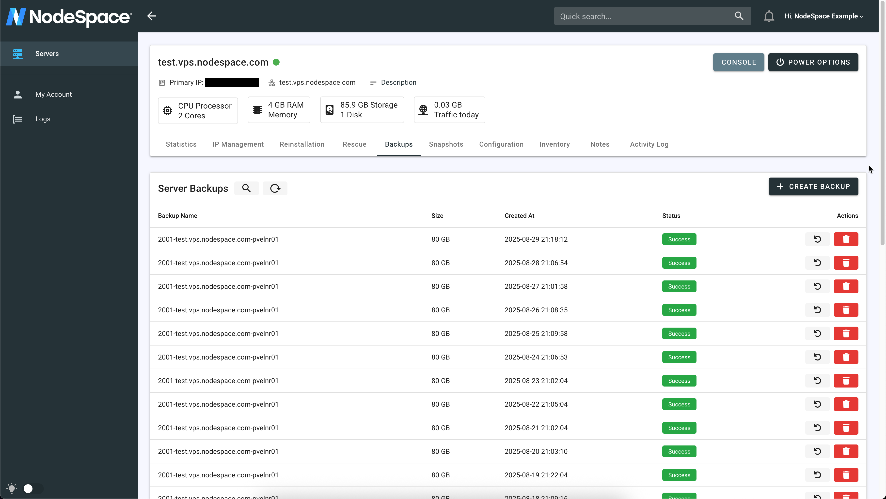
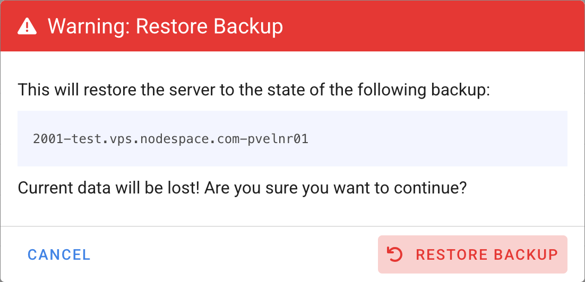
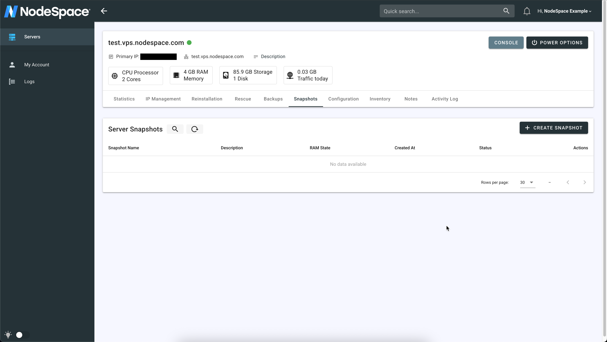
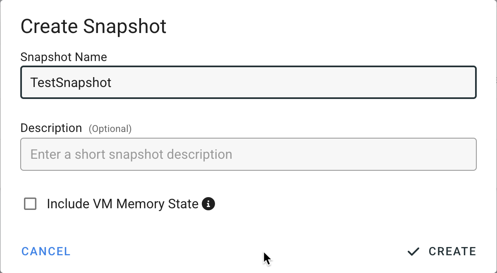
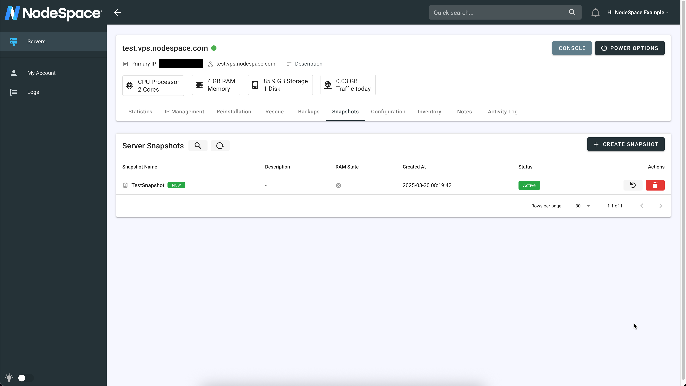
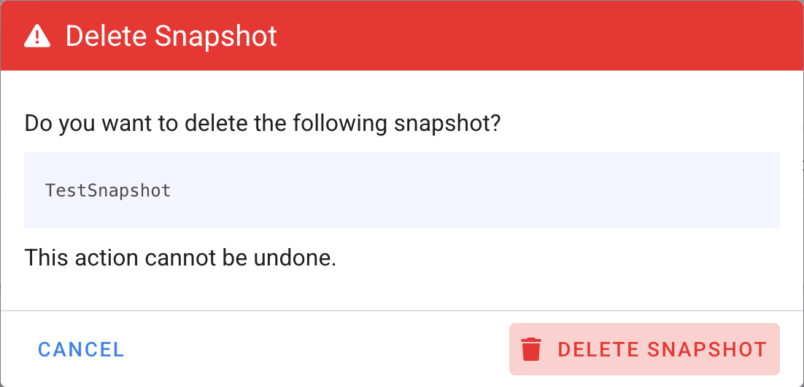
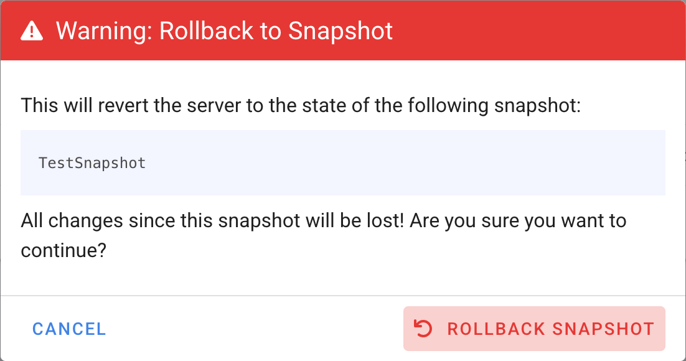

# Backups and Snapshots

!!! Note
    NodeSpace automatically creates backups of your server daily. You can create manual backups at any time through the control panel.

    Snapshots are also available for your server, allowing you to capture the current state of your server at any point in time. This can be useful for testing changes or rolling back to a previous state if needed.

## Managing Backups
To manage your backups, you will need to access the My NodeSpace portal and select your VPS instance. Once on the service page, you will need to click on "Login to Panel" button to login to the Server Management Panel. 

!!! Note
    Backup functionality is not yet built into the My NodeSpace portal. You will need to use the Server Manager directly.

When the Server Manager loads, select your VPS and then select the "Backups" tab to manage your backups. You will see all current backups we have for your server.

You can select a backup to restore your server to a previous state. Keep in mind that restoring a backup will overwrite any changes made after the backup was created. 

If you delete any backups, they cannot be recovered. Please ensure that you have the necessary backups before making any deletions.

!!! warning "VPS Will Be Offline During Backup Restore"
    Restoring a backup will require your VPS to be temporarily taken offline. Please plan accordingly and schedule downtime if necessary. Contact support if you would like to have a "live restore" completed. A live restore allows your VPS to remain online while the backup is being restored, but it may take longer to complete and could impact performance.

!!! info
    NodeSpace manages backups and doesn't indefinitely retain them. While you can create any number of backups, our system will automatically delete older backups as new ones are created to ensure optimal storage usage.

## Managing Snapshots
Snapshots allow you to capture the current state of your server at any point in time. This can be useful for testing changes or rolling back to a previous state if needed. These are different from backups in that they are typically more lightweight and can be created and deleted more easily. Snapshots are stored on the same infrastructure as your VPS, making them quick to create and restore.

To create a snapshot, you will need to access the My NodeSpace portal and select your VPS instance. Once on the service page, you will need to click on "Login to Panel" button to login to the Server Management Panel.

!!! Note
    Snapshot functionality is not yet built into the My NodeSpace portal. You will need to use the Server Manager directly.

When the Server Manager loads, select your VPS and then select the "Snapshots" tab to manage your snapshots. You will see all current snapshots we have for your server.

You can create a new snapshot by clicking the "Take Snapshot" button. You will be prompted to provide a name for the snapshot. Once created, the snapshot will appear in the list of snapshots.

!!! warning "Snapshot Names"
    Choose a descriptive name for your snapshot to help identify its purpose later. You cannot use special characters or spaces in the snapshot name. For example, `PreUpdate` will work, but `Pre Update` will not. You can add more details in the description field if needed.

When the snapshot is created, it will appear in the list of snapshots. You can manage your snapshots from this interface, including deleting old snapshots that you no longer need.

!!! question "Should I use snapshots or backups?"
    Snapshots are best for short-term changes and quick rollbacks, while backups are more suitable for long-term data retention and disaster recovery. Use both in conjunction for optimal protection.

!!! question "Should I delete old snapshots?"
    Yes, you should regularly review and delete old snapshots that you no longer need. This will help free up storage space and keep your snapshot list organized. Keep in mind that leaving old snapshots may prevent our system from moving your VPS to a new host or performing other maintenance tasks, which could lead to performance issues or downtime.

Deleting old snapshots is a straightforward process. Simply select the snapshot you wish to delete and click the "Delete" button. Confirm the deletion when prompted, and the snapshot will be removed from your list.

If you want to restore a snapshot, simply select the snapshot you wish to restore and click the "Restore" button. Confirm the restoration when prompted, and the snapshot will be restored to your VPS. Depending on if you snapshotted your VM's memory state, when you restore your VPS there may be a brief period of downtime as the snapshot is applied or if you need to power on your VPS.

!!! question "Should I snapshot the VM memory?"
    Snapshotting the VM memory can be useful if you want to preserve the exact state of the running applications and processes at the time of the snapshot. However, keep in mind that this may increase the size of the snapshot and the time it takes to create it. If you don't need to capture the memory state, it's generally faster and more efficient to snapshot just the disk state.

